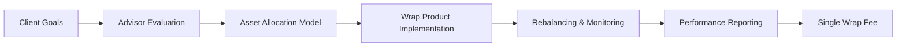

## 23.3 Wrap Products

Wrap products, sometimes referred to as “wrap accounts,” consolidate multiple investment vehicles—such as mutual funds, exchange-traded funds (ETFs), or separately managed accounts (SMAs)—under a single fee structure. This approach grants investors a comprehensive, ongoing wealth management service, often including asset allocation guidance, rebalancing, performance reporting, and the expertise of an advisory team or portfolio manager. Below, we delve deeper into the core components of wrap products, their benefits, potential pitfalls, and the considerations unique to the Canadian regulatory environment.

---

### Introduction to Wrap Products

In Canada, wrap products evolved out of investor demand for simplified portfolio management and transparent fees. Historically, clients paid commissions on each security transaction, received siloed advice, and had to manually track multiple accounts. By contrast, a wrap account bundles various services for a single “wrap fee,” typically levied as a percentage of assets under management (AUM).

Key aspects of wrap products include:

- A tailored asset allocation model suited to different risk/return profiles.  
- A single, consolidated fee (wrap fee) that typically covers advisory services, trading costs, and ongoing portfolio monitoring.  
- A structured advisory relationship with regular performance reviews.  
- A streamlined client experience through simplified statements, comprehensive reporting, and professional rebalancing.

---

### Key Features and Advantages

#### 1. Comprehensive Services

Wrap accounts often function as a one-stop shop. Clients receive:

- Ongoing investment advice from a dedicated advisory team.  
- Automatic rebalancing to maintain target asset allocations.  
- Periodic portfolio reviews and performance updates.  
- Access to underlying platforms of mutual funds, ETFs, or SMAs managed by professional portfolio managers.

Because these services are bundled, the client can focus on financial goals instead of micromanaging individual trades or securities.

#### 2. Transparency of Fees

Unlike commission-based models, wrap accounts charge a single, asset-based fee. This percentage typically ranges from 1% to 2.5% per year, depending on the size and complexity of the portfolio. The Canadian Investment Regulatory Organization (CIRO) requires advisors to disclose fees in a transparent manner, ensuring investors understand how their total cost is calculated. While this simplicity can be appealing, investors should still compare total wrap fees against the potential cost of buying each component—e.g., individually purchasing mutual funds or ETFs—to confirm they are receiving value.

#### 3. Professional Asset Allocation

A well-designed asset allocation model lies at the heart of most wrap products. Advisors or portfolio managers create strategic mixes of equities, fixed income, and alternative investments, aligned with the client’s time horizon, risk tolerance, and return objectives. In Canadian markets, major pension funds like the Canada Pension Plan Investment Board (CPPIB) use sophisticated asset allocation to achieve their long-term mandates, though on a much larger scale. By leveraging similar principles, wrap accounts can offer a robust foundation for portfolio construction.

---

### The Role of Separately Managed Accounts (SMAs)

Some wrap platforms grant access to SMAs where a professional manager directly invests in individual securities on behalf of a single client. This is particularly useful for high-net-worth clients needing:

1. Greater customization (e.g., removing certain stocks or industries to reflect an investor’s ethical, religious, or environmental preferences).  
2. Tax optimization by managing capital gains and losses at the security level.  
3. Personalized reporting beyond the scope of pooled vehicles like mutual funds or ETFs.

SMAs can be integrated into a wrap product's overall fee structure, enabling clients to pay one total fee for both advisory services and direct professional management.

---

### Fee Structures and Cost Analysis

Wrap fees can appear straightforward but can still vary by provider. When evaluating a wrap account offered by a major Canadian bank such as RBC, TD, or BMO, consider the following:

1. Base Fee Rate: Charged as a percentage of AUM (e.g., 1.5% of $500,000 under management = $7,500 per year).  
2. Underlying Fund Expenses: Some wraps include partial or full absorption of the underlying fund’s Management Expense Ratios (MERs) or reduce them with management fee rebates.  
3. Administrative or Custodial Fees: These might be included or charged separately.  
4. Potential Performance Fees: Certain strategies may layer performance fees over the base wrap fee if returns exceed a specific benchmark.

Below is a simple formula to estimate annual wrap costs:

$$
\text{Total Annual Wrap Cost} = \text{AUM} \times \text{Wrap Fee} + \sum(\text{Underlying Fund Expenses})
$$

For instance, a $300,000 portfolio with a 1.2% wrap fee will incur $3,600 in annual wrap fees. If the underlying mutual funds or ETFs average 0.3% MER, the total becomes $4,500 per year (1.5% of AUM).

---

### Mermaid Diagram: Wrap Account Flow

**Diagram Explanation:**
1. The client articulates financial goals (Node A).  
2. The advisor evaluates risk tolerance, objectives, and personal constraints (Node B).  
3. An asset allocation model is established (Node C).  
4. The advisor selects suitable products or managers within a wrap platform (Node D).  
5. The portfolio is regularly monitored and rebalanced to maintain target allocations (Node E).  
6. The client receives integrated performance reports (Node F).  
7. The investor pays a single wrap fee based on AUM (Node G).

---

### Regulatory Considerations

Because wrap accounts involve an ongoing advisory relationship, regulators in Canada—particularly CIRO—require that the advisor:

1. Demonstrates that the account structure is consistent with the client’s investment objectives, risk tolerance, and best interest.  
2. Discloses all fees and potential conflicts of interest clearly.  
3. Provides ongoing supervision, regular account reviews, and accurate performance reporting as per client-focused reforms and relevant CSA rules (e.g., NI 31-103).

Similarly, the Office of the Superintendent of Financial Institutions (OSFI) oversees capital adequacy for federally regulated financial institutions, ensuring banks that offer wrap accounts remain financially sound. Meanwhile, the Canada Revenue Agency (CRA) sets tax policies that govern how investment returns are taxed in wrap accounts. 

Client assets in wrap accounts are often protected by the Canadian Investor Protection Fund (CIPF) if the firm becomes insolvent, offering coverage up to specified limits.

---

### Suitability and Target Clients

Wrap accounts are generally well-suited for investors who:
- Prioritize simplicity and are comfortable paying a single fee for bundled services.  
- Have portfolios large enough to absorb fees without sacrificing performance potential.  
- Value professional advice, portfolio rebalancing, and consolidated reporting.  
- Seek a “hands-off” management style with the ability to customize some strategies.

However, a wrap program may not be the optimal solution if the client seldom trades, holds primarily passive investments, or has a relatively small portfolio where fees could significantly erode returns.

> **Pitfall:** Failing to compare wrap fees with individual fund costs may leave clients overpaying for convenience, especially if their portfolios are too small or do not require frequent advisory input.

---

### Best Practices and Tips

- **Conduct a Thorough Needs Assessment:** Advisors should explore a client’s risk profile, short- and long-term goals, and pressures like potential retirement timelines.  
- **Compare Wrap Fees to Alternatives:** Evaluate whether a direct index ETF approach or a portfolio of low-fee mutual funds might be cheaper.  
- **Review Underlying Investments:** Not all wrap accounts use top-tier funds. Make sure the underlying strategy aligns with the investor’s desired risk/return characteristics.  
- **Monitor Cost-Effectiveness:** Large portfolios stand to benefit the most from wrap programs, as the nominal fee percentage can yield significant holistic services.  
- **Encourage Quarterly or Semi-Annual Check-Ins:** Ongoing communication ensures alignment with changing market conditions and personal circumstances.

---

### Real-World Canadian Examples

1. **RBC Dominion Securities Wrap Programs**: Offer clients a customized approach combining RBC mutual funds, ETFs, or external managers. The wrap fee covers portfolio monitoring, rebalancing, and advice.  
2. **TD Private Investment Counsel**: Offers “all-inclusive” wrap solutions for affluent clients seeking integrated wealth management services.  
3. **BMO Nesbitt Burns Architect Program**: Combines multiple investment managers under one wrap fee, with a focus on precise asset allocation and tax strategies.

Case studies from these institutions often highlight improved client satisfaction from centralized reporting and consistent rebalancing—though it remains critical that clients verify cost savings relative to standalone investments.

---

### Additional Resources for Deeper Exploration

- [CIRO Fee-Based Accounts Guidelines](https://www.ciro.ca)  
- [CFA Institute Research on Wrap Fee Accounts](https://www.cfainstitute.org)  
- “Investment Management for Private Clients” by Jean Brunel  
- [CRA Website](https://www.canada.ca/en/revenue-agency.html) for tax-specific guidance  
- [Canadian Securities Administrators (CSA)](https://www.securities-administrators.ca/) for ongoing compliance updates

---

### Conclusion

Wrap products offer a convenient, holistic way to manage a portfolio by consolidating advisory, trading, and administrative services into a single fee. They can streamline the client experience, especially for investors who value professional oversight, thorough reporting, and minimal administrative burdens. As with any financial arrangement, thorough due diligence—a clear cost-benefit analysis, strong advisor-client communication, and regular performance reviews—is essential. By combining transparency, proper asset allocation, and regulatory safeguards, wrap products can serve as a powerful tool for meeting clients’ wealth management objectives.

---

## Test Your Knowledge: Wrap Products in Wealth Management



### 1. Which defining feature best explains a “wrap product?”

- [ ] The investor pays commission for each trade.  
- [ ] All adviser fees are based exclusively on realized capital gains.  
- [x] A single asset-based fee covers investment, trading, and advisory services.  
- [ ] The portfolio lacks rebalancing or performance reporting.  

> **Explanation:** Wrap products bundle various services—advice, transaction costs, and reporting—into one overarching fee, simplifying the client experience.

### 2. In Canada, wrap accounts are most commonly regulated by:

- [ ] The Mutual Fund Dealers Association (MFDA)  
- [ ] The Investment Industry Regulatory Organization of Canada (IIROC)  
- [x] The Canadian Investment Regulatory Organization (CIRO)  
- [ ] The Office of the Superintendent of Financial Institutions (OSFI)  

> **Explanation:** CIRO became the single self-regulatory organization overseeing investment and mutual fund dealers in 2023. OSFI regulates banks’ solvency, but it does not directly oversee client accounts in this context.

### 3. How is a typical wrap fee usually calculated?

- [ ] As a flat annual amount irrespective of portfolio size.  
- [ ] As a gradient fee with higher asset levels paying more.  
- [x] As a percentage of the assets under management.  
- [ ] As a fixed commission per trade.  

> **Explanation:** The hallmark of wrap accounts is charging clients an annual fee based on the total value of assets managed, rather than per-transaction costs.

### 4. Which of the following is NOT a potential benefit of wrap accounts?

- [ ] Simplified fee structure  
- [ ] Professional management and rebalancing  
- [ ] Comprehensive performance reporting  
- [x] Guaranteed protection against market declines  

> **Explanation:** While wrap accounts offer numerous services and expertise, they do not safeguard investors from market losses.

### 5. Why might a high-net-worth investor prefer a wrap product with a separately managed account (SMA)?

- [x] They can receive a higher level of customization in security selection and tax management.  
- [ ] SMAs are always cheaper than mutual funds.  
- [x] SMAs allow for specialized investment strategies not easily replicated by pooled funds.  
- [ ] SMAs eliminate all investment risk.  

> **Explanation:** SMAs in a wrap structure permit customized security selection and flexible tax strategies. While they can be cost-effective for large portfolios, they do not eliminate market risk.

### 6. What is one key consideration when comparing wrap fees to buying individual funds separately?

- [x] Determining whether the wrap fee exceeds or is less than combined individual expenses.  
- [ ] Ensuring the wrap structure entails daily liquidity lockups.  
- [ ] Verifying that the wrap fee is hidden within each fund.  
- [ ] Confirming the advisor has no fiduciary obligation.  

> **Explanation:** The primary cost question is whether the wrap fee, which may seem streamlined, is more cost-effective than managing a do-it-yourself or separate-fund portfolio.

### 7. Which statement about wrap accounts and rebalancing is most accurate?

- [x] Wrap accounts typically include rebalancing as part of their bundled services.  
- [ ] Rebalancing is never allowed in wrap structures.  
- [x] Rebalancing helps maintain a target asset allocation by adjusting to market fluctuations.  
- [ ] Rebalancing is an optional extra with no impact on risk management.  

> **Explanation:** Wrap fees usually include ongoing rebalancing, which helps keep the portfolio’s risk profile aligned with the client’s original objectives.

### 8. Which Canadian institution insures investors against broker insolvency in wrap accounts?

- [ ] OSFI  
- [ ] CSA  
- [x] Canadian Investor Protection Fund (CIPF)  
- [ ] CRA  

> **Explanation:** CIPF protects client accounts if a member firm fails. OSFI oversees financial institutions’ solvency, but not client account protection.

### 9. Which of the following best describes the administrative advantage of a wrap account?

- [x] Consolidated statements for all assets within one platform.  
- [ ] Frequent separate reports from each individual fund manager.  
- [ ] No updates on performance or transactions.  
- [ ] Additional fees for each statement produced.  

> **Explanation:** Wrap accounts streamline client reporting by combining detailed information across multiple managers or funds into a single statement.

### 10. True or False: Wrap products are generally suitable for every type of investor regardless of portfolio size or investment strategy.

- [x] True  
- [ ] False  

> **Explanation:** While wrap accounts serve many investors well, those with smaller portfolios or specialized investment strategies might find alternative models more cost-effective or better aligned with their needs.


