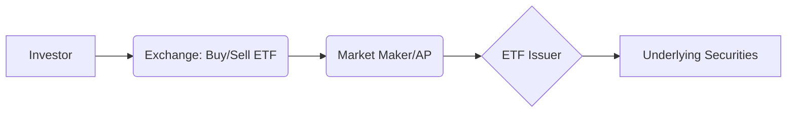

## 1.4 Exchange-Traded Funds (ETFs)

Exchange-Traded Funds (ETFs) are investment vehicles that combine features of both mutual funds and individual stocks. Investors purchase ETF units on a stock exchange, gaining exposure to a diversified basket of assets without needing to hold each security directly. In Canada, ETFs have become increasingly popular among individual investors, financial advisors, and institutional players—such as major pension funds—seeking competitive returns and cost-effective diversification.

Below, we explore how ETFs are structured, their regulatory landscape, and how their unique characteristics can be leveraged within a Canadian wealth management context.

---

## Key Characteristics of ETFs

### Intraday Liquidity

Unlike mutual funds—which can only be purchased or sold at the end-of-day net asset value (NAV)—ETFs are listed on an exchange and can be bought or sold at market prices throughout the trading day. This intraday liquidity allows investors to respond quickly to market events, employing strategies such as tactical asset allocation or short-term adjustments to capture specific market movements.

### Diversification

ETFs generally hold a basket of underlying assets, which can include equities, bonds, commodities, or other securities. By investing in ETFs, an investor can gain broad market exposure without needing to analyze or purchase each component within the ETF’s basket of underlying holdings. This feature is particularly helpful for:

- Small portfolios that need balanced exposure across sectors.  
- Institutional investments requiring swift, large-scale diversification.  
- Allocating funds into specific sectors or themes (e.g., technology, clean energy, dividend-focused).

### Tracking an Index (Passive) or Customized Strategies

Many ETFs seek to replicate the performance of a benchmark index (like the S&P/TSX Composite or the S&P/TSX 60). This is known as passive management or indexing. However, an increasing number of ETFs utilize more nuanced approaches:

1. **Smart Beta:** Blends active and passive investment styles by applying systematic factors (e.g., value, momentum, low volatility) to select and weight securities.  
2. **Active Strategies:** Some ETFs are actively managed, allowing portfolio managers greater leeway in choosing or rotating holdings to potentially outperform a benchmark.  
3. **Thematic Strategies:** Focus on specific themes (e.g., technology disruptors, ESG or responsible investments) that resonate with investor objectives.

### Cost-Effectiveness

Although ETF fees vary, most have lower management expense ratios (MERs) than comparable mutual funds. Common costs include:

- Management fees and operating expenses.  
- Bid-ask spreads when buying or selling ETF units.  
- Potential brokerage commissions—though many brokerage platforms now offer commission-free ETF trades, depending on account size or promotional structures.

Because of their creation/redemption mechanism, ETFs can be more tax-efficient than certain mutual funds by minimizing capital gains distributions to unitholders. However, investors should still monitor tracking error and compare net returns among ETF peers.

---

## Evaluating ETFs in a Canadian Context

### Regulatory Considerations

ETFs in Canada generally fall under National Instrument 81-102 – Investment Funds, which governs mutual funds, ETFs, and other collective investments. Investors should familiarize themselves with:

- **ETF Facts Document:** A concise overview of the fund, including objectives, fees, and risks, mandated by the Canadian Securities Administrators (CSA).  
- **CIRO Requirements:** Canadian Investment Regulatory Organization (CIRO) is the single self-regulatory organization overseeing investment dealers, mutual fund dealers, and the marketplaces. Advisors must abide by CIRO rules when recommending or selling ETFs to clients, ensuring suitability and delivering required disclosure to protect investor interests.

For official regulatory information, reference:  
- National Instrument 81-102 – Investment Funds at the BC Securities Commission (https://www.bcsc.bc.ca)  
- ETF Facts requirement overview from the CSA  
- The CIRO website at https://www.ciro.ca  

### Liquidity and Bid-Ask Spreads

While most large and broad-market ETFs exhibit high liquidity and tight bid-ask spreads, certain niche or specialized strategies (such as sector-specific or thematic ETFs) may trade with less frequency. This lower trading volume can translate into wider bid-ask spreads, raising transaction costs. Advisors should monitor:

1. **Average Trading Volume:** A higher average volume often indicates tighter spreads and improved liquidity.  
2. **Market Maker Activity:** Designated market makers help ensure sufficient liquidity and narrow spreads, especially for popular ETF products.  
3. **Intraday Price Fluctuations:** In periods of high market volatility, intraday premiums or discounts to the ETF’s net asset value may appear.

### Tracking Error

Tracking error measures the deviation between an ETF’s returns and those of its underlying index or stated benchmark. Common reasons for tracking error include:

- **Management Fees:** Deducted from returns.  
- **Sampling Methodology or Optimization:** Instead of holding all component securities, some ETFs select a representative sample to replicate performance.  
- **Cash Drag:** Holding uninvested cash for liquidity or redemption.  
- **Trading Costs & Slippage:** Friction in rebalancing or reacting to changes in the underlying index.

Mathematically, tracking error (TE) is often expressed as:

$$
\text{TE} = \sqrt{\frac{\sum_{t=1}^{n} (R_{\text{ETF},t} - R_{\text{Index},t})^2}{n}}
$$

Where \\( R_{\text{ETF},t} \\) is the ETF’s return at time \\( t \\), and \\( R_{\text{Index},t} \\) is the index return at time \\( t \\). Lower tracking error indicates the ETF more closely follows its benchmark.

### Example: Canadian Pension Fund Usage

Large pension funds in Canada, such as the Canada Pension Plan Investment Board (CPPIB), sometimes use ETFs to achieve short-term exposure to desired market segments or to rebalance quickly while they adjust their direct holdings. These strategies underscore the importance of liquidity, tight spreads, and minimal tracking error—features that allow rapid, cost-effective market entry or exit.

---

## Best Practices for Incorporating ETFs

1. **Understand the Investment Objective:** Determine whether a passive, smart beta, or active ETF aligns with the client’s risk profile and time horizon.  
2. **Assess Costs Thoroughly:** Compare management fees, trading spreads, and potential tax implications to understand the total cost of ownership.  
3. **Check Liquidity and AUM (Assets Under Management):** Larger, more liquid ETFs often have tighter spreads, leading to lower transaction costs.  
4. **Consider the Underlying Basket:** Evaluate geographic or sector exposure, credit quality (for bond ETFs), and weighting methodology (market-cap, factor-based, etc.).  
5. **Be Mindful of Tracking Error:** Pay attention to how closely the ETF adheres to its benchmark—especially crucial for passive portfolios.  
6. **Analyze Distributions and Tax Efficiency:** For Canadian investors, capital gain distributions can differ depending on the fund’s structure and turnover rate.  
7. **Review ETF Facts Documents:** Summaries that disclose essential information in plain language, ensuring transparency and comparability across products.

---

## How ETF Creation and Redemption Works

ETFs are structured with a creation/redemption mechanism that keeps their market price close to their net asset value (NAV). While primarily relevant to authorized participants (large institutional investors), understanding the basic process can help advisors explain ETF pricing and performance.

**Diagram Explanation:**  
1. The Investor buys or sells ETF units on a stock exchange (B).  
2. The Market Maker or Authorized Participant (C) facilitates liquidity, creating or redeeming ETF shares as required with the ETF Issuer (D).  
3. The ETF Issuer (D) directly manages the basket of underlying securities (E). This mechanism aims to keep the ETF’s market price in line with the NAV.

---

## Canadian Real-World Examples

1. **RBC iShares:** A partnership between RBC Global Asset Management and BlackRock iShares, offering a wide range of ETFs tailored to Canadian investors looking for regional or global exposure.  
2. **BMO ETFs:** The Bank of Montreal provides a broad family of ETFs focusing on Canadian and international equities, bonds, and specialized strategies like covered calls.  
3. **TD ETFs:** TD Asset Management has built a spectrum of ETFs covering core asset classes, actively managed funds, and multi-factor smart beta.  
4. **Vanguard Canada ETFs:** Known for low-cost broad market index funds, Vanguard offers a variety of sector, bond, and multi-factor ETFs in Canada.

---

## Pitfalls and Challenges

- **Overconcentration in Narrow ETFs:** Specialized ETFs (e.g., blockchain, cannabis, AI) can be more volatile and illiquid.  
- **Insufficient Due Diligence on Holdings and Rebalancing:** Certain strategies, such as leveraged or inverse ETFs, require frequent portfolio rebalancing, which can increase costs.  
- **Underestimating Tracking Error for Complex Benchmarks:** Smart beta or multi-factor ETFs can deviate more significantly from standard broad-market indexes.  
- **Neglecting Tax Implications:** While ETFs can often be tax-efficient, distributions may still trigger taxable events if held in non-registered accounts.

---

## Additional Resources

- [CIRO](https://www.ciro.ca) – Regulatory updates and information on Canadian investment industry rules.  
- [TMX Money](https://money.tmx.com) – Independent tool for comparing Canadian-listed ETFs.  
- [Yahoo Finance Canada](https://ca.finance.yahoo.com) – Broad financial data, analyst ratings, and ETF screeners.  
- [ETF Provider Sites (e.g., iShares, Vanguard, BMO)] – Offer educational materials, product comparisons, and calculator tools.

---

## Summary and Next Steps

ETFs bridge the benefits of mutual funds—diversification, professional management, and convenient exposure—to a wide range of markets, with the added advantages of intraday tradability and often lower fees. When evaluating ETFs for Canadian portfolios, consider the regulatory environment, liquidity, tracking error, cost structures, and tax implications. Proper diligence combined with a clear investment strategy ensures that ETFs can serve as a powerful component of both short-term tactical plays and long-term strategic asset allocations.

Advisors and investors should continually monitor industry developments, as product offerings expand and new forms of ETFs (e.g., actively managed, ESG-focused) continue to evolve. Staying updated on CIRO regulations and focusing on the ETF Facts documents can help ensure that the chosen products align with client objectives and Canadian compliance standards.

---

## Master Your ETF Knowledge: Top 10 Quiz Questions



### Which of the following best describes the main advantage of ETF intraday trading?

- [x] Investors can buy or sell ETF units on an exchange at market prices throughout the trading day.
- [ ] ETFs always trade at a discount to their net asset value (NAV).
- [ ] ETFs guarantee no tracking error.
- [ ] ETFs are only available after market close.

> **Explanation:** Intraday trading allows investors to enter or exit positions at real-time market prices, providing flexibility not found in end-of-day priced mutual funds.

---

### Which factor commonly leads to tracking error in a passive ETF?

- [x] Management fees and ETF operational costs.
- [ ] Guaranteed zero correlation with the benchmark.
- [ ] Reduced volatility compared to the index.
- [ ] The absence of any creation/redemption process.

> **Explanation:** Management fees, imperfect sampling, and trading costs can cause an ETF's performance to diverge from its underlying index.

---

### What is a potential drawback of investing in narrowly focused or thematic ETFs?

- [x] They may have wider bid-ask spreads and higher volatility.
- [ ] They always track the S&P/TSX Composite.
- [ ] They are exempt from National Instrument 81-102 regulations.
- [ ] They have zero risk of capital loss.

> **Explanation:** Narrow ETFs often have lower trading volumes, leading to wider bid-ask spreads; they can also exhibit higher volatility due to concentrated exposure.

---

### Which of the following is true about costs associated with ETFs?

- [x] ETFs typically have lower MERs compared to traditional mutual funds.
- [ ] ETFs are always free to buy and sell on every brokerage platform.
- [ ] There are no bid-ask spreads in ETF trading.
- [ ] ETFs never distribute capital gains to unitholders.

> **Explanation:** ETFs generally have lower overall costs, but investors incur bid-ask spreads and possible brokerage commissions; some may distribute capital gains.

---

### Why is the creation/redemption mechanism important for ETF price stability?

- [x] It helps the ETF's market price remain close to its net asset value (NAV).
- [ ] It ensures the ETF only trades at a premium.
- [ ] It guarantees zero volatility in the underlying securities.
- [ ] It requires investors to hold the ETF until maturity.

> **Explanation:** Creation and redemption by authorized participants keeps ETFs priced efficiently, as shares are created or destroyed to match demand and maintain NAV alignment.

---

### Under what circumstances might an ETF distribute capital gains to its investors?

- [x] When rebalancing or liquidating a portion of portfolio holdings that have appreciated in value.
- [ ] Never; ETFs do not distribute any profits to investors.
- [ ] Only if the index is outperforming the overall market.
- [ ] When the ETF is entirely redeemed by the market maker.

> **Explanation:** Although ETFs are often tax-efficient, rebalancing or changes to the underlying basket may create taxable capital gains, which can be distributed to unitholders.

---

### Which Canadian regulatory framework governs the rules for ETFs?

- [x] National Instrument 81-102 – Investment Funds.
- [ ] A custom set of unregulated industry guidelines.
- [ ] CIRO has no authority over ETFs.
- [ ] The Canada Pension Plan Act.

> **Explanation:** ETFs in Canada largely operate under the same framework as mutual funds—National Instrument 81-102—overseen by the CSA and CIRO.

---

### What is one benefit of reviewing the ETF Facts document before investing?

- [x] It provides clear, concise details on the ETF’s objectives, costs, and risks.
- [ ] It acts as a binding investment contract with guaranteed returns.
- [ ] It only contains promotional materials from the ETF provider.
- [ ] It replaces the need for professional advice.

> **Explanation:** The ETF Facts document is a simplified, regulator-mandated disclosure designed to help investors understand key information about the ETF in plain language.

---

### How do large Canadian pension funds sometimes use ETFs?

- [x] As a tool for short-term exposure to specific markets or to facilitate quick rebalancing.
- [ ] To eliminate the need for any direct investments in equities or bonds.
- [ ] Strictly for philanthropic activities.
- [ ] To ensure 100% guaranteed returns.

> **Explanation:** Pension funds leverage the liquidity and broad exposure ETFs provide, using them for swift adjustments to asset allocation while more complex direct positions are settled.

---

### True or False: Smart Beta ETFs strictly replicate a standard market-cap index.

- [x] False
- [ ] True

> **Explanation:** Smart Beta ETFs apply factor-based rules (e.g., value, momentum) rather than simply replicating standard market-cap-weighted indexes. They aim to harness systematic drivers of returns.




