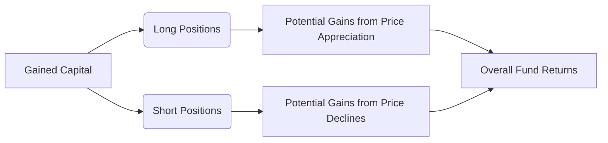

## 1.5 Hedge Funds

Hedge funds are pooled investment vehicles that use advanced investment strategies—such as short selling, leverage, and derivatives—to seek returns that can be uncorrelated with traditional equity or fixed income markets. In many cases, hedge fund managers aim for “absolute returns,” trying to generate positive performance regardless of the overall direction of the capital markets.

In Canada, hedge funds typically operate under prospectus exemptions, meaning formal registration statements (prospectuses) may not be publicly available. Instead, these funds are often marketed to “accredited investors” (see below), creating both unique opportunities and risks. The advanced strategies offered by hedge funds can be compelling for investors diversifying beyond standard mutual funds or exchange-traded funds (ETFs). However, hedge funds also carry higher costs, often involve limited liquidity, and come with significant risk—making them suitable only for specific client profiles.

---

## Defining Characteristics of Hedge Funds

### Flexible Mandates and Strategies

A core attraction of hedge funds is their flexibility. Unlike traditional mutual funds, hedge funds are not strictly bound to remain fully invested in equities or bonds. This broader mandate enables diverse strategies:

- Long/Short Equity: Buying undervalued equities while shorting overvalued ones.  
- Event-Driven: Investing based on corporate events such as mergers, acquisitions, or restructurings.  
- Global Macro: Making macroeconomic bets using derivatives on currencies, bonds, or commodities.  
- Distressed Debt: Targeting securities issued by companies in or near bankruptcy.  

With the freedom to employ strategies such as short selling (profiting from declining security prices) and to use derivatives for leverage, hedge funds can exploit opportunities unavailable to more traditional, heavily regulated funds.

### Increased Risk and Volatility

This flexibility also introduces higher risk. Hedge fund managers can employ leverage, magnifying both potential gains and losses. Short selling can lead to theoretically unlimited losses if the shorted asset unexpectedly appreciates. Performance may also hinge on the manager’s ability to predict and navigate rapidly changing market conditions—success or failure can lead to large swings in returns.

### Common Fee Structure: “2 and 20”

Hedge fund fees typically include:

1. A management fee (often around 2% of assets under management).  
2. A performance-based fee (commonly around 20% of the fund’s profits), sometimes subject to a “high-water mark” that ensures fees are charged only on new net profits.

While the performance fee may align the manager’s interests with investors, it also increases the cost of investing in hedge funds. Advisors should carefully assess the overall expense structure and its potential impact on a client’s long-term returns.

---

## Hedge Funds in the Canadian Context

### Regulatory Environment

In Canada, hedge funds are generally sold under one or more exemptions outlined in National Instrument 45-106 of the Canadian Securities Administrators (CSA). Typical exemptions include the “accredited investor” and “minimum amount” exemptions, which limit hedge fund sales to clients meeting specified income or net worth thresholds.

> **Important:**  
> The Canadian Investment Regulatory Organization (CIRO) governs market conduct and enforces suitability standards for investments—including hedge funds. Although hedge funds remain outside the realm of publicly offered mutual funds, CIRO still requires dealers and advisors to ensure any alternative product recommendation is aligned with the investor’s risk tolerance, investment objectives, and overall financial profile.

**Key Regulatory Points:**

- Accredited Investor Status: Investors normally must meet specific income or net worth requirements to qualify.  
- Offering Documents: Investors typically receive a private placement memorandum (PPM) outlining the fund’s strategy, fees, and risks.  
- Lock-Up Periods: Many hedge funds have a specified lock-up period (e.g., 6 to 12 months) restricting redemptions.  
- Risk Disclosure: Advisors must provide risk disclosure consistent with CSA and CIRO rules, ensuring clients understand the fund’s complexity and potential volatility.

### Tax Considerations

Depending on the fund’s legal structure (often a limited partnership or trust in Canada), hedge fund income can be distributed to investors in different forms—such as capital gains or partnership income. Each of these distributions may carry distinct tax implications. Investors should seek specialized tax advice, as hedge fund strategies can generate significant short-term capital gains or other taxable events.

### Role in Canadian Portfolios

Canadian pension funds, such as the Canada Pension Plan Investment Board (CPPIB) and Ontario Teachers’ Pension Plan (OTPP), have long maintained allocations to hedge funds in pursuit of uncorrelated and absolute returns. Similarly, certain larger Canadian banks (e.g., RBC, TD, BMO) may incorporate hedge fund investments within proprietary products or offer them to institutional clients.

For retail or high-net-worth Canadian investors, hedge funds can serve as part of an “alternative investments” sleeve within a diversified portfolio, potentially smoothing volatility or providing returns that differ from traditional equities and bonds. However, the advisor must confirm that the investor satisfies accredited investor criteria and that both the fund strategy and liquidity constraints align with the client’s financial goals.

---

## Understanding Advanced Strategies

Below is a simplified depiction of some hedge fund strategies using a flowchart:

**Explanation:**  
• The hedge fund pools investor capital (A).  
• Managers invest in various positions (B for long positions, C for short positions).  
• Profit or loss in each of these positions contributes to overall fund returns (F).  

---

## Due Diligence and Best Practices

Because hedge funds operate with fewer restrictions and higher complexity, thorough due diligence is vital:

1. **Manager Background:** Evaluate the manager’s track record, professional credentials, and overall reputation.  
2. **Strategy Alignment:** Ensure the hedge fund’s focus—long/short equity, global macro, event-driven, or a blend—matches the investor’s objectives.  
3. **Risk Controls:** Investigate how the manager handles risk, monitors leverage, and employs hedging.  
4. **Operational Infrastructure:** Review the fund’s service providers (auditors, administrators, prime brokers) to confirm adequate operational controls.  
5. **Redemption Terms and Liquidity:** Clarify lock-up provisions and redemption frequency, especially for clients who may need quick access to their capital.  
6. **High-Water Mark Provisions:** Check how performance fees are calculated to ensure they are charged on new net profits only.  

> **Tip:**  
> Seek out third-party research, such as reports from the Alternative Investment Management Association (AIMA) or specialized hedge fund consultancies. Their analyses often provide in-depth viewpoints on risk metrics, liquidity, and historical performance behavior.

---

## Potential Pitfalls

1. **Leverage and Volatility:** Leverage magnifies returns, both positive and negative, potentially leading to sudden drawdowns.  
2. **Limited Liquidity:** Many hedge funds restrict exits, so clients may be “locked in” for a period.  
3. **High Fees:** The traditional “2 and 20” fee structure can significantly erode net returns, especially in mediocre performance years.  
4. **Strategy Drift:** Hedge fund mandates can be flexible. A manager with broad authority can deviate from a stated strategy, potentially increasing unexpected risks.  
5. **Operational Risks:** Hedge funds can face operational failures, fraud, or inadequate back-office controls.  

Advisors must ensure clients fully understand these risks and are positioned to sustain potential losses without jeopardizing their financial goals.

---

## Suitability Considerations

### Matching Client Profiles

Hedge funds cater to experienced investors, often with significant investable assets and stable cash flow. As an advisor, you must:

- Confirm the client meets accredited investor requirements under National Instrument 45-106.  
- Evaluate the client’s tolerance for potential losses.  
- Assess the time horizon to ensure the client can handle a lock-up period.  
- Confirm the investor’s familiarity with complex strategies, derivatives, and use of leverage.  

### Recommendations and Compliance

Given the specialized nature of hedge funds, advisors should:

- Document the rationale for recommending hedge funds in the client file.  
- Cross-reference the client’s Know-Your-Client (KYC) profile to ensure suitability.  
- Offer a clear explanation of fees, redemption rights, and performance risk.  

> **Pitfall:**  
> Providing incomplete disclosures around redemption policies and lock-up periods can lead to regulatory issues and erode client trust. Always be transparent about restrictions and associated liquidity risks.

---

## Practical Steps for Advisors

1. **In-Depth Discovery:** During client discovery, identify any interest in alternative investments and confirm if the client meets accredited investor criteria.  
2. **Educational Discussions:** Use plain language to explain short selling, leverage, and other hedge fund strategies.  
3. **Risk-Return Profiling:** Quantify potential downside scenarios to test the client’s ability to withstand higher volatility.  
4. **Compare Fees and Performance:** Present net-of-fee returns and apply scenario analysis.  
5. **Coordinate with Tax Specialists:** If the client invests in a hedge fund structured as a partnership or trust, coordinate with a tax advisor to interpret any T5013 or T3 slips.  
6. **Review Ongoing Suitability:** Monitor the hedge fund’s performance, strategy changes, and any regulatory shifts (e.g., CIRO updates), and regularly evaluate whether the investment remains aligned with the client’s profile.

---

## Glossary of Key Terms

- **Short Selling:** Selling a security not currently owned—borrowing it with the expectation of buying it back later at a lower price, aiming to profit from price declines.  
- **Accredited Investor:** An individual or entity meeting specific net worth or income requirements, allowing them to purchase exempt market securities such as hedge funds.  
- **Leverage:** Using borrowed money or derivatives to boost potential returns (and amplify risk).  
- **Absolute Return Strategy:** Aims to generate positive returns in various market conditions, rather than outperforming a benchmark index.  
- **Lock-Up Period:** A time span during which an investor’s capital cannot be redeemed from the fund.  
- **High-Water Mark:** A fee calculation method ensuring performance fees apply only on gains beyond the previous peak in net asset value.  
- **Private Placement Memorandum (PPM):** A document outlining a hedge fund’s strategy, risk factors, fees, and legal structure.  
- **Due Diligence:** A rigorous assessment of the fund’s manager, strategy, track record, risk management, and operations.

---

## Additional Resources

- **Canadian Securities Administrators (CSA)**:  
  Review National Instrument 45-106 for regulations around hedge fund offerings.  
- **Canadian Investment Regulatory Organization (CIRO)**:  
  For ongoing rule updates and guidelines on product suitability, visit [ciro.ca](https://www.ciro.ca).  
- **Alternative Investment Management Association (AIMA)**:  
  Publishes in-depth reports, best practices, and industry data on hedge funds.  
- **Further Study**:  
  • “Hedge Funds: Quantitative Insights” by François-Serge L’habitant  
  • Courseload from recognized Canadian universities with alternative investment electives  
  • CFA Institute’s “Alternative Investments” curriculum for rigorous academic coverage  

---

## Summary

Hedge funds represent an advanced, and often more complex, segment of the asset management universe. Their potential to generate uncorrelated or absolute returns can form a valuable diversification tool in a broader portfolio. Still, the high fees, lock-up periods, regulatory restrictions, and greater volatility demand a careful suitability assessment. Canadian advisors should follow CIRO’s requirements to ensure hedge fund recommendations align with clients’ investment objectives, risk profile, and financial sophistication. By performing thorough due diligence and offering transparent communication, advisors can help qualified clients effectively incorporate hedge funds into their wealth management strategies.

---

## Evaluate Your Hedge Fund Knowledge: Strategies, Risks, and Regulations



### Which of the following best describes the typical fee structure for a hedge fund?

- [ ] 1% management fee, no performance fee
- [ ] 0.5% management fee, 10% performance fee
- [x] 2% management fee, 20% performance fee
- [ ] 5% management fee, no performance fee

> **Explanation:**  
> Hedge funds commonly charge a base fee of about 2% of assets under management and around 20% of any profits, aligning manager compensation with fund performance.

---

### Which of the following strategies aims to profit from both rising and falling stock prices?

- [x] Long/short equity
- [ ] Distressed debt
- [ ] Passive index tracking
- [ ] Buy and hold

> **Explanation:**  
> Long/short equity strategies involve buying undervalued stocks (long) and shorting overvalued stocks to generate returns from both upward and downward price movements.

---

### What is a “lock-up period” in hedge funds?

- [ ] A period in which fees are not charged
- [x] A timeframe where an investor’s capital cannot be redeemed
- [ ] A penalty imposed for redeeming units early
- [ ] A guarantee that the value will not fall below a certain threshold

> **Explanation:**  
> Many hedge funds have lock-up periods, during which investors cannot withdraw or redeem their capital. This helps the fund manager implement long-term strategies without worrying about short-term redemptions.

---

### Why might an advisor recommend hedge funds to a client’s portfolio?

- [ ] To guarantee outperformance of the TSX Composite Index
- [ ] To reduce fees relative to mutual funds
- [x] To add diversification through uncorrelated or absolute return strategies
- [ ] To ensure absolute safety from market downturns

> **Explanation:**  
> Hedge funds can provide diversification benefits because their strategies often have low correlation with traditional markets, potentially smoothing overall portfolio volatility.

---

### Which of the following is typically required for an individual to invest in a hedge fund under National Instrument 45-106?

- [x] Accredited investor status based on income or net worth
- [ ] No net worth or income requirements
- [ ] A minimum age of 65
- [ ] A mandatory 12-year holding period

> **Explanation:**  
> In Canada, most hedge funds are sold under exemptions that typically require an investor to meet certain “accredited investor” thresholds for income or net worth.

---

### What is the primary risk associated with short selling?

- [x] Losses can theoretically be unlimited if the shorted security rises in price
- [ ] The investor earns dividends
- [ ] Gains are always capped at the current market price
- [ ] It involves no counterparty risk

> **Explanation:**  
> In a short sell, if the security’s price rises instead of falls, the position can generate theoretically unlimited losses, as the share price has no upper limit.

---

### Which of the following is an example of due diligence before investing in a hedge fund?

- [x] Reviewing the manager’s track record and operational infrastructure
- [ ] Assuming past performance guarantees future results
- [ ] Relying solely on marketing materials
- [ ] Ignoring the fund’s private placement memorandum

> **Explanation:**  
> Proper due diligence involves reviewing a hedge fund’s management team, track record, risk processes, and operational setup, including auditing and administration.

---

### In the Canadian context, which organization oversees market conduct and suitability rules for hedge fund recommendations?

- [ ] The defunct Investment Industry Regulatory Organization of Canada (IIROC)
- [x] The Canadian Investment Regulatory Organization (CIRO)
- [ ] The Mutual Fund Dealers Association (MFDA)
- [ ] The Commodity Futures Trading Commission (CFTC)

> **Explanation:**  
> CIRO is the national self-regulatory organization formed by amalgamating IIROC and MFDA. It oversees investment dealers, mutual fund dealers, and regulates market integrity in Canada.

---

### How can a "high-water mark" benefit hedge fund investors?

- [ ] Ensures performance fees are applied regardless of fund losses
- [x] Prevents the fund manager from charging performance fees on the same gains more than once
- [ ] Guarantees a fixed rate of return
- [ ] Eliminates the management fee

> **Explanation:**  
> A high-water mark prevents the manager from earning performance fees until the fund’s value has surpassed its previous peak, ensuring fees aren’t charged multiple times for regaining lost ground.

---

### Hedge funds are considered most suitable for investors who can tolerate:

- [x] Higher volatility and potential lack of liquidity
- [ ] Guaranteed principal repayment
- [ ] Zero management fees
- [ ] Minimal dependence on fund manager skill

> **Explanation:**  
> Hedge funds typically carry higher levels of risk, can have lock-up periods that limit liquidity, and rely on active management strategies. They suit more experienced, higher net worth clients who can tolerate these factors.


