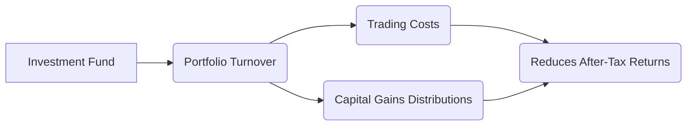

## 1.6 Fees, Portfolio Turnover, and Taxes

Effective wealth management requires a solid understanding of how fees, portfolio turnover, and taxation interact to influence the performance of managed products. In Canada, mutual funds, exchange-traded funds (ETFs), wrap accounts, and hedge funds have distinct fee structures, turnover profiles, and tax implications. This section explains these critical components, illustrates how they affect investment returns, and highlights strategies to help clients optimize their after-tax outcomes.

---

### Understanding Fund Fee Structures

Fees are a key factor influencing the net return of any managed product. These fees typically compensate the investment manager for portfolio management, research, and operational costs.

1. **Management Expense Ratio (MER)**  
   - The MER is the annual percentage of a fund’s assets that covers management fees, administrative costs, and other expenses. For instance, many Canadian mutual funds charge MERs ranging from 1% to 3%.  
   - A higher MER means higher ongoing costs for investors, reducing net returns over time.

2. **Performance Fees**  
   - Some funds (notably hedge funds) charge performance fees, often calculated as a percentage (e.g., 20%) of the fund’s profits above a specified benchmark or hurdle.  
   - While this structure can align manager and investor interests, it can also result in significantly higher fees for investors if the fund performs well.

3. **Sales Charges**  
   - Traditional mutual funds might impose front-end loads (charged upon purchase) or deferred sales charges (charged upon redemption). Although less common today, they still exist and must be clearly disclosed to investors.  

4. **Fee Disclosure Statements**  
   - In Canada, regulations under the Canadian Investment Regulatory Organization (CIRO) require transparency in disclosing all fees and charges.  
   - It's essential to review the Fee Disclosure Statement for each product to ensure clients understand the full cost structure.

---

### Portfolio Turnover: Impact on Costs and Taxes

**Portfolio Turnover Rate** measures how frequently a fund replaces its holdings within a single year. A 100% turnover rate means the entire portfolio has been replaced once during that year.

- **Trading Costs:** Higher turnover leads to increased trading commissions and bid-ask spreads, which can erode fund performance. Though these costs are not always captured in the MER, they still affect overall returns.  
- **Distribution of Capital Gains:** A fund with frequent trading may realize more capital gains. These gains must be distributed to unitholders, creating potential tax liabilities—even if the investor has not sold their own fund units.

**Diagram Explanation:**  
The mermaid diagram above illustrates how a fund’s turnover can increase trading costs and capital gains distributions, ultimately diminishing the investor’s net (after-tax) returns.

---

### Tax Implications for Canadian Investors

In Canada, taxation on fund distributions and capital gains plays a crucial role in determining actual net returns.

1. **Types of Fund Distributions**  
   - **Interest Income:** Paid from fixed-income securities in the fund; taxed at the investor’s marginal tax rate.  
   - **Dividends:** Qualifying Canadian dividends receive a dividend tax credit, which reduces the effective tax rate.  
   - **Capital Gains:** Gain distributions from a fund’s profitable trades can be taxed at 50% of the investor’s marginal tax rate.  
   - **Return of Capital (ROC):** Some funds distribute amounts characterized as ROC, which lowers the investor’s adjusted cost base (ACB) rather than incurring immediate taxes.

2. **Capital Gains on Sale of Fund Units**  
   - When an investor sells fund units at a profit, the realized capital gain is taxed at 50% of the marginal rate.  

3. **Foreign Withholding Tax**  
   - If the fund invests in non-Canadian securities, foreign governments may withhold tax on dividends or interest before distributing returns to the fund.  
   - The effective yield might be reduced. In some cases, a foreign tax credit may offset part of the withholding tax.

4. **Registered Plans and Tax Deferral**  
   - **RRSP (Registered Retirement Savings Plan):** Contributions are tax-deductible and investment income grows tax-deferred until withdrawal.  
   - **TFSA (Tax-Free Savings Account):** Contributions are made with after-tax dollars, but all future income and withdrawals are tax-free.  
   - **RESP (Registered Education Savings Plan) & RDSP (Registered Disability Savings Plan):** Provide similar tax benefits for specific goals.  

**Tip:** Place interest-bearing or high-turnover investments inside tax-deferred or tax-free accounts (e.g., RRSP or TFSA) to minimize the impact of annual taxes on distributions.

---

### Impact of Fees, Turnover, and Taxes on Returns

The equation below simplifies how fees, turnover, and taxes reduce overall returns. Suppose your fund has a gross return \\( r \\), an expense ratio \\( f \\), and an effective tax rate \\( t \\) on distributions and capital gains:

$$
\text{After-Fee, After-Tax Return} = (r - f) \times (1 - t)
$$

While this is a simplified illustration, it highlights the compounding impact of fees and taxes over time.

---

### Real-World Canadian Examples

1. **Case Study: RBC Canadian Equity Fund**  
   - Suppose an RBC Canadian Equity Fund charges an MER of 2%. Over time, if the equity portfolio achieves an 8% gross annual return, the net pre-tax return is approximately 6%.  
   - If the investor’s marginal tax rate on dividends and capital gains is 30% (blended due to various sources), the net return after tax might be closer to 4.2%. This demonstrates how a seemingly modest 2% MER can lead to a sizable reduction in overall returns.

2. **Canadian Pension Funds**  
   - Large Canadian pension funds, like the Canada Pension Plan Investment Board (CPPIB), aim to keep fees low through direct ownership strategies and internally managed portfolios. They also use strategies to minimize turnover, thus lowering transaction costs and potential tax events.  

3. **High Turnover Example**  
   - In a hypothetical BMO Balanced Fund with a 100% turnover rate, the trading costs and frequent capital gains distributions boost annual tax liability for unitholders. Even if the gross performance looks strong, the after-tax return can be significantly lower than a lower-turnover alternative.

---

### Strategies to Minimize Fees and Improve After-Tax Returns

1. **Select Low-Cost Products**  
   - **ETFs vs. Mutual Funds:** ETFs often have lower MERs compared to traditional mutual funds.  
   - **Index Funds:** Passive index funds typically reduce turnover and can help mitigate high trading costs.

2. **Effective Use of Registered Accounts**  
   - Contribute to RRSPs to defer tax on income and capital gains, allowing for tax-sheltered growth.  
   - Utilize TFSAs for investments likely to incur high capital gains or distributions.

3. **Understand Performance Fees**  
   - Investigate if the fund’s performance fees are justified by consistent outperformance or unique investment strategies.

4. **Systematic Withdrawal Strategies**  
   - Retirees might consider withdrawing from specific accounts to manage overall taxable income each year.

5. **Ongoing Portfolio Reviews**  
   - Regularly review your holdings to ensure that fees remain competitive, turnover is appropriate for the strategy, and distributions are optimized from a tax perspective.

---

### Best Practices, Pitfalls, and Challenges

- **Important:** Always compare the fund’s objective, management style, and fees against similar products. A high MER may be acceptable if the fund consistently outperforms net of fees.  
- **Pitfall:** Focusing solely on total return without factoring in taxes can mislead investors. Tax liabilities on distributions can significantly reduce net gains.  
- **Challenge:** Market changes (e.g., interest rate hikes or currency fluctuations) can alter the benefits of certain assets inside particular account types (e.g., foreign bonds in an RRSP versus a TFSA).

---

### Resources and Regulatory References

- **CRA (Canada Revenue Agency):**  
  Review updated guidelines on mutual funds, ETFs, and investment income at  
  [https://www.canada.ca/en/revenue-agency.html](https://www.canada.ca/en/revenue-agency.html)

- **CIRO (Canadian Investment Regulatory Organization)**  
  CIRO oversees investment dealers, mutual fund dealers, and marketplace integrity. Access resources at  
  [https://www.ciro.ca](https://www.ciro.ca)

- **National Instrument 81-105 – Mutual Fund Sales Practices:**  
  Outlines rules aimed at minimizing conflicts of interest in distributing mutual funds.

- **KPMG’s “Tax Planning for You and Your Family”:**  
  Comprehensive guide on Canadian tax strategies.

- **Online Calculators:**  
  - Broker-provided tools or CRA tax calculators can help compare after-fee, after-tax returns to test different scenarios.

---

### Glossary of Key Terms

- **Portfolio Turnover Rate:** Percentage of a fund’s portfolio replaced in a given period.  
- **Capital Gains Distribution:** Taxable distribution of profits from selling securities within a fund.  
- **Interest Income:** Earnings from fixed-income securities (government bonds, corporate bonds, GICs), taxed at marginal rates.  
- **Tax-Advantaged Accounts:** Accounts offering tax benefits, e.g., TFSAs (tax-free growth) or RRSPs (tax-deferred growth).  
- **Deferred Taxation:** Delays tax payment on investment gains until withdrawal (common in RRSPs).  
- **Withholding Tax:** A portion withheld by foreign governments on cross-border dividend or interest payments.  
- **Marginal Tax Rate:** The rate of tax applied to the next dollar of taxable income.  
- **Fee Disclosure Statement:** Document outlining fees, commissions, and other charges tied to the investment.

---

### Summary

Fees, portfolio turnover, and taxes have a collective and compounding effect on returns from Canadian managed products. A well-informed approach—focusing on competitive fees, managed turnover, and tax-smart asset location—helps investors maximize after-tax outcomes. Armed with knowledge of registered accounts and relevant regulations, advisors can guide clients toward a portfolio structure that aligns with their long-term investment goals.

---

## Maximize Returns: Test Your Knowledge on Fees, Turnover, and Taxes



### Which type of fee is charged as a percentage of a fund’s ongoing operating costs and management expenses?

- [x] Management Expense Ratio (MER)
- [ ] Deferred Sales Charge
- [ ] Performance Fee
- [ ] Sales Load

> **Explanation:** The MER includes management fees and running costs. It’s expressed as a percentage of the fund’s assets.

---

### A higher portfolio turnover rate in a managed product typically leads to:

- [x] Higher trading costs and more capital gains distributions
- [ ] Lower overall fee disclosure obligations
- [ ] Greater tax-deferred growth
- [ ] No measurable impact on after-tax returns

> **Explanation:** Funds with higher turnover incur increased transaction costs and realize more gains, meaning more taxable distributions for investors.

---

### Which of the following is NOT typically included in a mutual fund’s MER?

- [x] Embedded capital gains tax
- [ ] Management fees
- [ ] Operational costs
- [ ] Administrative fees

> **Explanation:** Capital gains tax is borne by the unitholder upon distributions or sale of units and is not included within the MER.

---

### What is a key benefit of placing high-yielding investments in an RRSP or TFSA?

- [x] Deferring or eliminating tax on distributions
- [ ] Reducing the fund’s MER
- [ ] Eliminating the risk of capital loss
- [ ] Guaranteeing outperformance of the market index

> **Explanation:** RRSPs and TFSAs allow income to grow tax deferred (RRSP) or tax free (TFSA), reducing immediate tax burdens.

---

### Which Canadian organization currently oversees investment dealers, mutual fund dealers, and marketplace integrity?

- [x] CIRO
- [ ] MFDA (defunct)
- [x] IIROC (defunct)
- [ ] OSFI

> **Explanation:** MFDA and IIROC were amalgamated; CIRO is the present self-regulatory organization.

---

### An investor holds a fund that has realized large capital gains but has not sold their fund units. Which statement is true?

- [x] The investor may still face a taxable distribution.
- [ ] No tax is owed until the investor redeems units.
- [ ] All distributions are taxed as interest income.
- [ ] These gains are tax-exempt under Canadian law.

> **Explanation:** Mutual funds must distribute net realized capital gains to unitholders annually, even if they keep their units.

---

### Placing foreign dividend-paying securities in a TFSA may still result in:

- [x] Foreign withholding tax
- [ ] Tax-free foreign dividends
- [x] Immediate Canadian tax deduction
- [ ] Conversion to capital gains

> **Explanation:** Dividend income from non-Canadian sources is often subject to foreign withholding tax, even in a TFSA.

---

### What advantage do index funds typically offer in terms of turnover?

- [x] Lower turnover due to passive management
- [ ] Higher turnover to capture momentum
- [ ] Turnover rates matching hedge funds
- [ ] Turnover has no effect on index funds

> **Explanation:** Index funds follow a benchmark, so fewer trades are made, resulting in lower turnover and potentially lower costs and distributions.

---

### How can capital gains distributions affect an investor’s ACB (Adjusted Cost Base)?

- [x] They do not directly change the ACB, but Return of Capital distributions do.
- [ ] They increase the ACB by the amount of the distribution.
- [ ] They reset the ACB to zero.
- [ ] They never have any tax implications.

> **Explanation:** Capital gains distributions are taxable events for the investor, but the ACB is generally unaffected by them. Return of Capital, on the other hand, reduces the ACB.

---

### If a fund has a gross return of 8% and an MER of 2%, what is the investor’s net return before taxes?

- [x] 6%
- [ ] 2%
- [ ] 8%
- [ ] 10%

> **Explanation:** Net return before taxes is calculated as gross return minus expenses: 8% - 2% = 6%.




