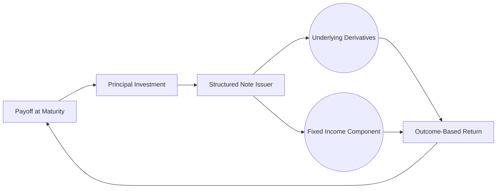

## 1.8 Outcome-Based Investments

### Introduction
Outcome-based investments aim to deliver specific objectives—such as principal protection, a defined income level, or a pre-set return target—rather than simply outperforming a benchmark index. These solutions often appeal to clients who have very clear and time-sensitive financial goals. For instance, a soon-to-retire investor who wants to protect principal while still seeking modest growth might find outcome-based strategies attractive.

However, building an outcome-based portfolio typically involves complex instruments and structures, including derivatives, insurance-like features, or alternative strategies. While outcome-based solutions can mitigate certain risks, they often come with higher fees, lock-up provisions, additional credit risk, and constraints on potential upside. As such, any recommendation must be carefully evaluated for suitability, cost-effectiveness, and alignment with the client’s overall wealth plan.

### Key Features and Components
Outcome-based products are intentionally designed to deliver predictable results under certain market conditions. Below are some commonly used structures and features:

1. **Structured Notes**  
   - Combine debt instruments (from issuers like major banks) with derivatives.  
   - Can limit downside risk or target a specific payoff at maturity.  
   - Subject to the credit risk of the issuing financial institution.

2. **Segregated Funds**  
   - Insurance contracts providing guarantees (e.g., a minimum maturity or death benefit).  
   - Often include locked-in periods (or “reset” dates) and a variety of fee schedules.  
   - Regulated in Canada under insurance legislation and overseen by the Office of the Superintendent of Financial Institutions (OSFI).

3. **Defined Outcome Strategies**  
   - Limit the upside (e.g., a cap on returns) while offering protection on the downside.  
   - May be packaged in exchange-traded products or private funds.  
   - Often involve options-based strategies to shape the payoff profile.

4. **Guaranteed Minimum Withdrawal Benefits (GMWBs)**  
   - A feature commonly added to variable annuities or segregated funds.  
   - Guarantees a minimum income stream regardless of market volatility.  
   - Fees are typically higher to account for the insurer’s risk exposure.

### When Are Outcome-Based Investments Used?
Outcome-based strategies can be highly relevant in scenarios such as:

- Clients approaching retirement who want to protect accumulated capital.  
- Investors seeking to lock in a structured form of income over a specific time horizon.  
- Individuals with a low risk tolerance but needing some exposure to potential market gains.  
- Estate planning situations requiring guarantees for a surviving spouse or beneficiaries.

A relevant example seen among large Canadian pension funds involves implementing liability-driven investing (LDI) strategies, where the main goal is to match pension liabilities rather than outperform a traditional market benchmark. This approach effectively targets a specific "outcome": ensuring liabilities are fully funded. Although pension funds often employ custom derivatives, the principle parallels retail-level outcome-based strategies.

### Complexity and Costs
Outcome-based investments tend to be more complex than traditional mutual funds or broadly diversified portfolios. Some key considerations include:

- **Higher Fees and Expenses**: Additional layers of derivatives, insurance, and professional structuring often lead to elevated expense ratios.  
- **Limited Liquidity**: Many products impose lock-up periods or higher redemption fees.  
- **Complex Payoff Structures**: The final returns may depend on multiple factors (market index performance, interest rates, issuer’s creditworthiness).  
- **Potential Opportunity Cost**: By focusing on specific outcomes, investors may forgo higher returns if markets significantly rally.

### Suitability and Risk Assessment
Under current regulations enforced by the Canadian Investment Regulatory Organization (CIRO), investment dealers in Canada must perform thorough suitability and know-your-client (KYC) analyses before recommending outcome-based products. Some key dimensions for a suitability assessment include:

1. **Risk Tolerance**  
   - Clients with a lower appetite for volatility may be drawn to guaranteed or buffered structures.  
   - Conversely, clients who can tolerate higher volatility might find these products limiting.

2. **Investment Goals**  
   - Defined outcome strategies often align with a specific target date or event, such as funding a child’s education or retiring in five years.  
   - Advisors should match the product term to the client’s timeframe to avoid early redemption penalties.

3. **Cost-Benefit Analysis**  
   - Compare potential benefits—like downside protection or steady income—to higher fees.  
   - Conduct a breakeven analysis to illustrate whether the insurance-like features justify the costs.

4. **Credit and Counterparty Risk**  
   - Structured notes or insured outcomes rely on issuers’ financial strength.  
   - Investors should evaluate the credit rating of the sponsoring bank or insurance company.

### Disclosure and Client Education
While marketing materials for outcome-based products highlight the protection or targeted returns, advisors must ensure clients fully understand the product’s conditions and potential risks. The following disclosures are crucial:

- **Terms and Characteristics**  
  Clearly outline the product term (lock-up period), the conditions under which protection or guaranteed income applies, and the circumstances that might lead to partial or no protection.

- **Risks**  
  Emphasize market risk (possibly limited but still present), credit risk of the issuer, fees, potential tax implications, and what happens if the product is redeemed prematurely.

- **Fees and Costs**  
  Demonstrate how any additional layer of costs, such as derivative premiums or insurance charges, can reduce the net return.

### Canadian Market Examples
Major Canadian banks (RBC, TD, BMO, and others) often issue structured notes that incorporate principal protection and exposure to underlying benchmarks, such as the S&P/TSX 60 Index. These notes are marketed to retail investors seeking to participate in equity markets while safeguarding part or all of their principal at maturity.

Similarly, segregated fund products from nationally recognized life insurers (e.g., Canada Life, Sun Life) offer capital guarantees upon death or maturity. These offerings have grown popular among clients seeking some downside safety in volatile markets, with the trade-off being higher MERs (management expense ratios) relative to conventional mutual funds.

### Sample Outcome-Based Structure
Below is a simple mermaid diagram depicting how funds flow in a structured note:

- The investor allocates principal to the structured note issuer (e.g., a Canadian bank).  
- The issuer invests in a combination of fixed income instruments and derivatives tied to an index or a basket of assets.  
- Upon maturity, the structured note provides an outcome-based payoff (e.g., principal plus some participation rate in market growth).  

### Step-by-Step Approach to Implementing Outcomes in a Canadian Portfolio
1. **Define Client Objectives**  
   - Identify the precise outcome—principal protection, guaranteed annual withdrawal, or a capped level of growth.

2. **Select Appropriate Structures**  
   - Evaluate whether a structured note, segregated fund with guarantees, or a combination of yield- and growth-focused products best suits the outcome.

3. **Analyze Product Features**  
   - Review the prospectus, issuer’s credit rating, fees, and performance track record of similar previous tranches (if applicable).

4. **Incorporate into Asset Allocation**  
   - Consider how outcome-based solutions interact with existing assets.  
   - Balance liquidity needs versus lock-up periods.

5. **Assess Tax Implications**  
   - Consult the Canada Revenue Agency (CRA) rules on how gains, distributions, or payouts are taxed.  
   - Some structured notes may convert what would have been interest income into capital gains (or vice versa).

6. **Monitor Periodically**  
   - Outcome-based structures may have interim resets or performance thresholds.  
   - Advise clients on how any changes to personal circumstances might affect the product’s suitability.

### Regulatory and Tax Considerations
1. **CIRO Suitability Rules**  
   - CIRO stipulates robust KYC, know-your-product (KYP), and suitability obligations.  
   - This means thoroughly documenting a client’s objectives, financial circumstances, and risk tolerance.

2. **OSFI Guidance on Insurance-Backed Products**  
   - Segregated funds and other guaranteed insurance contracts fall under OSFI oversight for federally regulated insurers.  
   - OSFI issues guidelines that insurers must follow to ensure solvency and transparency.

3. **CRA Tax Rules**  
   - Income from structured notes may be classified as interest income, capital gains, or a combination.  
   - Advisors must confirm that the payoff structure is aligned with the client’s tax strategy.

### Important Formula: Structured Note Payoff
A typical structured note with partial principal protection might promise:

$$
\text{Final Value} = P_0 + \max(0, \alpha \times (\text{Index}_T - \text{Index}_0))
$$

- \\( P_0 \\) = the principal portion (often protected at 100% or slightly less).  
- \\( \alpha \\) = participation rate in the index’s performance.  
- \\( \text{Index}_T \\) = the underlying index level at maturity.  
- \\( \text{Index}_0 \\) = the underlying index level at issuance.

The investor’s upside is limited by \\(\alpha\\), while the principal is fully or partially guaranteed, subject to the issuing bank’s creditworthiness.

### Best Practices and Pitfalls
#### Best Practices
- **Comprehensive Planning**: Integrate outcome-based investments with broader retirement or estate plans, rather than treating them as standalone solutions.  
- **Regular Monitoring**: Track how the product is performing relative to the expected outcome.  
- **Diversification**: Avoid concentrating a large portion of the portfolio in one structured product or issuer.

#### Common Pitfalls
1. **Overlooking Credit Risk**: Even a 100% principal-protected note can default if the issuer becomes insolvent.  
2. **Underestimating Fees**: High costs erode net returns, especially over longer lock-up periods.  
3. **Ignoring Liquidity Needs**: Clients may require capital unexpectedly, and the product’s lock-up or redemption penalties can be prohibitive.  
4. **Misaligned Time Horizons**: Maturing too late or too early can undermine the intended benefit.

### Additional Resources
- **CIRO (https://www.ciro.ca)** for compliance standards and member guidance on outcome-based product sales.  
- **CFA Institute** for articles and research reports on structured products and defined outcome solutions.  
- **OSFI Guidelines** on capital adequacy and risk management for insurers offering segregated funds (https://www.osfi-bsif.gc.ca).  
- **Structured Products in Wealth Management**: A recommended book that dives deeply into structured product mechanics and case studies.

### Conclusion
Outcome-based investments provide a powerful tool for targeting precise financial goals, especially for clients with near-term objectives such as retirement or wealth transfer. By combining traditional assets with derivatives, insurance wrappers, or other contractual guarantees, these strategies can mitigate certain market risks while delivering a defined payoff structure. However, outcome-based solutions are neither guaranteed against losses (except as contractually stated and subject to issuer solvency) nor without costs. The challenge for wealth managers is to thoroughly assess suitability, clarify complex terms, and incorporate these strategies deliberately into a diversified portfolio that aligns with each client’s broader life plan.

Ultimately, outcome-based investing underscores the importance of marrying a client’s financial goals with an investment vehicle that explicitly targets those goals. Carefully balancing risk, cost, and potential return is critical, along with ongoing communication to ensure clients understand how their investments are performing and evolving over time.

---

## Achieve Your Outcome-Based Investment Goals: Quiz on Strategy and Risk



### Which of the following best describes outcome-based investments?

- [x] They target a specific result, such as principal protection or a return threshold, rather than simply beating a market benchmark.
- [ ] They use only equity-based mutual funds to maximize capital gains.  
- [ ] They concentrate all investments in a single sector to achieve higher returns.  
- [ ] They rely solely on short-selling strategies for downside protection.

> **Explanation:** Outcome-based investments focus on achieving specific goals (e.g., principal protection, income guarantees), often incorporating derivatives or insurance features. The emphasis is on defined outcomes, not merely outperforming a market index.

### Which of the following is a potential advantage of a defined outcome strategy?

- [x] It can offer a degree of downside protection in exchange for limiting the upside.
- [ ] It eliminates all forms of credit risk.  
- [ ] It always guarantees above-market returns.  
- [ ] It has no lock-up or limitation periods.

> **Explanation:** Defined outcome strategies often include downside buffers or principal protection but typically cap the upside and may involve lock-up periods. Credit risk remains a concern if the product’s issuer defaults.

### What does "lock-up period" refer to in the context of outcome-based investments?

- [x] A period during which investors cannot redeem or withdraw funds without incurring penalties.  
- [ ] A term referring to low-volatility equity securities.  
- [ ] The time span between interest payments.  
- [ ] A binding contract that issuers have with the government.

> **Explanation:** Many outcome-based products place restrictions on early redemption. This lock-up period can help the product’s issuer manage risk and ensure the structure holds until maturity.

### In Canada, which regulatory body oversees both mutual fund dealers and investment dealers under a single framework as of 2025?

- [x] The Canadian Investment Regulatory Organization (CIRO).  
- [ ] MFDA, now defunct.  
- [ ] IIROC, now defunct.  
- [ ] OSFI (Office of the Superintendent of Financial Institutions).

> **Explanation:** Effective January 1, 2023, the Mutual Fund Dealers Association (MFDA) and the Investment Industry Regulatory Organization of Canada (IIROC) have amalgamated into the Canadian Investment Regulatory Organization (CIRO).

### Which key risk factor must be considered when evaluating the purchase of a structured note?

- [x] The creditworthiness of the issuing financial institution.  
- [ ] The exact premium paid for derivatives.  
- [ ] The redemption style used by equity mutual funds.  
- [ ] The typical daily trading volume of an ETF.

> **Explanation:** Security of principal or income streams heavily depends on whether the issuer can meet its obligations. A default or credit event could negate the “protection” promised by the note.

### What is a common trade-off for investors who choose a principal-protected note?

- [x] They may face limited upside potential compared to direct equity investments.  
- [ ] They are exempt from paying provincial and federal taxes.  
- [ ] They receive unlimited liquidity with zero fees.  
- [ ] They gain derivative exposure only when markets decline.

> **Explanation:** Principal protection usually comes at the cost of capping potential gains. High fees and restricted access to funds are additional drawbacks to consider.

### Which of the following best describes a segregated fund in the Canadian context?

- [x] An insurance contract with certain maturity or death benefit guarantees.  
- [ ] A short-term money market fund with no regulatory oversight.  
- [ ] An index-based ETF with no management expenses.  
- [ ] A specialized hedge fund only available to institutional clients.

> **Explanation:** Segregated funds in Canada are issued by insurance companies and can offer certain guarantees, making them a popular choice for capital preservation objectives.

### Why might investors consider adding outcome-based investments to their retirement portfolios?

- [x] To minimize the effect of market downturns on essential retirement assets.  
- [ ] To concentrate their positions solely in high-volatility cryptocurrency.  
- [ ] To eliminate all taxes on retirement income.  
- [ ] To avoid any risk associated with matching future liabilities.

> **Explanation:** Near-retirees looking to protect principal or secure a guaranteed income could benefit from these products, though they must be conscious of higher fees and lock-up terms.

### Which Canadian regulatory body provides guidance on insurers offering segregated funds?

- [x] OSFI (Office of the Superintendent of Financial Institutions)  
- [ ] CIPF (Canadian Investor Protection Fund)  
- [ ] CSA (Canadian Securities Administrators)  
- [ ] CFA Institute

> **Explanation:** OSFI regulates federally incorporated insurers and sets guidelines on capital adequacy, risk management, and disclosure, influencing the structure and offerings of segregated funds.

### True or False: Outcome-based investments are entirely free of market risk because they often include principal or income guarantees.

- [x] True  
- [ ] False  

> **Explanation:** While outcome-based strategies can provide buffers or guarantees, they are not fully immune to market risk. Credit risk, fee structures, and other factors mean investors can still face losses or reduced returns.




