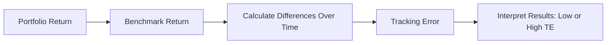

## 24.2 Portfolio Performance Evaluation

Portfolio performance evaluation is an essential component of wealth management. It goes beyond looking at the absolute number at the bottom of a client’s statement. Done properly, performance evaluation answers questions such as:  
- Did the portfolio outperform or underperform a relevant benchmark?  
- How much risk did the portfolio take to achieve its return?  
- Were the returns driven by skillful strategies, or simply by market direction?  
- Is the portfolio meeting the individual objectives and constraints outlined in the Investment Policy Statement (IPS)?  

This section explores the key methods and metrics used in performance evaluation, while also offering perspectives on Canadian regulations, real-world applications, and best practices.

---

### Importance of Portfolio Performance Evaluation

1. **Client Relationship and Trust**  
   • Canadian financial institutions, such as RBC and TD, emphasize transparent and consistent performance reporting to help clients understand how their investments are managed.  
   • Adhering to CIRO guidelines (previously enforced by former SROs) assures clients that advisors and firms are meeting stringent standards, thereby fostering trust.

2. **Regulatory Requirements**  
   • Canadian wealth management professionals must meet CIRO’s disclosure and performance reporting requirements.  
   • The Client Relationship Model (CRM) provisions stipulate that advisors provide clear commentary on fees, risks, and potential conflicts of interest, further reinforcing transparent performance evaluation.

3. **Identifying Strengths and Weaknesses**  
   • Performance evaluation pinpoints whether missteps are occurring in sector selection, security selection, or timing.  
   • Canadian pension funds, such as the Ontario Teachers’ Pension Plan, rigorously measure performance to adjust asset allocation or manager oversight, demonstrating how institutional best practices can apply to individual investors.

---

### 1. Absolute vs. Relative Returns

#### Absolute Return
- **Definition**: The total gain or loss that a portfolio achieves over a given period, ignoring benchmarks.  
- **Use Case**: A simple approach to see if a client is netting a profit. For example, if a portfolio starts at CAD 100,000 and grows to CAD 110,000 over one year (with no cash flows), its absolute return is 10%.

#### Relative Return
- **Definition**: Compares the portfolio’s performance to a specific benchmark (e.g., the S&P/TSX Composite).  
- **Use Case**: If the S&P/TSX Composite returns 8% while the portfolio returns 10%, the relative outperformance is +2%. This helps gauge skill versus market performance.

---

### 2. Time-Weighted Rate of Return (TWRR) vs. Money-Weighted Rate of Return (MWRR)

Properly distinguishing between TWRR and MWRR is crucial, especially in circumstances where clients add or withdraw funds.

#### Time-Weighted Rate of Return (TWRR)
- **Definition**: Evaluates portfolio returns on an equal basis for each sub-period, ignoring the effect of cash inflows and outflows.  
- **Why It Matters**: TWRR is the standard for comparing one manager or strategy with another because it isolates the effect of investment decisions rather than the client’s timing of contributions or withdrawals.  
- **Formula** (illustrative):
  $$
  TWRR = \left[\prod_{i=1}^{n} (1 + R_i)\right]^{\frac{1}{n}} - 1
  $$
  Where \\( R_i \\) is the return for each sub-period \\( i \\).

#### Money-Weighted Rate of Return (MWRR) or Internal Rate of Return (IRR)
- **Definition**: Incorporates the exact timing and amount of cash flows (contributions and withdrawals).  
- **Why It Matters**: MWRR accurately reflects the investor’s personal experience; if a client invests a large sum just before a downturn, the MWRR will reflect that.  
- **Formula** (cash-flow based):
  $$
  \sum_{t=1}^{T} \left( \frac{CF_t}{(1 + IRR)^t} \right) = 0
  $$
  Where \\( CF_t \\) is the net cash flow at time \\( t \\).

---

### 3. Risk-Adjusted Return Metrics

A portfolio’s raw return often doesn’t tell the full story. Risk-adjusted metrics help gauge whether the return justifies the risk taken.

#### Sharpe Ratio
- **Formula**:
  $$
  \text{Sharpe Ratio} = \frac{R_p - R_f}{\sigma_p}
  $$
  Where \\( R_p \\) = portfolio return, \\( R_f \\) = risk-free rate, and \\( \sigma_p \\) = standard deviation of portfolio returns.  
- **Interpretation**: Higher values generally indicate better risk-adjusted performance.

#### Treynor Ratio
- **Formula**:
  $$
  \text{Treynor Ratio} = \frac{R_p - R_f}{\beta_p}
  $$
  Where \\( \beta_p \\) is the portfolio’s beta measure of market (systemic) risk.  
- **Use Case**: Particularly helpful for portfolios considered well-diversified, since unsystematic risk is assumed minimal.

#### Jensen’s Alpha
- **Concept**: Assesses whether a portfolio outperforms or underperforms its expected return, given its beta.  
- **Formula**:
  $$
  \alpha_p = R_p - \left[ R_f + \beta_p \times (R_m - R_f) \right]
  $$
  Where \\( R_m \\) is the market return.  
- **Interpretation**: Positive alpha suggests the manager added value above and beyond market forces.

#### Sortino Ratio
- **Definition**: A refinement of the Sharpe Ratio that divides the excess return by downside deviation only.  
- **Benefit**: Useful when an investor is particularly concerned with avoiding losses rather than symmetrical volatility.

---

### 4. Performance Attribution Analysis

Performance attribution breaks down sources of return to analyze whether the result stems from asset allocation decisions (e.g., overweighting equities over bonds), security selection (choosing specific stocks or bonds), or market timing (deciding when to enter or exit certain investments).

1. **Allocation Effect**  
   - Did the manager pick the right sectors or asset classes?  
   - Example: Overweighting Canadian technology stocks when they outperformed the broader market.

2. **Selection Effect**  
   - Did the manager choose the right securities within a particular sector or asset class?  
   - Example: Selecting superior banks (e.g., RBC vs. peers) that outperformed the overall financial sector.

3. **Interaction (or Timing) Effect**  
   - Measures the joint contribution of allocation and selection decisions over time.  
   - Example: Accurately moving from cyclical to defensive sectors during uncertain economic times.

---

### 5. Benchmark Selection and Tracking Error

#### Benchmark Selection
- **Core Principles**: The benchmark should be relevant, consistent, measurable, and reflective of the portfolio’s strategy.  
- **Example**: A portfolio heavily invested in small-cap Canadian equities might use the S&P/TSX SmallCap Index rather than the broader S&P/TSX Composite.

#### Tracking Error
- **Definition**: The standard deviation of the difference between the portfolio’s returns and the benchmark’s returns.  
- **Insight**: High tracking error can indicate a more actively managed portfolio or significant deviations in asset allocation from the benchmark.

_The above diagram illustrates how tracking error can be calculated by comparing portfolio returns to benchmark returns over multiple periods, then computing the standard deviation of those differences._

---

### 6. Reporting and Communication

1. **Clarity and Transparency**  
   - Provide straightforward performance reports (e.g., monthly or quarterly) that highlight top contributors and detractors, fees, and net returns.  
   - Ensure alignment with CIRO regulations on performance reporting and fund facts documents for mutual funds or ETFs.

2. **Regular Client Reviews**  
   - Include updates on market developments, portfolio rebalancing, and ongoing alignment with the client’s IPS.  
   - Discuss potential shifts in Canadian regulations (e.g., tax laws by CRA) and how they might affect performance.

3. **Ethics and Disclosure**  
   - Present performance in a manner that accurately reflects risk and return (e.g., disclosing conflict of interests or fees).  
   - Maintain compliance with the Global Investment Performance Standards (GIPS) when possible to foster credibility.

---

### Practical Canadian Examples and Resources

- **Pension Funds**: The Canada Pension Plan Investment Board (CPPIB) regularly publishes its TWRR, highlighting routing of different asset classes into private equity, real estate, and global equities.  
- **Major Banks**: RBC, TD, and BMO produce forward-looking reports based on risk-adjusted metrics. These reports often incorporate Sharpe Ratios, Treynor Ratios, and alpha analyses to communicate manager skill.  
- **Open-Source Tools**:  
  • R packages like “PerformanceAnalytics” and “quantmod” enable robust return and risk calculations (e.g., TWRR, MWRR, Sharpe, Sortino).  
  • Python libraries like “pandas” and “numpy” allow for performance modeling and risk scenario testing.  
- **Further Study**:  
  • [CIRO Guidelines](https://www.ciro.ca): Performance reporting, client relationships, and disclosure standards  
  • [CFA Institute – GIPS Standards](https://www.cfainstitute.org/en/ethics-standards/gips-standards): Global framework for ethical and standardized performance measurement  
  • [CFA and CIPM Programs](https://www.cfainstitute.org): In-depth resources on portfolio analysis and evaluation  
  • Academic and professional periodicals (e.g., *The Journal of Portfolio Management*) for evolving research.

---

### Best Practices, Common Pitfalls, and Potential Challenges

- **Important**: Choose a benchmark that accurately represents the portfolio’s strategy. A mismatch can mislead performance evaluation and client expectations.  
- **Pitfall**: Using only TWRR or only MWRR can obscure vital details. Advisors should understand both metrics for comprehensive analysis.  
- **Tip**: Apply multiple risk-adjusted return metrics (Sharpe, Sortino, Treynor, Jensen’s Alpha) to gain a holistic view of performance.  
- **Challenge**: Communicating complex statistical metrics in plain language to clients. Advisors can use visuals (charts, tables) and real-world analogies to alleviate confusion.  
- **Remedy**: Maintain open dialogue using structured reporting formats accepted across the Canadian industry.

---

### Conclusion

A solid performance evaluation framework is essential for advisors to validate investment decisions, continually adjust strategies, and maintain client trust. Whether comparing returns against a benchmark or dissecting risk-adjusted results, the combination of robust analytics, thoughtful communication, and a thorough understanding of Canadian regulatory requirements ensures that wealth managers can effectively guide their clients toward their long-term financial goals. Armed with these tools and methodologies—along with an ongoing commitment to ethical standards—investment professionals can deliver consistently higher value to clients.

---

## Optimize Your Learning: Portfolio Performance Evaluation Quiz



### Which statement best captures the main difference between absolute and relative returns?

- [x] Absolute returns measure total gains or losses, while relative returns compare results against a benchmark.
- [ ] Absolute returns adjust for risk, while relative returns do not.
- [ ] Relative returns factor in the timing of cash flows, while absolute returns do not.
- [ ] Relative returns rely on IRR, while absolute returns rely on TWRR.

> **Explanation:** Absolute returns look purely at the gain or loss of the portfolio over a period, whereas relative returns compare those results to a benchmark.

---

### In the Canadian regulatory environment, why is TWRR often used to compare managers or strategies?

- [ ] It automatically adjusts for changes in tax law.
- [x] It removes the effect of contributions and withdrawals, isolating the manager’s skill.
- [ ] It is the only accepted method under CIRO guidelines.
- [ ] It ranks managers from highest to lowest fund size.

> **Explanation:** TWRR controls for external cash flows, making manager-to-manager evaluations more accurate.

---

### Why might an advisor use the Money-Weighted Rate of Return (MWRR) rather than TWRR?

- [x] To reflect an investor’s unique experience, accounting for timing of contributions and withdrawals.
- [ ] To isolate the portfolio manager’s decisions free of external cash flows.
- [ ] To measure purely risk-adjusted performance relative to a benchmark.
- [ ] To comply with GIPS standards.

> **Explanation:** MWRR incorporates the impact of when money is added or withdrawn, giving insight into the actual returns an investor experiences.

---

### Which ratio best measures returns relative to the total volatility (standard deviation) of the portfolio?

- [ ] Treynor Ratio
- [x] Sharpe Ratio
- [ ] Jensen’s Alpha
- [ ] Sortino Ratio

> **Explanation:** The Sharpe Ratio uses the portfolio’s standard deviation as the measure of risk, providing insight into total (systemic + idiosyncratic) risk-adjusted returns.

---

### If a fund is particularly concerned with downside risk, which risk-adjusted measure is most appropriate?

- [ ] Alpha
- [ ] Beta
- [x] Sortino Ratio
- [ ] Sharpe Ratio

> **Explanation:** The Sortino Ratio modifies the Sharpe Ratio by penalizing only downside volatility, making it particularly useful for investors who want to minimize losses.

---

### A positive Jensen’s Alpha indicates:

- [ ] The fund underperformed its expected return.
- [ ] The fund performed in line with the benchmark.
- [x] The fund exceeded its risk-adjusted expected return.
- [ ] The fund’s return was negative.

> **Explanation:** Jensen’s Alpha measures a manager’s performance above or below the expected return as determined by the CAPM. A positive alpha suggests value-added beyond market movements.

---

### Performance attribution analysis separates returns into which three main effects?

- [x] Allocation, selection, and interaction.
- [ ] Absolute, relative, and risk-adjusted.
- [ ] Alpha, beta, and gamma.
- [ ] TWRR, MWRR, and IRR.

> **Explanation:** Allocation, selection, and interaction provide insight into whether returns stem from sector weighting, specific security picks, or the timing of these decisions.

---

### Which of the following best describes tracking error?

- [x] The standard deviation of the difference between portfolio returns and benchmark returns.
- [ ] The absolute return of the portfolio compared to an external index.
- [ ] The percentage of underperformance in a given time period.
- [ ] The slope of the capital market line.

> **Explanation:** Tracking error indicates how closely a portfolio follows (or deviates from) its benchmark, measured by the volatility of returns differences.

---

### What is the primary purpose of selecting an appropriate benchmark for portfolio evaluation?

- [ ] To guarantee positive alpha.
- [x] To accurately assess how well the portfolio aligns with its stated strategy.
- [ ] To avoid disclosure of fees and commissions.
- [ ] To eliminate volatility from performance.

> **Explanation:** Benchmarks should reflect the portfolio's asset mix and objectives, enabling a fair comparison of returns and risk.

---

### True or False: Under CIRO regulations, all references to the former MFDA and IIROC organizations must acknowledge they no longer exist as separate entities.

- [x] True
- [ ] False

> **Explanation:** The MFDA and IIROC amalgamated into CIRO effective June 1, 2023, so references to those organizations in current (2025) materials must note that they are defunct predecessor SROs.




