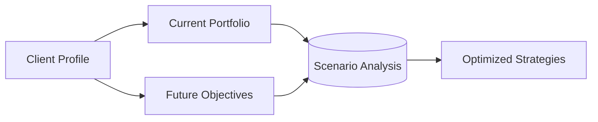

## 3.2 Going Beyond the Regulatory and Legal Minimum

When it comes to getting to know clients, Canadian advisors have clear regulatory obligations to “Know Your Client” (KYC). These obligations stem from guidelines enforced by the Canadian Investment Regulatory Organization (CIRO)—the national self-regulatory body formed after the amalgamation of the former Mutual Fund Dealers Association of Canada (MFDA) and the Investment Industry Regulatory Organization of Canada (IIROC). However, meeting the minimum regulatory standard is only the starting point. Top-performing wealth professionals strive for a deeper understanding of their clients’ aspirations, risk tolerances, and holistic life circumstances.  

Below, we explore how wealth advisors in Canada can go beyond the legal baseline to truly align financial strategies with client values and needs.

---

## Expanding on KYC: From Compliance to Client-Centric Service

### Understanding the Client’s Broader Goals and Lifestyle Objectives

• **Lifestyle Objectives**  
  - Envisioning an early retirement timeline  
  - Funding children’s education or supporting extended family  
  - Pursuing philanthropic goals (e.g., donating to charitable foundations)  
  - Purchasing properties, such as vacation homes  

• **Qualitative Metrics**  
  - Gauging past investment experiences and lessons learned  
  - Exploring personal philosophies about risk and reward  
  - Observing behavioral responses to market volatility  

While standard KYC requirements focus on financial details such as net worth, liquidity needs, and risk tolerance, uncovering these deeper lifestyle and qualitative dimensions is essential for delivering truly personalized wealth solutions.

---

## Going Beyond the Basics: A Holistic Approach

A **Holistic Approach** in wealth management means viewing a client’s financial plan as one interdependent system of goals, risks, and resources. By zooming out to incorporate family dynamics, career aspirations, and lifestyle choices, advisors can construct and maintain strategies that adapt to changing realities.

### Practical Steps Toward Holistic Client Engagement

1. **Comprehensive Data Gathering**  
   - Expand standard KYC questionnaires to include questions about life goals, philanthropic interests, and personal finance philosophies.  
   - Leverage digital client portals for continuous updates on evolving client preferences.

2. **Frequent Communication**  
   - Schedule regular check-ins to discuss any changes in personal circumstances: career moves, new family members, or large purchases.  
   - Provide educational resources and updates, such as notes on emerging investment strategies (e.g., Responsible Investment, Smart Beta ETFs).

3. **Tools and Technology**  
   - **Cash-flow modeling:** Helps illustrate how monthly inflows and outflows shift over time.  
   - **Scenario analysis:** Tests the impact of various events (market downturns, job loss, new business ventures) on a portfolio.  
   - **Online calculators:** Use publicly available tools, such as the Financial Consumer Agency of Canada (FCAC) calculators at [https://itools-ioutils.fcac-acfc.gc.ca](https://itools-ioutils.fcac-acfc.gc.ca), to visualize future outcomes.

4. **Collaboration with Specialists**  
   - Bring in estate lawyers, tax accountants, and insurance professionals to assess complex needs.  
   - Consult philanthropic advisors for clients interested in donating to Canadian charities or setting up family foundations.

---

## Maintaining an Ongoing Discovery Process

Meeting clients’ evolving needs is an iterative endeavor. A wealth advisor who checks in only annually may miss critical changes in a client’s financial life, especially in moments of market turbulence or sudden windfalls.

Once financial plans are initially set, continuous discovery may include:

- **Quarterly or Biannual Updates**: Revisit financial targets and portfolio allocations.  
- **Life Events Tracking**: Weddings, divorces, inheritances—each milestone calls for an adjusted strategy.  
- **Multi-Generational Communication**: Involve children or other family members in relevant discussions about legacy or intergenerational wealth transfer.  

This proactive approach helps identify needs for updated insurance coverage, potential property acquisitions, or shifting retirement savings strategies.  

---

## Scenario Analysis: Stress-Testing Client Portfolios

**Scenario Analysis** involves designing multiple “what if” situations to see how a client’s portfolio and broader plan hold up under various economic or personal conditions. This technique is used extensively by Canadian pension funds—like the Canada Pension Plan Investment Board (CPPIB) or Ontario Teachers’ Pension Plan (OTPP)—to ensure robust risk management.

By applying scenario testing to individual client portfolios, an advisor can provide a clear picture of how shifting interest rates, a market correction, or major life events (e.g., branching out into a new business) might impact overall wealth.

**Diagram Explanation:**  
1. Collect a client’s financial details and personal goals (A).  
2. Evaluate how the current portfolio (B) aligns with future objectives (C).  
3. Scenario analysis (D) then examines the resilience of strategies under different market and life-event scenarios (e.g., recession, large inheritance, new business venture).  
4. Results from the analysis lead to updated or optimized strategies (E).  

---

## Ethical Responsibilities and Transparency

### Maintaining Client Trust

Going beyond the minimum isn’t simply about extra effort—it’s also about upholding ethical standards and maintaining client confidence. Advisors must disclose any **Conflict of Interest**, where personal benefit could outweigh a client’s best interests. They should also clarify their **Fee Structures**—commission-based, fee-only, or otherwise—so clients understand every recommendation’s financial motivation.

Strict adherence to CIRO regulations ensures legal compliance, and transparent practices build trust over the long term. The Canadian Securities Administrators (CSA) further offer [Investor Tools](https://www.securities-administrators.ca/investortools/) to help consumers understand fees, risk, and financial products.

### Ongoing Client Education

Educated clients are more likely to remain engaged and loyal. By simplifying complex products or demonstrating how investments fit into a client’s big-picture goals, advisors can foster long-term relationships. Recommending accessible books—such as “The Wealthy Barber” by David Chilton or “The Intelligent Investor” by Benjamin Graham—empowers clients with foundational knowledge.

---

## Real-World Example: Integrating Disney Dreams into a Financial Plan
Consider a hypothetical example at RBC or TD:

1. **Initial Discovery**: A family reveals they want to take their three children on annual, immersive Disney World vacations, eventually culminating in a one-year sabbatical to travel North America.  
2. **Scenario Analysis**: Testing how consistent travel costs would impact their debt obligations, retirement timeline, and children’s education funds if a mild recession hit.  
3. **Customized Solutions**:  
   - Setting up an annual vacation fund coupled with a tax-efficient savings strategy (e.g., a Family Registered Education Savings Plan (RESP) for the children’s college fund).  
   - Adapting their retirement plan to accommodate a one-year sabbatical, possibly pausing certain retirement contributions or saving enough in a high-interest savings account prior to departure.  
4. **Regular Check-Ins**: Ensuring market changes or job shifts do not derail the sabbatical plan.

By exploring lifestyle objectives up front and applying a holistic lens, the advisor ensures client happiness without overlooking standard regulatory requirements.

---

## Canadian Market Nuances to Consider

1. **Tax Implications**  
   - Integrate personal and corporate tax strategies in your plan, referencing Canada Revenue Agency (CRA) guidelines.  
   - Use tax-sheltered accounts (e.g., RRSPs and TFSAs) effectively to maximize after-tax returns.

2. **Regulatory Framework**  
   - Keep up-to-date with CIRO rules (post-2023) and ensure all client interactions and recommendations adhere to these standards.  
   - Consult OSFI (Office of the Superintendent of Financial Institutions) rules for broader risk management guidelines, especially when dealing with bank-related products.

3. **Potential Pitfalls**  
   - **Overlooking Liquidity Needs**: A robust plan must include short-term liquidity.  
   - **Ignoring Behavioral Factors**: Emotions often overshadow logic if the market becomes highly volatile.  
   - **Fee Misalignment**: If fees aren’t disclosed clearly, clients may lose trust and question advice quality.

---

## Solidifying the Advisor-Client Relationship

When advisors consistently deliver more than the regulatory checkbox, they cultivate a partnership grounded in mutual respect and well-rounded decision-making. Here are key takeaways:

- **Regularly Maintain a Comprehensive Client Profile**  
- **Incorporate Scenario Testing and Risk Assessments**  
- **Address Behavioral and Emotional Elements of Investing**  
- **Commit to Transparent Fee and Conflict-of-Interest Disclosures**  
- **Emphasize Long-Term, Values-Driven Financial Engagement**

By broadening the conversation to envelop all aspects of a client’s financial and personal journey, you can help them chart a course toward not just financial security, but genuine peace of mind.

---

## Summary and Action Steps

Going beyond the regulatory and legal minimum means adopting a client-centric, ethically minded practice. Advisors who engage on a deeper level—looking at motivations, values, and goals—can craft financial strategies that resonate far beyond the KYC form. Here are a few ways to apply this in your own practice:

1. **Revisit client goals and stress-test the portfolio at least once a year.**  
2. **Use open-source calculation tools** (e.g., FCAC’s budgeting and mortgage calculators) to enhance client demonstrations and transparency.  
3. **Recommend accessible reading**—like “The Wealthy Barber”—to spur your clients’ curiosity and self-education.  
4. **Keep up to date with CIRO** ([https://www.ciro.ca](https://www.ciro.ca)) **and CRA** guidelines, ensuring your practice remains compliant and client-first.  

By following these insights, you’ll elevate your client relationships, differentiate your services in the Canadian market, and foster the kind of trust that is critical to long-term success.

---

## Test Your Knowledge: Holistic Wealth Management in Canada



### Which of the following best describes going beyond the regulatory KYC requirements?

- [x] Collecting deeper insights into clients’ personal values and long-term aspirations.
- [ ] Strictly following the bare minimum CIRO-wide regulations.
- [ ] Ensuring compliance only for record-keeping demands.
- [ ] Charging higher advisor fees to guarantee profitability.

> **Explanation:** Going beyond KYC means capturing qualitative data such as personal values, future goals, and unique lifestyle needs, which exceed the typical regulatory checklists.

### What is an example of a qualitative factor to discuss during the client discovery process?

- [ ] Dates of client’s mortgage renewal.
- [x] How the client reacts to market downturns based on past experience.
- [ ] Required minimum regulator-mandated risk profile tags.
- [ ] Their precise monthly grocery budget to the cent.

> **Explanation:** Understanding how a client reacts to market swings and their personal experiences is a deeper qualitative measure that helps in customizing the portfolio.

### How does scenario analysis help in financial planning?

- [x] It stress-tests a client’s portfolio under different market or life-event conditions.
- [ ] It automatically guarantees higher returns.
- [ ] It focuses exclusively on interest rate predictions.
- [ ] It replaces the need to verify a client’s risk tolerance.

> **Explanation:** Scenario analysis examines how changes in the market or personal circumstances might impact a portfolio, allowing advisors to make more informed, robust plans.

### Why is maintaining open communication after the initial discovery phase important?

- [x] Because life circumstances or client attitudes can change, affecting the plan.
- [ ] So the advisor can pitch new products every month.
- [ ] To comply with a monthly legal requirement from CIRO.
- [ ] To increase administrative paperwork.

> **Explanation:** Continuous communication ensures the advisor remains aware of any new developments—such as an inheritance or shifting risk tolerances—and can adjust the plan accordingly.

### What is a holistic approach in wealth management?

- [x] Considering multiple aspects of a client’s life—financial and otherwise—for a comprehensive plan.
- [ ] Focusing only on maximizing short-term investment returns.
- [ ] Prioritizing compliance paperwork above relationship-building.
- [ ] Using one-size-fits-all strategies to expedite the process.

> **Explanation:** A holistic approach goes beyond numerical assets and liabilities, integrating broader life goals, personal values, and aspirations for a more customized financial plan.

### Which of the following tools is often used to visualize different outcomes based on varied market conditions?

- [x] Scenario Analysis
- [ ] Fixed Commission Schedules
- [ ] A simple KYC risk score
- [ ] Government bond yields

> **Explanation:** Scenario analysis is a forecasting technique that shows how multiple inputs (e.g., inflation, job changes, market slumps) could affect a client’s strategy.

### When disclosing fee structures, which of the following is best practice?

- [x] Clearly stating the type of fees (commission-based, fee-only, etc.) and potential conflicts of interest.
- [ ] Simply providing the client with the regulator’s official fee schedule.
- [x] Ensuring clients are aware of any embedded commissions.
- [ ] Omitting fee discussions to avoid deterring potential investors.

> **Explanation:** Clarity around fees, including how they are calculated and any embedded commissions, is essential to maintain transparency and trust.

### How do Canadian pension funds commonly utilize scenario analysis?

- [x] They project outcomes for pension sustainability under various market conditions to guide long-term decisions.
- [ ] They only use scenario analysis when forced by government audits.
- [ ] They avoid any form of market predictions to remain unbiased.
- [ ] They rely entirely on historical returns instead of future-looking analysis.

> **Explanation:** Canadian pension funds (e.g., CPPIB, OTPP) often employ scenario analysis to measure possible portfolio outcomes and maintain robust risk management protocols.

### What resource does the Canadian Securities Administrators (CSA) provide to assist clients?

- [x] Comprehensive Investor Tools on risk, investing basics, and product understanding.
- [ ] Legal advice for retirement disputes.
- [ ] Free personal accounting services.
- [ ] Guaranteed investment returns.

> **Explanation:** CSA’s online investor tools help clients become more knowledgeable about various aspects of investing, risk management, and products.

### True or False: Going beyond regulatory requirements can help advisors build more personalized and enduring relationships with their clients.

- [x] True
- [ ] False

> **Explanation:** Advisors who learn about clients’ deeper aspirations and changing life circumstances can create tailored solutions and stronger bonds over time, thus extending well beyond minimal compliance.


