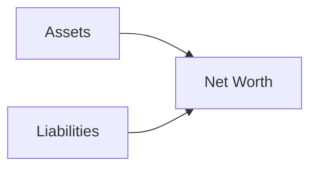

## 4.1 Analyzing Personal Financial Statements and Savings Plan

A thorough understanding of a client’s personal financial statements is essential for wealth advisors. By carefully evaluating these statements, you can identify key areas of strength and weakness in a client’s financial life, recommend solutions to improve their financial standing, and guide long-term wealth management strategies. This section covers the two fundamental statements—the Net Worth Statement and the Cash Flow Statement—and explores how a savings plan integrates with these tools to create a holistic picture of financial well-being.

---

## Importance of Personal Financial Statements

Personal financial statements help you and your clients:

- Measure progress toward financial goals.  
- Highlight areas of inefficiency (e.g., excessive debt or unallocated surplus).  
- Pinpoint opportunities for increased savings, investments, or estate planning.  
- Serve as a benchmark for discussing wealth accumulation strategies.

In Canada, these statements also serve as reference documents when applying for credit or mortgages from major banks such as RBC, TD, or BMO. They inform both lending decisions and investment recommendations.

---

## Net Worth Statement

A Net Worth Statement (sometimes called a Statement of Financial Position) offers a snapshot of a client’s financial health at a given point in time. It comprises total assets minus total liabilities. Tracking changes in a client’s net worth over time allows both the client and advisor to see whether the client’s overall financial position is improving or deteriorating.

### Components of Net Worth

1. **Assets**  
   - Liquid Assets: Cash, chequing and savings accounts, money market funds.  
   - Investment Assets: Stocks, bonds, mutual funds, exchange-traded funds (ETFs), real estate investments.  
   - Personal-Use Assets: Principal residence, vehicles, furniture, and personal items that may have some liquidation value.

2. **Liabilities**  
   - Short-Term Liabilities: Credit card balances, lines of credit, other debts due within one year.  
   - Long-Term Liabilities: Mortgages, car loans, student loans, and other obligations exceeding one year.

### Calculating Net Worth

At the simplest level:

$$
\text{Net Worth} = \text{Total Assets} - \text{Total Liabilities}
$$

It is crucial to re-evaluate net worth periodically—ideally, at least once per year or whenever a major life change occurs (e.g., marriage, divorce, job change, or property purchase).

**Diagram Explanation:**  
- This diagram illustrates that net worth is calculated by taking all assets (A) and subtracting all liabilities (B), resulting in net worth (C). It is a straightforward approach to understanding an individual’s financial position.

---

## Cash Flow Statement

A Cash Flow Statement (often called a Personal Income and Expenditure Statement) details how money flows in and out of a client’s accounts over a specific period—usually monthly or annually. It helps identify potential deficits and highlights opportunities to adjust spending or increase saving.

### Components of Cash Flow

1. **Inflows**  
   - Employment Income: Salaries, bonuses, commissions.  
   - Investment Income: Dividends, interest, rental properties.  
   - Additional Sources: Pensions, support payments, side-business income.

2. **Outflows**  
   - Fixed Expenses: Mortgage or rent, insurance, subscriptions, property taxes.  
   - Variable Expenses: Groceries, entertainment, telecommunications charges.  
   - Discretionary Expenses: Vacations, dining out, hobby-related expenses.

By categorizing fixed, variable, and discretionary outflows, an advisor can tailor recommendations for expense reduction or reallocation.

### Surplus or Deficit

A client’s cash flow can be in surplus (when inflows exceed outflows) or deficit (when outflows exceed inflows). Surplus cash flow is an excellent sign of potential investment capital, whereas a deficit signals the need for budget adjustments, debt reduction, or rethinking monthly commitments.

---

## Integrating the Savings Plan

A well-designed savings plan propels a client toward achievements like buying a home, funding education, or saving for retirement. Advisors often look for ways to streamline savings contributions by automating transfers and leveraging tax-advantaged accounts (e.g., TFSAs or RRSPs).

### Key Elements of a Savings Plan

1. **Current Savings Rate**  
   Advisors start by measuring how much disposable income clients commit to savings. For instance, a household aiming to save 10% of its net income might fully automate monthly deposits into high-interest savings accounts or investment vehicles.

2. **Time Horizons**  
   - **Short-Term:** Emergency funds, near-future goals such as vacations or down payments on short-notice purchases.  
   - **Medium-Term:** Buying a home or financing a child’s education within five to ten years.  
   - **Long-Term:** Retirement savings, often involving registered plans like RRSPs, as well as real estate or equity investments.

3. **Automation**  
   Setting up preauthorized contributions into TFSAs, non-registered investment accounts, or high-interest savings accounts. Automation helps mitigate the temptation to spend leftover funds that might otherwise be earmarked for savings.

4. **Tools and Resources**  
   - **Budgeting Software:** Examples include open-source GnuCash or Buddi for tracking spending and balancing inflows vs. outflows.  
   - **Spending Tracking:** Encouraging a client to use apps or banking tools to categorize expenses and highlight potential areas for cuts.

---

## Best Practices for Advisors

1. **Review Statements Regularly**  
   - Conduct an in-depth analysis of both net worth and cash flow at least annually.  
   - Align your findings with the client’s financial objectives and time horizons.

2. **Focus on Reducing High-Interest Debt**  
   - Highlight how credit card debt and lines of credit (often issued by major Canadian banks) can erode net worth.  
   - Recommend debt consolidation or re-financing if it aligns with the client’s goals and has favourable terms.

3. **Increase Surplus**  
   - Guide clients in minimizing discretionary spending.  
   - Suggest dividing increases in income or bonuses among savings, investments, and debt reduction.

4. **Collaborate With Specialists**  
   - Work alongside tax experts to optimize strategies under Canadian regulations, such as leveraging RRSP contribution limits or TFSA allowances.  
   - Consult legal professionals for estate, trust, or marital property issues that affect personal financial statements.

5. **Encourage Realistic Goal Setting**  
   - Break down long-term aspirations (like retirement funding) into manageable annual or monthly targets.  
   - Communicate the importance of emergency funds, typically three to six months of living expenses.

---

## Potential Pitfalls

1. **Ignoring Deficits**  
   Failing to address negative cash flow exacerbates debt issues and stunts wealth accumulation.  
2. **Overestimating Asset Values**  
   Personal-use assets can be harder to liquidate and are often worth less than perceived, potentially inflating net worth.  
3. **Treating Variable Expenses as Fixed**  
   Many clients misjudge their discretionary spending and label it as necessary—leading to suboptimal saving and investment.  
4. **Overlooking Taxes**  
   Advisors must factor in tax obligations for each income stream. Consult Canada Revenue Agency (CRA) resources for clarity on taxable vs. non-taxable income and recommended filings.

---

## Canadian Context and Regulatory Considerations

- **CIRO (Canadian Investment Regulatory Organization):**  
  As Canada’s national self-regulatory organization, CIRO ensures dealers and advisors meet proficiency standards and ethical benchmarks. Refer to <https://www.ciro.ca> for current regulations and guidelines on delivering advice suited to the client’s financial condition.  
- **Financial Consumer Agency of Canada (FCAC):**  
  Offers a wealth of budgeting and money management resources (<https://www.canada.ca/en/financial-consumer-agency.html>), supporting both clients and advisors in financial literacy efforts.  
- **Canada Revenue Agency (CRA):**  
  For tax-related information—such as RRSP and TFSA contribution limits or the treatment of capital gains—visit <https://www.canada.ca/en/revenue-agency.html>.  
- **Open-Source Financial Tools:**  
  Tools like GnuCash (<https://www.gnucash.org/>) or Buddi (<http://buddi.digitalcave.ca/>) assist in crafting personal financial statements and budgets at no additional cost.  

By incorporating these Canadian resources and software approaches, wealth advisors can provide enhanced services tailored to clients’ specific regulatory, tax, and budgeting contexts.

---

## Practical Steps and Exercises

1. **Compile All Assets and Liabilities**  
   Have your client gather bank statements, credit card statements, investment summaries, and loan records from institutions such as RBC, TD, or BMO. This ensures an accurate calculation of net worth.

2. **Categorize Expenses**  
   Encourage clients to classify fixed, variable, and discretionary costs. An exercise:  
   - List last month’s expenses in three columns.  
   - Identify which areas offer the greatest potential for spending cuts.

3. **Set Target Savings Rate**  
   Work with clients to establish a realistic percentage of income to save. For instance, if a client nets $5,000 monthly and aims for a 10% savings rate, they should set up an automated $500 monthly deposit into a TFSA or ETF-based investment portfolio.

4. **Monitor Progress**  
   Suggest monthly or quarterly check-ins to validate whether the client’s net worth is rising and if cash flow remains comfortably in surplus.

5. **Question for Consideration**  
   How would a sudden decrease in income—due to job loss or medical leave—impact the client’s net worth and cash flow? What contingencies are in place?

---

## Additional Resources

- “Wealth Management Essentials” by the Canadian Securities Institute: Offers a broader context on personal finance topics in Canada.  
- “Your Money or Your Life” by Vicki Robin and Joe Dominguez: An influential text on transforming your relationship with money and tracking cash flows.  
- Coursera, edX, or Udemy: Hosts numerous online courses on budgeting, personal financial planning, and wealth management strategies.  
- Canadian Pension Funds (e.g., CPP Investments, Ontario Teachers’ Pension Plan): Case studies on their diversified, long-term investment strategies can offer insights into building robust portfolios.

By leveraging personal financial statements effectively and integrating a thoughtful savings plan, wealth advisors gain a clear view of a client’s short-term requirements and long-term aspirations. The next step involves shaping strategies—such as debt consolidation, rebalancing investment portfolios, or tax optimization—that align precisely with the client’s unique needs and objectives.

---

## Test Your Knowledge: Personal Financial Statements and Savings Essentials



### Which document provides a snapshot of a client’s net worth at a given point in time?

- [x] Net Worth Statement
- [ ] Cash Flow Statement
- [ ] Equity Evaluation Report
- [ ] Budget Forecast

> **Explanation:** A Net Worth Statement (or Statement of Financial Position) compares total assets to total liabilities, revealing the client’s net worth at a specific moment.

### Which expenses are most easily adjusted to increase a client’s surplus?

- [x] Variable expenses
- [ ] Fixed expenses
- [x] Discretionary expenses
- [ ] Mortgage principal payments

> **Explanation:** Variable and discretionary expenses can often be reduced or postponed, whereas fixed expenses—like rent or mortgage payments—are less flexible.

### What is the most immediate red flag when analyzing a Cash Flow Statement?

- [x] A consistent monthly deficit
- [ ] A surplus reinvested in capital improvements
- [ ] Stable monthly savings contributions
- [ ] Allocated emergency fund contributions

> **Explanation:** Chronic deficits quickly erode wealth, leading to increased debt and potential credit issues.

### In Canada, which entity provides budgeting and money management tools to consumers?

- [x] Financial Consumer Agency of Canada (FCAC)
- [ ] Canada Mortgage and Housing Corporation (CMHC)
- [ ] Canadian Investment Regulatory Organization (CIRO)
- [ ] Office of the Superintendent of Financial Institutions (OSFI)

> **Explanation:** The FCAC focuses on consumer protection and financial literacy, offering free budgeting and money management resources.

### Which type of liabilities are considered long-term?

- [x] Mortgages
- [ ] Credit card balances paid off monthly
- [x] Car loans
- [ ] Monthly subscriptions

> **Explanation:** Long-term liabilities typically extend beyond one year, including mortgages and car loans.

### Which best describes an ideal outcome for a client’s cash flow?

- [x] Regular surplus directed to investments
- [ ] Break-even with no extra funds
- [ ] Recurring deficits at certain times of year
- [ ] Consistent overspending

> **Explanation:** A surplus allows the client to invest or save for future needs, fostering financial growth.

### What is the formula for calculating net worth?

- [x] Net Worth = Total Assets - Total Liabilities
- [ ] Net Worth = Total Assets + Total Liabilities
- [x] Net Worth = Assets + Savings Rate
- [ ] Net Worth = Savings Rate / Income

> **Explanation:** Net worth is measured by subtracting total liabilities from total assets to determine financial standing.

### Which of the following contributes significantly to a strong net worth?

- [x] High-value assets and minimal debt
- [ ] Only variable expense reductions
- [ ] Lack of financial statements
- [ ] Maximized recurring liabilities

> **Explanation:** A positive net worth results when total assets noticeably exceed liabilities and debt is well-managed.

### According to Canadian tax regulations, which agency is primarily responsible for managing RRSP and TFSA policies?

- [x] Canada Revenue Agency (CRA)
- [ ] Financial Consumer Agency of Canada (FCAC)
- [ ] Canadian Investment Regulatory Organization (CIRO)
- [ ] Office of the Superintendent of Financial Institutions (OSFI)

> **Explanation:** The CRA provides guidelines, contribution limits, and tax treatment policies for RRSPs and TFSAs.

### True or False: In creating a robust savings plan, automating monthly contributions can minimize the risk of overspending.

- [x] True
- [ ] False

> **Explanation:** Automated contributions remove the need for manual transfers, which can be postponed or forgotten, thus helping clients consistently meet saving goals.


