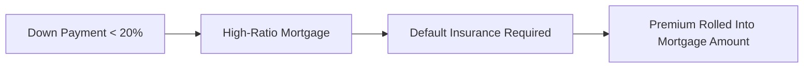
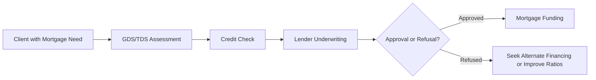

## 5.2 Residential Mortgages

Residential mortgages are pivotal in helping Canadians finance the purchase or maintenance of a home. As a secured loan, the property itself acts as collateral: if the borrower defaults, the lender can seize and sell the property to recover the loan balance. Wealth advisors must ensure their clients understand the various phases, requirements, and risks involved in taking on a residential mortgage.

---

### The Purpose of Residential Mortgages

1. **Homeownership and Wealth Building**  
   - For many Canadians, owning a home is both a personal milestone and a key component in long-term wealth building.  
   - A mortgage allows individuals to spread the cost of the property over many years, increasing affordability and enabling earlier homeownership.  

2. **Investment Properties**  
   - Some clients seek a mortgage for a rental or investment property, aiming to generate income and potential capital appreciation.  
   - While the fundamentals of mortgage qualification and approval are similar, lenders may impose stricter requirements or higher interest rates for investment properties due to added risk.

3. **Refinancing and Consolidation**  
   - A mortgage can also be used to refinance higher-interest debt or consolidate existing loans.  
   - Advisors help clients evaluate whether refinancing lowers their overall cost of borrowing and improves cash flow.

---

### Assessing Affordability and Risk

Advisors should carefully review factors that affect a client’s ability to maintain mortgage payments over time:

- **Income Stability:** Clients with steady employment or stable business revenue are considered less risky by lenders.  
- **Interest Rate Environment:** Variable rates can rise quickly, potentially increasing monthly payments. Fixed-rate mortgage holders may face higher rates upon renewal if market rates have climbed.  
- **Property Value Fluctuations:** A downturn in the real estate market can leave borrowers with negative equity (owing more on the mortgage than the home’s market value).  
- **Liquidity Needs:** Clients should maintain an emergency fund to cover unforeseen disruptions, such as job loss or urgent repairs.

---

### Mortgage Qualification: GDS and TDS Ratios

Canadian lenders evaluate two critical ratios to determine whether a borrower qualifies for a mortgage and how large that mortgage can be:

1. **Gross Debt Service (GDS) Ratio**  
   - Formula generally includes mortgage payments (principal + interest), property taxes, heating costs, and half of condominium fees (if applicable).  
   - The GDS ratio is calculated as:  
     $$
     \text{GDS} = \frac{\text{Mortgage Payments} + \text{Property Taxes} + \text{Heating} + \frac{\text{Condo Fees}}{2}}{\text{Gross Annual Income}}
     $$
   - A common lender guideline is that the GDS ratio should not exceed approximately 32–35%.

2. **Total Debt Service (TDS) Ratio**  
   - Formula includes all debts such as credit cards, car loans, student loans, plus the items included in the GDS.  
   - The TDS ratio is calculated as:  
     $$
     \text{TDS} = \frac{\text{Mortgage Payments} + \text{Property Taxes} + \text{Heating} + \frac{\text{Condo Fees}}{2} + \text{Other Debt Payments}}{\text{Gross Annual Income}}
     $$
   - A common lender guideline is that the TDS ratio should not exceed approximately 40–42%.

**Important:** These guidelines can be more stringent if lenders or regulations tighten (for example, under OSFI’s [B-20 guidelines](https://www.osfi-bsif.gc.ca/)).

---

### Mortgage Terms and Amortization Periods

In Canadian mortgage lending:

- **Mortgage Term:** The period during which the agreed interest rate and conditions remain in effect. Common terms range from six months to 10 years, with five years being the most popular. After the term expires, clients usually need to renew or refinance the mortgage.  
- **Amortization Period:** The total length of time required to pay off the mortgage balance in full (principal + interest) if all payments are made as scheduled. Common amortization periods in Canada are 25 years, although some lenders may allow up to 30 years (subject to certain conditions).

**Pitfall:** Borrowers often focus on the initial term’s interest rate without fully considering how an extended amortization indirectly increases the total interest paid over the life of the mortgage.

---

### Interest Rate Structures: Fixed vs. Variable

1. **Fixed-Rate Mortgage**  
   - The interest rate remains constant for the duration of the mortgage term (e.g., 3% fixed for five years).  
   - Payments remain predictable, shielding borrowers from sudden interest rate hikes during the term.

2. **Variable-Rate Mortgage**  
   - The interest rate (and possibly payment amount) fluctuates with an underlying reference rate, often the lender’s prime rate.  
   - In a rising rate environment, clients may face higher payments within the term, which could strain cash flow unless a “fixed payment” structure is in place (where the payment stays the same, but the interest portion vs. principal portion changes).

---

### Mortgage Features and Flexibility

Modern mortgage products, offered by major Canadian banks such as RBC, TD, and BMO, often include features that improve flexibility:

- **Prepayment Privileges:** Allow borrowers to make lump-sum payments or accelerate payments annually without incurring a penalty (up to a certain percentage of the original loan balance).  
- **Portability:** Allows transferring an existing mortgage to a new property without penalty, subject to lender approval. This can be attractive for clients looking to move without incurring breakage fees.  
- **Assumability:** Enables a future buyer to assume the seller’s mortgage under certain conditions, potentially locking in a favourable rate.  

**Tip:** Encouraging clients to make use of prepayment privileges when financially feasible can significantly reduce both principal and total interest.

---

### Mortgage Default Insurance

In Canada, high-ratio mortgages (down payment below 20%) usually require mortgage default insurance (often from [CMHC](https://www.cmhc-schl.gc.ca/), Sagen, or Canada Guaranty). This insurance premium, typically rolled into the mortgage, protects the lender—but not the borrower—in the event of default.

- **Cost Impact:**  
  - The insurance premium is charged as a percentage of the mortgage loan amount, depending on the loan-to-value ratio.  
  - The premium can add thousands of dollars to the overall cost, so clients should be aware of the trade-off between a smaller down payment and extra fees.

**Diagram Explanation:** This flowchart shows that if a borrower’s down payment is less than 20% (A), the mortgage is considered high-ratio (B), which requires default insurance (C). The borrower then pays a premium that is usually added to the mortgage balance (D).

---

### Working with a Mortgage Broker

A licensed mortgage broker can compare products from various lenders, potentially securing a more favourable rate or product. While some clients prefer to work directly with their main bank, brokers often:

- Negotiate for better rates or terms.  
- Provide access to specialized lenders not available to the public.  
- Advocate for borrowers with unique credit or employment profiles.

**Important:** Mortgage brokers are licensed provincially (for example, [FSRA](https://www.fsrao.ca/) in Ontario). Advisors must ensure the broker they refer clients to is reputable and in good regulatory standing.

---

### Regulatory Environment

Canada’s mortgage landscape is primarily governed by federal and provincial authorities:

- **CIRO (Canadian Investment Regulatory Organization):**  
  - While CIRO oversees investment dealers and other registrants, it also enforces suitability and undue leverage rules that may apply when mortgages (or mortgage-backed securities) are part of an investment strategy. Refer to [CIRO’s website](https://www.ciro.ca) for updates.
  
- **OSFI (Office of the Superintendent of Financial Institutions):**  
  - Publishes [B-20 Mortgage Underwriting Guidelines](https://www.osfi-bsif.gc.ca/) for federally regulated financial institutions (such as RBC or TD), which outline minimum underwriting practices and stress-testing requirements.
  
- **CMHC (Canada Mortgage and Housing Corporation):**  
  - Facilitates and administers mortgage loan insurance for lenders. Their website offers detailed information and tools for homebuyers, including calculators and step-by-step guides.
  
- **Provincial Mortgage Broker Regulation:**  
  - Each province has its own legislation. For instance, Ontario’s Mortgage Brokerages, Lenders and Administrators Act is overseen by FSRA.
  
- **The Canadian Home Buyer’s Guide (CREA):**  
  - An introductory guide for newcomers to the housing market that explains the home-buying process, from saving for a down payment to closing costs and moving.

**Tip:** Advisors should maintain an up-to-date awareness of regulatory changes, especially in a dynamic interest rate environment. Sharing official resources (like CMHC’s mortgage calculators) with clients helps them conduct preliminary self-assessments.

---

### Calculation Example: Monthly Mortgage Payment

A handy formula for the standard fixed monthly mortgage payment calculation (assuming a fixed rate) is given by:

$$
M = P \times \frac{i (1 + i)^n}{(1 + i)^n - 1}
$$

Where:  
- \\( M \\) = Monthly mortgage payment  
- \\( P \\) = Mortgage principal (initial amount borrowed)  
- \\( i \\) = Monthly interest rate (annual rate ÷ 12)  
- \\( n \\) = Total number of monthly payments over the amortization period  

For instance, if a client borrows \$400,000 at an annual interest rate of 4% fixed for a 25-year amortization (300 months):  
- \\( i \\) = 4% ÷ 12 = 0.003333…  
- \\( n \\) = 300 months  

Plugging into the formula, the monthly payment would be around \$2,104.  
(Actual calculators may produce slightly different values due to rounding.)

---

### Real-World Canadian Examples

1. **Major Canadian Banks**  
   - RBC (Royal Bank of Canada) often offers promotional rates, e.g., “special offer rates” for closed fixed or variable mortgages. Clients with robust credit scores and a history of low debt usage may qualify for these discounted rates.  
   - TD and BMO also structure specialized mortgage products, such as “cashback mortgages” or lines of credit secured against home equity (e.g., “HELOC” products), appealing to borrowers needing flexible access to funds.

2. **Pension Funds’ Exposure to Real Estate**  
   - Large Canadian pension funds (e.g., the Canada Pension Plan Investment Board) commonly invest in both commercial and residential real estate, domestically and abroad.  
   - While not directly about personal residential mortgages, pension funds’ real estate investments underscore the importance and resilience of Canada’s housing sector in institutional portfolios.

---

### Best Practices and Pitfalls

**Best Practices**  
- **Stress Testing:** Ensure clients can afford payments if interest rates rise by 2% or more.  
- **Early Repayment Strategy:** Advise using prepayment privileges if a client has surplus cash flow.  
- **Review at Renewal:** Clients should re-evaluate their situation and current mortgage product upon renewal to secure competitive terms.

**Common Pitfalls**  
- **Over-Leveraging:** Borrowing to the maximum limit may leave clients vulnerable to financial shocks.  
- **Ignoring Closing Costs:** Land transfer taxes, legal fees, and other expenses can strain short-term finances if unprepared.  
- **Neglecting Insurance Premiums:** High-ratio borrowers who overlook the cost of mortgage default insurance may underestimate total loan expenses.

---

**Diagram Explanation:** This flowchart illustrates a simplified process that borrowers typically follow when seeking mortgage approval from a financial institution. Advisors should guide clients through each stage, from the initial assessment of GDS/TDS to final funding.

---

### Summary

Residential mortgages stand at the intersection of real estate and financial planning. Advisors play a critical role in helping clients:

- Determine the right mortgage size based on affordability and long-term stability.  
- Select between fixed or variable interest rate structures.  
- Understand mortgage features such as prepayment, portability, and assumability.  
- Navigate essential regulations (OSFI B-20, CMHC requirements, CIRO rules for leveraging in investment portfolios).  

Given the dynamism of Canada’s mortgage market—driven by interest rate environments, property price trends, and evolving regulatory frameworks—continuous monitoring is critical. By employing best practices and educating clients on potential pitfalls, advisors can integrate mortgage strategies effectively into their clients’ broader wealth management objectives.

---

## Test Your Knowledge of Canadian Residential Mortgages



### 1. Which of the following statements most accurately defines a residential mortgage in Canada?

- [x] It is a loan secured by the home itself, allowing lenders to seize the property if the borrower defaults.  
- [ ] It is an unsecured personal loan used solely for purchasing property insurance.  
- [ ] It is a non-transferable contract that prohibits refinancing under any circumstance.  
- [ ] It can only be obtained from provincial lenders.  

> **Explanation:** A residential mortgage is a secured loan where the property acts as collateral, giving the lender the right to seize it if the borrower fails to make payments.

---

### 2. What is the most common amortization period for residential mortgages in Canada?

- [ ] 5 years  
- [ ] 10 years  
- [x] 25 years  
- [ ] 40 years  

> **Explanation:** The standard amortization period for most new mortgages in Canada is 25 years, although some lenders may offer extended periods up to 30 years.

---

### 3. Which ratio considers a borrower’s total borrowing costs, including credit cards, car loans, and mortgage-related expenses?

- [ ] Gross Income Ratio (GIR)  
- [x] Total Debt Service (TDS) Ratio  
- [ ] Gross Debt Service (GDS) Ratio  
- [ ] Current Ratio  

> **Explanation:** TDS includes all monthly debt obligations (e.g., car loans, credit cards) plus housing expenses relative to gross income.

---

### 4. Under what condition is mortgage default insurance typically required in Canada?

- [ ] Whenever a borrower has any outstanding debt apart from the mortgage.  
- [x] When the down payment is less than 20% of the property’s purchase price.  
- [ ] If the property is commercial rather than residential.  
- [ ] Only when mandated by the buyer’s real estate agent.  

> **Explanation:** Mortgages with a down payment of less than 20% (high-ratio) generally require default insurance from providers like CMHC, Sagen, or Canada Guaranty.

---

### 5. Which of the following is an advantage of a fixed-rate mortgage?

- [x] Predictable payments throughout the term.  
- [ ] Lower long-term interest costs than any variable-rate product.  
- [x] Protection against sudden rate hikes.  
- [ ] Automatic renewal at the same rate after maturity.  

> **Explanation:** A fixed-rate mortgage locks in an interest rate, facilitating predictable payments and insulating borrowers from rate increases during the term. Renewal is not automatic at the same rate; a new agreement is typically required.

---

### 6. Which Canadian regulator oversees the underwriting standards for federally regulated financial institutions?

- [x] OSFI (Office of the Superintendent of Financial Institutions)  
- [ ] FSRA (Financial Services Regulatory Authority) in all provinces  
- [ ] CIPF (Canadian Investor Protection Fund)  
- [ ] CMHC (Canada Mortgage and Housing Corporation)  

> **Explanation:** OSFI publishes guidelines (like B-20) concerning mortgage underwriting practices for institutions such as RBC or TD. FSRA, CIPF, and CMHC serve different functions.

---

### 7. When might a borrower benefit from a mortgage with portability features?

- [x] When planning to sell a current home and buy another property without incurring penalties.  
- [ ] Only when they have fully paid off their existing mortgage.  
- [x] If they expect to move within the term and want to preserve the existing interest rate.  
- [ ] If they plan to use the borrowed funds for consumer debt.  

> **Explanation:** Portability lets borrowers transfer their mortgage to a new property, retaining terms and avoiding breakage penalties. It’s attractive for those moving mid-term.

---

### 8. What is one of the main advantages of working with a mortgage broker?

- [x] Access to multiple lenders and potentially better rates.  
- [ ] Guaranteed approval without regard to creditworthiness.  
- [ ] Elimination of any closing costs.  
- [ ] Exemption from provincial licensing requirements.  

> **Explanation:** Mortgage brokers compare mortgage options from various lenders, often finding more competitive rates or specialized solutions for clients.

---

### 9. Which government agency commonly provides default insurance for high-ratio mortgages in Canada?

- [ ] CIRO  
- [x] CMHC (Canada Mortgage and Housing Corporation)  
- [ ] OSFI  
- [ ] TD Bank  

> **Explanation:** CMHC, along with Sagen and Canada Guaranty, is a main provider of default insurance for high-ratio residential mortgages. 

---

### 10. True or False: One of the biggest pitfalls in mortgage planning is over-leveraging, where clients borrow to their maximum limit without considering potential rate hikes or life changes.

- [x] True  
- [ ] False  

> **Explanation:** Over-leveraging can leave borrowers extremely vulnerable to financial shocks. Clients often need a buffer to handle rate increases or income disturbances.




