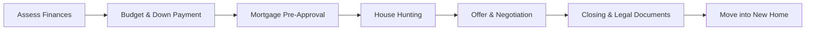

## 5.3 Key Financial Factors to Consider When Purchasing a Home

Purchasing a home remains one of the most significant financial decisions for many Canadians. Whether clients are first-time buyers or experienced property owners, evaluating key financial factors is vital to making informed decisions and achieving long-term wealth management goals. This section provides an overview of crucial considerations—such as affordability, down payments, closing costs, interest rates, property factors, and stress testing—to guide clients in shaping their home-buying strategies.

---

### Understanding Affordability

Affordability is the cornerstone of any home purchase. Clients should ensure the total monthly housing expenses (mortgage payments, property taxes, insurance, and utilities) fit comfortably within their household budgets. Generally, experts recommend keeping housing costs below 32% of gross monthly income.

1. **Household Budgeting**  
   - Start with net household income and list all expenses, including non-housing costs (groceries, transportation, education, etc.).  
   - Allocate a maximum percentage of gross income to housing (commonly known as the Gross Debt Service ratio, GDS).  
   - Include a contingency buffer in case of unexpected costs or temporary reductions in income.

2. **Fixed vs. Variable Expenses**  
   - **Fixed Expenses:** Mortgage principal and interest, property taxes, and home insurance.  
   - **Variable Expenses:** Utilities, maintenance, and seasonal costs such as higher energy bills in winter.  
   - A well-structured budget can help manage both types of expenses, preventing overspending.

3. **CRA Tax Credits and Deductions**  
   - For certain tax considerations in Canada—such as the Home Buyers’ Plan (HBP) for first-time buyers—clients should consult the Canada Revenue Agency (CRA) guides and speak with a tax professional where needed.

---

### Down Payment: Balancing Present and Future Needs

The down payment is the initial equity infusion clients make toward their home. In Canada, a minimum **5%** down payment is generally required for properties below a certain price threshold. However, **20%** or more is often recommended to avoid mortgage default insurance premiums.

1. **Advantages of a Larger Down Payment**  
   - Lower monthly mortgage payments.  
   - Potentially better mortgage rates.  
   - Reduced borrowing costs over the life of the mortgage.

2. **Trade-Offs of a Smaller Down Payment**  
   - Preserves liquidity for other uses, including emergency funds, investments, or business ventures.  
   - Requires mortgage default insurance if below 20%, adding an extra premium to monthly costs through the Canada Mortgage and Housing Corporation (CMHC) or private insurers.

3. **Sources of Down Payment Funds**  
   - **Personal Savings or TFSA Withdrawals:** Tax-free withdrawals can be ideal if managed responsibly.  
   - **Home Buyers’ Plan (HBP):** Allows for withdrawing up to $35,000 from your Registered Retirement Savings Plan (RRSP) if you qualify as a first-time homebuyer.  
   - **Gifts or Family Assistance:** Common in Canada’s high-cost markets (e.g., Vancouver and Toronto).

---

### Closing Costs: The Hidden Extras

Closing costs can amount to **1.5%–4%** (or more) of the property purchase price. These fees often surprise first-time buyers and must be factored into the client’s overall budget and liquidity planning.

1. **Legal Fees**  
   - Attorneys are necessary for title searches, drafting legal documents, and validating property transfers.  
   - Expect anywhere from $1,000–$2,500, or more, depending on the complexity of the transaction.

2. **Land Transfer Taxes (LTT)**  
   - Levied by provinces and sometimes municipalities.  
   - Some provinces (e.g., Ontario) offer rebates for first-time homebuyers.  
   - Always verify the applicable formula to estimate LTT accurately.

3. **Appraisal and Inspection Fees**  
   - **Appraisal Fee:** Typically required by lenders to determine the property’s market value.  
   - **Inspection Fee:** Helps identify potential defects or safety hazards, ensuring the client knows the property’s condition upfront.

4. **Mortgage Insurance (If Applicable)**  
   - Mortgage default insurance costs vary based on down payment size and property value.  
   - CMHC or private insurers provide this coverage for the lender’s protection.

---

### Interest Rates: Navigating Fixed and Variable Options

Interest rates significantly impact how much clients will pay over the life of their mortgage. Both fixed and variable rates come with unique pros and cons.

1. **Fixed-Rate Mortgages**  
   - Offer consistent payments over a set term (often 1–5 years in Canada).  
   - Ideal for clients seeking predictability and protection against rate hikes.  
   - RBC, TD, and BMO typically advertise competitive fixed-rate specials for new buyers.

2. **Variable-Rate Mortgages**  
   - Rate is tied to a benchmark (e.g., lender prime rate based on the Bank of Canada’s overnight rate).  
   - While initial payments may be lower, increases in the prime rate can raise monthly costs.  
   - Advanced strategies, like combining part fixed and part variable (a “hybrid” mortgage), can diversify interest-rate risk.

3. **Impact of Interest Rate Increases**  
   - Rising rates increase mortgage payments and potentially reduce overall affordability.  
   - Advisors can use the Bank of Canada’s mortgage affordability calculator to simulate various interest rate scenarios.

---

### Property Considerations: More Than Just Location

The home’s physical details can affect future maintenance requirements, resale value, and ongoing expenses.

1. **Type of Property**  
   - **Single-Family Home:** Greater privacy but higher maintenance costs (e.g., roof repairs, landscaping).  
   - **Condominium:** Shared maintenance costs but monthly condo fees add to the overall budget.  
   - **Rental Suite or Duplex:** Potential for rental income but may come with additional landlord responsibilities.

2. **Location and Market Trends**  
   - Established or growing neighborhoods with good infrastructure often create better resale potential.  
   - Proximity to workplaces, schools, or transit can influence both lifestyle and property value appreciation.

3. **Age of the Home**  
   - Older homes may be underpriced but often require more extensive renovations or ongoing repairs.  
   - Newer homes can be move-in ready yet may carry higher upfront costs.

---

### Stress Testing: Preparing for Uncertain Future Scenarios

In Canada, lenders apply a “stress test” to ensure borrowers can manage future interest-rate hikes. Even if a client locks in a lower rate, they must qualify at a higher buffer rate, typically the contract rate plus 2%.

1. **OSFI’s Guidelines**  
   - The Office of the Superintendent of Financial Institutions (OSFI) sets federal guidelines for mortgage qualification.  
   - The stress test aims to reduce systemic risk and protect borrowers from defaulting in the event of rate increases or unexpected financial hardships.

2. **Personal Stress Testing**  
   - Encourage clients to overlay personal scenarios: job loss, reduction in rental income, or health-related expenses.  
   - Maintaining an emergency fund to cover at least three to six months of expenses can provide extra security.

---

### Best Practices, Common Pitfalls, and Potential Challenges

#### Best Practices
- **Comprehensive Budgeting:** Factor in all housing-related costs, not just the monthly mortgage payment.  
- **Diversify Down Payment Sources:** Explore options like TFSAs or the Home Buyers’ Plan to enhance financial flexibility.  
- **Compare Rates and Terms:** Shop around, considering different lenders and mortgage brokers, including those at credit unions or online platforms.  
- **Use Available Tools:** Provincial land transfer tax calculators, the Bank of Canada’s mortgage calculator, and CMHC guides can clarify final costs.

#### Common Pitfalls
- **Insufficient Down Payment:** A down payment below 20% can lead to unavoidable high insurance premiums.  
- **Ignoring Renovation or Maintenance Costs:** Minor issues can quickly escalate, impacting your monthly budget.  
- **Overlooking Hidden Fees:** Legal costs or land survey fees can add thousands to final closing estimates.  
- **Not Reviewing the Fine Print:** Certain mortgage terms, such as prepayment penalties or restrictions, can become costly over time.

#### Potential Challenges
- **Market Volatility:** Real estate markets in major Canadian cities like Toronto and Vancouver can experience rapid ups and downs, affecting affordability.  
- **Personal Credit Constraints:** Low credit scores may restrict clients to higher interest rates.  
- **Changing Regulations:** Mortgage rules occasionally shift under new policies from provincial or federal authorities, or new guidelines from CIRO (Canadian Investment Regulatory Organization).

---

### Visualizing the Home-Buying Journey

Below is a simple Mermaid.js flowchart illustrating the path from initial financial planning to final purchase:

**Explanation:** This diagram shows the logical steps of the home-buying process, highlighting the importance of establishing a budget and down payment before seeking mortgage pre-approval and ultimately closing on a property.

---

### Glossary of Important Terms

- **Property Taxes:** Levied by municipal governments based on assessed property values, covering services such as road maintenance and garbage collection.  
- **Home Insurance:** Insurance coverage for damage or loss to a property; mortgage lenders typically require it to protect their collateral.  
- **Land Transfer Tax:** A tax imposed by certain provinces and municipalities upon the transfer of property ownership.  
- **Inspection Fee:** A cost for hiring a professional inspector to evaluate a property’s condition before purchase.  
- **Stress Test:** A regulatory requirement by which borrowers must qualify at a higher rate than the actual mortgage rate to ensure affordability under future rate increases.

---

### Additional Resources

- **Canada Mortgage and Housing Corporation (CMHC):**  
  Useful guides on mortgage default insurance, down payment requirements, and closing costs.  
  <https://www.cmhc-schl.gc.ca>

- **Financial Consumer Agency of Canada (FCAC):**  
  Offers a comprehensive “Home Buyers Checklist” covering financial and regulatory considerations.  
  <https://www.canada.ca/en/financial-consumer-agency/services/buying-home.html>

- **Bank of Canada Mortgage Calculator:**  
  A tool to run stress test scenarios and gauge monthly payments under different interest-rate environments.  
  <https://www.bankofcanada.ca>

- **Land Transfer Tax Calculators:**  
  Provincial or municipal sites (e.g., Ontario’s LTT website, British Columbia’s Property Transfer Tax portal).  
  Check your province or municipality for the relevant pages.

- **CIRO (Canadian Investment Regulatory Organization):**  
  For investment dealer and mutual fund dealer regulatory guidelines.  
  <https://www.ciro.ca>

- **Recommended Reading:**  
  - “The Wealthy Renter” by Alex Avery for insights on renting vs. owning.  
  - Continuing professional education through recognized Canadian business schools or the Canadian Securities Institute.

---

### Summary

Clients need to consider a multifaceted set of factors—affordability, down payment options, closing costs, interest rates, property characteristics, and stress testing—when purchasing a home in Canada. Each element can have a substantial long-term impact on both day-to-day cash flow and overall wealth management goals. Advisors play a pivotal role in guiding clients through budgeting, understanding regulatory requirements, comparing mortgage structures, and employing stress-testing techniques to ensure a comfortable and sustainable homeownership experience.

With strategic planning, comprehensive analysis, and the use of readily available resources, clients can position themselves for financial success and stability in the Canadian real estate market.

---

## Mortgage Affordability and Home Buying in Canada: Quiz



### Which of the following is part of a recommended approach to ensure affordability when purchasing a home?

- [x] Keeping housing costs below 32% of gross monthly income.
- [ ] Maximizing monthly mortgage payments.
- [ ] Using a credit card to cover the down payment.
- [ ] Applying only for the largest mortgage possible, regardless of budget.

> **Explanation:** Advising clients to keep housing costs (mortgage, taxes, insurance) below 32% of their gross income is a common guideline to maintain manageable debt levels.

### What is a key advantage of a larger down payment?

- [x] Lower monthly mortgage payments.
- [ ] Higher interest rates.
- [ ] Eligibility for larger closing cost rebates.
- [ ] Exemption from paying property taxes.

> **Explanation:** A larger down payment reduces mortgage principal, resulting in lower monthly payments and less overall interest.

### Which cost would most likely be included in the range of approximately 1.5%–4% of a home’s purchase price?

- [x] Legal fees and land transfer taxes.
- [ ] Monthly utility bills.
- [ ] Mortgage principal payments.
- [ ] Ongoing property maintenance costs.

> **Explanation:** Closing costs (typically 1.5%–4%) combine expenses such as legal fees, appraisal fees, and land transfer taxes.

### How do fixed-rate mortgages differ from variable-rate mortgages?

- [x] A fixed-rate mortgage maintains consistent interest rates over the term, while a variable-rate mortgage can fluctuate with the market.
- [ ] A fixed-rate mortgage is only available through private lenders, while a variable-rate mortgage is only available through Canadian chartered banks.
- [ ] A variable-rate mortgage guarantees lower interest rates for the entire term.
- [ ] Only fixed-rate mortgages require mortgage default insurance.

> **Explanation:** Fixed-rate mortgages lock in a rate for a set term, whereas variable-rate loans adjust according to the prime rate or other benchmarks.

### Which of the following factors can affect ongoing property maintenance costs?

- [x] The home’s age.
- [ ] The mortgage stress test rate.
- [x] Property type (e.g., single-family, condo).
- [ ] Accounting for GDS beyond 50% of monthly income.

> **Explanation:** Property type and age can directly impact maintenance costs. A stress test influences mortgage affordability, not the property’s maintenance expenses.

### What is the purpose of the regulatory “stress test” for mortgages in Canada?

- [x] To ensure borrowers can manage future interest-rate hikes.
- [ ] To increase the mortgage approval rate for first-time buyers.
- [ ] To lock in a below-market interest rate.
- [ ] To provide free CMHC coverage.

> **Explanation:** The stress test qualifies borrowers at a higher interest rate, protecting them from potential financial strain if rates rise.

### Which of the following closing costs might be overlooked by a first-time buyer?

- [x] Home inspection fee.
- [ ] Preventive home maintenance.
- [x] Appraisal fee.
- [ ] Monthly mortgage payment.

> **Explanation:** While many focus on the mortgage payment itself, some first-time buyers forget about additional upfront costs like the inspection and appraisal fees.

### Why might a homebuyer choose a variable-rate mortgage?

- [x] Potential to benefit from lower initial interest rates.
- [ ] Guaranteed rate predictability over the life of the mortgage.
- [ ] Disregarding the possibility of rate increases.
- [ ] Avoiding land transfer taxes.

> **Explanation:** A variable-rate mortgage can offer lower initial rates, though borrowers face the risk of rising rates if the prime rate goes up.

### What can happen if a borrower fails to plan for property tax payments?

- [x] They could experience a budget shortfall and default risks over time.
- [ ] They receive an automatic extension on mortgage payments.
- [ ] Nothing, as it has no impact on homeownership costs.
- [ ] They become exempt from municipal taxes.

> **Explanation:** Property taxes are a significant component of housing costs. Failure to plan for them may lead to financial stress or risk of default.

### True or False: Having less than a 20% down payment in Canada can require mortgage default insurance through CMHC or a private insurer.

- [x] True
- [ ] False

> **Explanation:** If a borrower provides a down payment below 20%, Canadian regulations typically mandate mortgage default insurance to protect the lender.


