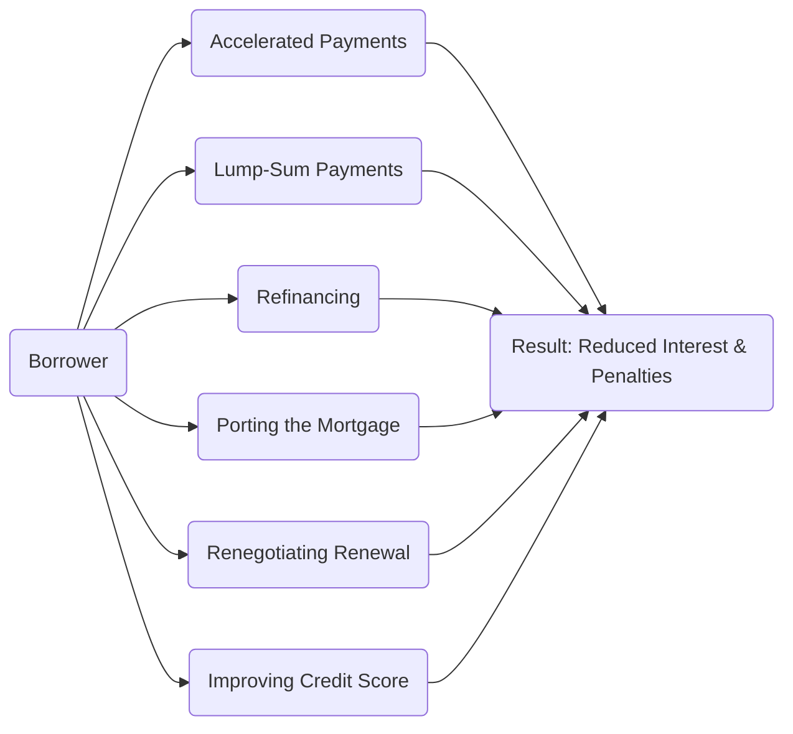

## 5.4 Methods of Reducing Interest Costs and Penalties

Reducing the interest costs and penalties associated with a mortgage can greatly improve a client’s long-term financial outlook. While mortgage contracts vary across lenders, several strategies—when applied thoughtfully—offer potential cost savings. This section examines accelerated payment options, lump-sum prepayments, refinancing, porting, renewal opportunities, credit score improvements, and the importance of understanding penalty calculations. It also provides insights into relevant Canadian mortgage regulations, sample calculation methods, and resources for deeper exploration.

---

### Accelerated Payments

One of the most accessible ways to reduce interest costs in Canada is through an accelerated mortgage payment schedule. Typically, homeowners can choose from several payment frequencies:

- Weekly (52 payments/year)  
- Bi-weekly (26 payments/year)  
- Semi-monthly (24 payments/year)  
- Monthly (12 payments/year)  

With an accelerated weekly or bi-weekly schedule, borrowers effectively make an extra monthly payment each year. This can shorten the total amortization period while avoiding significant disruptions to monthly cash flow.

#### Benefits of Accelerated Payment Schedules
- Faster mortgage principal reduction, resulting in less total interest paid  
- Builds home equity more quickly, which can be beneficial if the property is sold or refinanced later  
- Moderately sized, more frequent payments can be easier to budget for some households  

#### Practical Example
If a client has a $400,000 mortgage at 5% annual interest, amortized over 25 years, switching from monthly to accelerated bi-weekly payments could save them tens of thousands of dollars in interest over the life of the mortgage. Such savings vary depending on the initial loan amount, interest rate, and overall term, but the principle remains consistent across major Canadian lenders like RBC, TD, or BMO.

---

### Lump-Sum Payments

Many mortgage contracts in Canada allow borrowers to make lump-sum principal payments annually or at specific intervals without incurring a prepayment penalty. Utilizing these privileges helps clients pay down their mortgages faster and reduce the interest accrual base.

- Common mortgage options permit annual lump-sum payments of up to 10%, 15%, or 20% of the original principal.  
- Even if a borrower cannot maximize the annual limit, any amount applied directly to principal can substantially lower long-term interest costs.  
- Some homeowners align lump-sum payments with year-end bonuses, tax refunds, or inheritances.

#### Step-by-Step Approach
1. Review the mortgage agreement’s prepayment privileges for allowable annual amounts.  
2. Determine how much a client can comfortably pay without jeopardizing their liquidity or other financial goals.  
3. Make the lump-sum payment at the ideal time (e.g., early in the year) to maximize interest savings.  
4. Track the mortgage balance and recalculate amortization schedules to visualize reduced costs.

---

### Refinancing

Refinancing involves replacing an existing mortgage with a new one, generally to secure a more favorable interest rate or adjust other loan terms. In Canada, fluctuating market rates can create opportunities to reduce overall borrowing costs. However, borrowers should balance potential interest savings against any penalties or fees for breaking the current mortgage.

#### Key Considerations
1. Prepayment Penalties: Lenders typically charge either three months’ interest or an Interest Rate Differential (IRD) to exit a fixed-rate mortgage early.  
2. Administrative & Legal Fees: Refinancing often entails appraisal, legal, and registration costs.  
3. Improved Terms: A lower rate, extended or shortened amortization, or access to home equity could outweigh penalty charges over the long term.

#### Real-World Example
A client with a 3.5% fixed mortgage for three years remaining may choose to refinance if rates drop to 2.5%. Even after factoring in the IRD, the client may still realize net savings. Industry examples include RBC and TD offering “blend and extend” options that can help mitigate penalties by combining the remaining term’s rate with the new rate.

---

### Porting a Mortgage

Porting a mortgage allows a borrower to transfer the terms and rate of their existing mortgage from one property to another. This can help clients avoid early payout penalties when purchasing a new home. However, the new property must meet the lender’s underwriting criteria, and timing between closings can sometimes complicate porting.

#### Advantages of Porting
- Avoidance of early payout penalties if the mortgage is moved seamlessly  
- Retention of an existing favorable rate in a rising interest rate environment  
- Continuity of terms and conditions that the borrower finds beneficial

#### Pitfall
If there is any delay in closing dates or a mismatch between property values, the client may face complications or potentially lose porting privileges. Checking with the lender for specific conditions is essential.

---

### Renegotiating Renewals

At the end of each mortgage term in Canada, borrowers have an opportunity to renegotiate or “renew” the contract. This is a strategic time to:

- Shop around for better rates or more flexible terms.  
- Negotiate with the existing lender, leveraging competitive offers from other institutions.  
- Explore new mortgage products that might be more aligned with financial goals.

#### Best Practices for Renewals
- Start exploring rates and terms at least four months before the renewal date.  
- Maintain open communication with the current lender and inform them of other rates you have been offered.  
- Evaluate the overall cost (not just the interest rate) and compare any fees that different lenders might charge.

---

### Improving Credit Score

A client’s credit score significantly impacts lending options, including mortgage interest rates and terms. A higher credit score translates into better financing flexibility and potentially lower interest costs.

#### Credit Score Improvement Strategies
1. Reduce Outstanding Balances: Aim to keep credit utilization ratios below 30%.  
2. Pay Bills on Time: Late or missed payments negatively affect credit scores.  
3. Check Credit Reports for Errors: Incorrect or outdated information can depress a score needlessly.  
4. Limit New Credit Applications: Frequent applications can signal financial distress to lenders.

#### Practical Impact
Clients who enhance their credit scores over a few years may benefit from improved refinancing or renewal terms, especially if their existing mortgage is up for renewal in a rising rate environment.

---

### Penalty Calculations

Breaking a mortgage contract before the scheduled term often triggers penalties. Canadian lenders typically apply:

1. **Three Months’ Interest**:  
   The borrower pays an amount equivalent to three months’ worth of interest payments at the mortgage’s current rate.  
2. **Interest Rate Differential (IRD)**:  
   The IRD is calculated by comparing the original mortgage rate to the rate that the lender could charge for the remaining term. The difference in rates (multiplied by the principal and the time remaining) forms the penalty.

It is crucial for clients to understand precisely how their penalty will be computed if they opt for early paydown or refinancing—particularly in an environment where interest rates can fluctuate significantly.

#### Sample IRD Formula

If the lender’s posted rate for a comparable term is denoted as \\( r_{new} \\), and the borrower’s remaining loan principal is \\( P \\), then the yearly interest rate differential penalty can be approximated as:

$$
\text{IRD Penalty (annual)} = P \times (r - r_{new})
$$

where \\( r \\) is the borrower’s original annual mortgage rate. The penalty is often prorated based on the time remaining in the term.

---

### Diagram: Strategies for Reducing Mortgage Costs

In this flowchart, each node from Accelerated Payments to Improving Credit Score contributes to lowering overall mortgage costs over the long term. When combined effectively, these strategies can substantially reduce the borrower’s debt burden.

---

### Canadian Regulatory Context and Resources

Financial professionals should remain aware of relevant regulations and guidelines that influence mortgage lending and refinancing:

- **CIRO Guidelines:** Canada’s national self-regulatory organization overseeing investment dealers and mutual fund dealers. Although CIRO’s direct influence on mortgages may be more limited than on investment products, its guidelines reinforce transparency and proper disclosure of fees or penalties in any service relationship with the client.  
- **OSFI Prudent Refinancing Guidelines:** The Office of the Superintendent of Financial Institutions (OSFI) offers guidance to federally regulated financial institutions, helping ensure lenders operate within prudent risk management frameworks.  
- **FCAC (Financial Consumer Agency of Canada):** The FCAC provides consumer information on mortgage prepayment penalties and more. Their Mortgage Calculator can help clients model how lump-sum or accelerated payments affect long-term cost:  
  https://itools-ioutils.fcac-acfc.gc.ca/MC-CH/MortgageCalculator.aspx  
- **CRA (Canada Revenue Agency):** Mortgage interest is generally not tax-deductible for primary residences in Canada, though other tax implications (e.g., for investment properties) may exist.  
- **Additional Reading**:  
  - “The Complete Guide to Purchasing a Condo in Canada” by Dan Barnabic  
  - OSFI’s ongoing updates and advisories for federally regulated lenders  
  - Government of Canada’s website on mortgages: https://www.canada.ca/en/financial-consumer-agency/services/mortgages.html

---

### Putting It All Together: Best Practices and Pitfalls

**Best Practices**
- Conduct annual reviews of a client’s mortgage to assess potential savings.  
- Encourage small, consistent improvements (accelerated payments, small lump sums) that accumulate into large interest savings.  
- Maintain a strong lender-client relationship to facilitate negotiations and flexible solutions.

**Common Pitfalls**
- Ignoring penalty details: Some homeowners inadvertently trigger high penalties because they did not check whether the IRD exceeds three months’ interest.  
- Overextending financially: Large lump-sum payments should not compromise emergency funds or other investments.  
- Failing to assess break-even points: Refinancing or porting only makes sense after considering all associated costs.

---

### Recap

Methods to reduce mortgage interest costs and penalties include choosing an accelerated payment schedule, making lump-sum contributions when possible, refinancing (if it yields net savings despite penalties), porting a mortgage upon moving, and renegotiating better terms at renewal. Improving credit scores ensures clients access more favorable borrowing rates and terms. Advisors in Canada should ensure clients understand prepayment privileges, penalty calculations, and relevant regulatory guidelines to optimize their mortgage strategies.

---

## Lower Your Mortgage Expenses in Canada: A Comprehensive Quiz



### 1. Which of the following payment schedules can help reduce total interest costs without significantly increasing monthly cash outflow?

- [ ] Monthly  
- [x] Accelerated bi-weekly  
- [ ] Semi-monthly  
- [ ] Decreasing payments

> **Explanation:** Accelerated bi-weekly payments make the annual outflow slightly higher than simple bi-weekly or monthly structures, resulting in additional principal reduction over time.

### 2. When considering a lump-sum payment toward a mortgage, which key factor must a client verify first?

- [ ] If their mortgage is variable rate  
- [x] The prepayment privileges in their mortgage contract  
- [ ] Whether house prices are rising in their neighborhood  
- [ ] That the client’s monthly payment will stay the same

> **Explanation:** Clients should always review the maximum allowable prepayment amount under their contract to avoid penalties or additional fees.

### 3. Which of the following penalties might apply for paying off a fixed-rate mortgage early?

- [ ] Nothing, it’s always free to pay a mortgage early in Canada  
- [x] Three months’ interest or an Interest Rate Differential (IRD)  
- [ ] A one-year interest penalty on the principal  
- [ ] A 10% penalty on the outstanding balance

> **Explanation:** Most Canadian lenders calculate early mortgage payoff penalties using either three months’ interest or an IRD, whichever is higher.

### 4. If a borrower’s current mortgage rate is 3.2% and the lender’s posted rate for a comparable remaining term is 2.7%, which formula best represents the annual IRD calculation?

- [x] IRD = P × (3.2% – 2.7%)  
- [ ] IRD = 3 months’ interest at 2.7%  
- [ ] IRD = principal × monthly payment × 0.5%  
- [ ] IRD = scheduling penalty × 12 months

> **Explanation:** The IRD is calculated by multiplying the principal by the difference in rates over the prorated remaining term.

### 5. Which statement best describes the benefit of mortgage porting?

- [x] It allows clients to transfer their existing rate and terms to a new property  
- [ ] Clients can eliminate penalties even if the mortgage isn’t fully closed  
- [ ] It guarantees a higher mortgage amount without requalification  
- [ ] It always results in a lower interest rate

> **Explanation:** Porting lets a borrower keep the existing rate and terms, helping them avoid early payout penalties under certain conditions.

### 6. Which Canadian regulatory body offers consumer information on mortgage prepayment penalties?

- [ ] CSA (Canadian Securities Administrators)  
- [ ] CIRO (Canadian Investment Regulatory Organization)  
- [ ] OSFI (Office of the Superintendent of Financial Institutions)  
- [x] FCAC (Financial Consumer Agency of Canada)

> **Explanation:** The FCAC publishes guidance and resources to help Canadian consumers understand costs and strategies related to mortgages.

### 7. What is a primary advantage of improving one’s credit score before mortgage renewal?

- [x] It can lead to more favorable interest rates and terms.  
- [ ] It eliminates the need for mortgage insurance.  
- [x] It may increase leverage in negotiating a lower penalty.  
- [ ] It reduces the cost of home inspections.

> **Explanation:** Excellent credit can help a borrower qualify for the best rates and reduce potential penalty negotiations, improving overall financing flexibility.

### 8. Which of the following is NOT a typical approach for reducing mortgage interest costs?

- [x] Switching from accelerated to monthly payments  
- [ ] Refinancing to a lower interest rate  
- [ ] Making extra lump-sum principal payments  
- [ ] Improving credit score

> **Explanation:** Switching from accelerated to monthly payments would likely increase total interest costs over the long term rather than reduce them.

### 9. What is the key benefit of negotiating proactively at mortgage renewal time?

- [ ] Ensures the lender can recalculate penalties.  
- [ x] Allows the borrower to compare competitive rates and possibly secure better terms.  
- [ ] Increases mortgage default insurance coverage.  
- [ ] Eliminates the requirement for property appraisals.

> **Explanation:** The renewal window is an opportunity to shop around and compare market rates, enhancing the leverage to secure more favorable terms.

### 10. True or False: A lump-sum payment always requires the borrower to pay a penalty.

- [x] True
- [ ] False

> **Explanation:** This statement is actually false in many cases. Borrowers often have prepayment privileges allowing certain amounts or percentages to be paid penalty-free. If they exceed these limits, then a penalty can apply, but not in every case.




