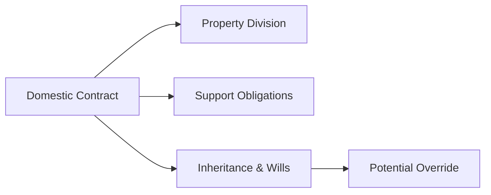

## 6.3 Domestic Contracts

Domestic contracts—often referred to as “family law agreements”—are a vital component of wealth management in Canada. Whether you are advising clients before marriage, during cohabitation, or at the point of separation, understanding the structure, enforceability, and implications of domestic contracts can help safeguard your clients’ financial well-being. These agreements lay out the financial and property rights between parties, potentially reducing legal complexity and conflict if the relationship ends.

Below, we delve into the types of domestic contracts, their objectives, the critical elements needed to ensure enforceability, and best practices for financial professionals advising clients. We will also discuss relevant Canadian regulations and highlight resources that can help guide the process.

---

### Overview of Domestic Contracts

In essence, domestic contracts (also called family law agreements) serve to define or clarify the legal relationship between two individuals who are married, planning to marry, living together, or separating. These agreements typically outline:

- How property is divided if the relationship breaks down.  
- The spousal support obligations (or the waiver thereof).  
- How to address existing assets, inheritances, or business interests.  
- Responsibilities for any debts or ongoing financial obligations.

Though family law falls under provincial or territorial jurisdiction, each region in Canada broadly recognizes prenuptial (marriage) agreements, cohabitation agreements, and separation agreements. However, the specific rules about their enforceability may vary slightly. In Ontario, for example, the key statute is the Family Law Act (Ontario), whereas British Columbia relies on the Family Law Act (British Columbia). Advisors should always encourage clients to consult a lawyer familiar with the relevant jurisdiction.

---

### Types of Domestic Contracts

#### Prenuptial Agreement (Marriage Contract)
A prenuptial agreement is made before marriage. It stipulates how property, business interests, and financial obligations will be handled in the event of divorce or death. For instance, an executive with stock options in a large bank such as RBC, TD, or BMO might wish to protect her shares from being considered part of the marital property. The prenuptial agreement would typically outline each party’s assets entering the marriage and how those assets—or any growth in value—will be divided upon separation or death.

#### Cohabitation Agreement
A cohabitation agreement serves a similar purpose as a prenuptial agreement but applies to partners who live together without being legally married. Cohabitation agreements are especially important in provinces where common-law spouses may have spousal support or property division rights by default, such as British Columbia and others.

#### Separation Agreement
A separation agreement outlines the terms of a couple’s separation, covering child support, spousal support, parenting arrangements, and division of property. It can be entered into by both legally married and common-law spouses who are no longer cohabiting as a couple.

---

### Key Objectives of Domestic Contracts

1. **Establish Clear Financial Obligations**  
   Clearly define each party’s rights and responsibilities regarding debts, property, and assets. This clarity reduces future uncertainties and conflicts.

2. **Specify Property Ownership and Division Rules**  
   Determine how to divide or retain specific assets, especially assets acquired prior to or during the relationship. For example, spouses in a Vancouver-based couple might agree that any growth in a private corporation remains with the business owner spouse, subject to certain compensation.

3. **Set or Waive Spousal Support**  
   Under certain conditions, and depending on provincial laws, spouses may agree to the level of spousal support or to waive support entirely. Courts, however, retain ultimate discretion in ensuring terms are fair and not unconscionable.

4. **Reduce Litigation Risks**  
   By addressing pivotal financial matters in advance, domestic contracts can minimize court battles and legal costs if disagreements arise later.

---

### Advising Clients on Domestic Contracts

Financial advisors can play an invaluable role in guiding clients through the process of domestic contracts. Although you are not in a position to give legal advice, you can help clients appreciate the financial implications and direct them to qualified lawyers. Below are key considerations:

1. **Independent Legal Advice (ILA)**  
   - Recommend each party seek their own legal counsel to ensure they understand the contract’s legal implications.  
   - This requirement helps prevent arguments that a party did not understand what they were signing.

2. **Full Financial Disclosure**  
   - Encourage clients to provide detailed disclosure of their assets, liabilities, and income sources. Any misrepresentation may be grounds for challenging the contract.  
   - It is common for financial advisors to assist in organizing net worth statements or pulling statements from investment accounts (e.g., RBC Dominion Securities, TD Wealth Management, BMO Nesbitt Burns).

3. **Incorporate Specialists Where Needed**  
   - A broad wealth management team often includes tax specialists, family law professionals, and estate planners.  
   - Canadian pension plans, for instance, have specific rules about dividing pension rights upon marital breakdown, and specialized counsel may be prudent.

4. **Awareness of Beneficiary Designations and Wills**  
   - Domestic contracts can override existing will provisions if they address the same property.  
   - Ensure that beneficiary designations in registered accounts (e.g., RRSPs) and life insurance policies align with the contract’s terms and provincial family law requirements.

5. **Mind Provincial/Territorial Variations**  
   - Different jurisdictions (e.g., Quebec, Ontario, British Columbia) have unique rules for spousal property division, spousal support, and common-law relationships.  
   - Review the Department of Justice Canada resources and provincial Family Law Information Centres for further support.

---

### Potential Court Intervention and Limitations

Domestic contracts can be struck down or modified by courts under certain conditions. Canadian courts generally uphold contracts unless they are deemed:

- **Unconscionable**: Extremely unfair or one-sided.  
- **Signed Under Duress**: One party was coerced or pressured improperly.  
- **Lacking Financial Disclosure**: One party hid assets or substantially misrepresented income.  
- **Misunderstood**: If it is proven that a party did not comprehend the nature or consequences of the agreement.

“Unconscionability” may also reference scenarios where the agreement’s impact becomes grossly unfair over time due to unforeseen circumstances (e.g., serious illness or loss of employment).

---

### Real-World Example: Canadian Pension Fund Scenario

Consider a hypothetical scenario in which one spouse is an executive at one of Canada’s largest pension funds. She brought substantial defined-benefit pension entitlements into the relationship. If those entitlements significantly grow over time, questions about how to divide the future pension can arise upon separation or divorce. A domestic contract can clarify whether pension benefits are fully shared or if certain portions remain outside the matrimonial property regime. This proactive approach provides greater financial certainty for both parties and reduces stress during separation negotiations.

---

### Practical Insights for Wealth Advisors

- **Tip**: Encourage clients to review domestic contracts periodically, especially if they experience large windfalls or the birth of children, or if they relocate to a different province.  
- **Important**: Document any discussions about domestic contracts carefully, including disclaimers that legal advice must be sought from a family lawyer or notary (in Quebec).  
- **Pitfall**: Failing to cross-check beneficiary designations in an RRSP or RRIF after a separation agreement may lead to unintended consequences. For example, if a spouse was initially listed as beneficiary but the separation agreement revokes that benefit, an updated beneficiary designation is crucial.  
- **Strategy**: Advisors can use open-source budgeting tools or financial planning software to create detailed net worth worksheets, ensuring clients meet the requirement for “full and frank financial disclosure.”

**Diagram Explanation:**  
The flowchart above illustrates how a domestic contract can govern property division, define spousal support, and even affect inheritance or will provisions. The “Potential Override” arrow shows that where a domestic contract covers specific assets (e.g., a cottage, a life insurance policy benefit), its terms may override conflicting directions in a will.

---

### Regulation and Resources

Below is a non-exhaustive list of Canadian resources to guide further research:

- **Provincial or Territorial Family Legislation**  
  - Ontario’s Family Law Act, British Columbia’s Family Law Act, Alberta’s Family Property Act, etc.  
  - Each statute provides jurisdiction-specific rules on property division and support obligations.

- **Department of Justice Canada**  
  - Comprehensive resources on separation and divorce:  
    https://www.justice.gc.ca/eng/fl-df/

- **Family Law Information Centres**  
  - Often available through local courthouses, these centres provide free or low-cost info on domestic contracts.

- **CIRO (Canadian Investment Regulatory Organization)**  
  - While historically, the MFDA and IIROC were separate Self-Regulatory Organizations (SROs), they amalgamated into CIRO on January 1, 2023. CIRO’s website (https://www.ciro.ca) offers resources related to regulatory standards for investment dealers and can help advisors understand their compliance obligations when handling client assets.

- **Recommended Reading**  
  - “The Family Law Sourcebook for British Columbia” (Continuing Legal Education Society of BC).  
  - “The Law of Family Property” by Rollie Thompson & Carol Rogerson (useful for advisors seeking a deeper understanding of property division jurisprudence).

---

### Summary

Domestic contracts are a cornerstone of proactive wealth management, allowing couples to clarify financial rights and responsibilities, potentially preventing costly disputes. As a financial advisor, your role is to:

- Alert clients to the financial implications of entering a domestic contract.  
- Encourage transparent disclosure of assets and liabilities.  
- Emphasize the necessity of seeking independent legal counsel.  
- Remain vigilant about how these agreements interact with beneficiary designations, wills, and trusts.

When carefully drafted and supported by full disclosure, domestic contracts provide valuable legal and financial protections for Canadian families, ensuring clarity, fairness, and peace of mind in various relationship scenarios.

---

## Domestic Contracts Quiz: Test Your Canadian Family Law Knowledge



### 1. Which of the following correctly describes the purpose of a domestic contract in Canada?

- [x] It sets out each partner’s financial obligations, property rights, and potential support provisions.
- [ ] It only serves to renegotiate interest rates on a joint mortgage.
- [ ] It is a standard lease agreement for couples renting property.
- [ ] It is an arrangement solely to structure a holding company.

> **Explanation:** Domestic contracts (prenuptial, cohabitation, and separation agreements) clarify financial obligations, outline property division, and set or waive spousal support terms.

### 2. What is the importance of “independent legal advice” (ILA) in domestic contracts?

- [x] Ensures each party fully understands the contract’s implications before signing.
- [ ] It eliminates the need for financial disclosures.
- [ ] It guarantees the agreement will never be overturned by a court.
- [ ] It only applies if both parties are Canadian citizens.

> **Explanation:** Each party must understand their rights and obligations under the agreement. Courts may set aside contracts where one spouse did not obtain ILA or lacked capacity to consent.

### 3. Domestic contracts may override certain will provisions. What does this imply for estate planning?

- [x] Contractual terms in a domestic contract can supersede conflicting clauses in a will.
- [ ] Once a will is drafted, it always has priority over domestic contracts.
- [ ] A will and a domestic contract can never address the same assets.
- [ ] A domestic contract has no effect on estate planning whatsoever.

> **Explanation:** The stipulations in a domestic contract may, for example, specify that a spouse is entitled to or excluded from specific property, overriding instructions in a previously drafted will.

### 4. Under which circumstances might Canadian courts set aside a domestic contract?

- [x] If it is found to be unconscionable or signed under duress.
- [ ] When both spouses have independent legal advice.
- [ ] Only when the agreement is less than one year old.
- [ ] If the agreement was signed in a province other than Quebec.

> **Explanation:** Courts aim to protect fairness. A domestic contract can be overturned if it’s profoundly unjust, was signed under coercion, or lacked informed consent.

### 5. What is a core requirement for the enforceability of a domestic contract?

- [x] Full and frank financial disclosure by both parties.
- [ ] Registration with CIRO.
- [ ] A mandatory real estate appraisal in every case.
- [ ] Endorsement by a federal arbitrator.

> **Explanation:** Without complete transparency, courts may invalidate the contract or modify its terms.

### 6. Which of the following best describes a prenuptial agreement?

- [x] A legal contract signed before marriage outlining property and support obligations.
- [ ] A contract used exclusively by couples who cohabit for over five years.
- [ ] A type of mortgage contract signed with a Canadian bank.
- [ ] A spousal arrangement that only deals with child support.

> **Explanation:** A prenuptial agreement (marriage contract) is entered before marriage and can address property division, spousal support, and estate matters.

### 7. If a couple separates and signs a separation agreement, which topics are typically covered?

- [x] Property division, spousal support, child support, and parenting arrangements.
- [ ] Only child custody matters.
- [x] Pension benefit splits where relevant.
- [ ] Techniques to incorporate an offshore business.

> **Explanation:** A separation agreement often deals comprehensively with family finances, support obligations, and parenting plans.

### 8. Why should advisors monitor potential changes to beneficiary designations after a domestic contract is signed?

- [x] To maintain alignment between the domestic contract’s provisions and estate planning tools.
- [ ] Because it is a legal requirement that changes must be made annually.
- [ ] To ensure the spouse is always listed on investment accounts.
- [ ] Because banks will cancel the client’s accounts otherwise.

> **Explanation:** If a domestic contract changes asset allocation or ownership, updating beneficiary designations is critical so they remain consistent with the agreement.

### 9. Which regulatory body now oversees investment dealers and mutual fund dealers in Canada?

- [x] CIRO (Canadian Investment Regulatory Organization)
- [ ] MFDA
- [ ] IIROC
- [ ] OSFI

> **Explanation:** The MFDA and IIROC amalgamated on January 1, 2023, into CIRO. References to MFDA or IIROC are now historical.

### 10. True or False: Seeking legal advice is unnecessary if both parties agree to the terms informally and sign a written agreement at home.

- [x] True
- [ ] False

> **Explanation:** This is actually a trick question. While an agreement can be signed at home, failing to have professional legal advice and proper witness or disclosure procedures increases the likelihood that courts could later set it aside. In practice, seeking legal advice is strongly recommended.


