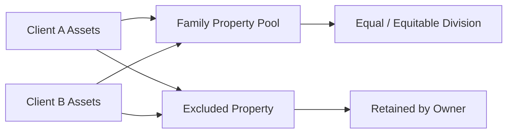

## 6.4 Property Issues on Relationship Breakdown

When a relationship ends—whether it is a marriage or a common-law partnership—one of the most complex and sensitive financial challenges is dividing property. In Canada, the laws and regulations that govern this process vary by province or territory, with some jurisdictions mandating an equal division of “family property” and others adopting a more flexible “equitable” or “fair” division approach. Understanding the classification of property, the tax implications of property transfers, pension splitting rules, and major provincial differences is critical for wealth advisors seeking to provide comprehensive guidance.

Wealth advisors can play an instrumental role in identifying assets, understanding the client’s preferences (e.g., retaining the matrimonial home vs. liquidating certain investments), and managing the potential cash flow or liquidity needs that arise when dividing assets. This section outlines key considerations, processes, and professional resources that can help advisors navigate property issues effectively when a relationship breaks down.

---

### Family Property vs. Excluded Property

In most Canadian jurisdictions, family property (also referred to as marital property) typically includes any assets acquired during the marriage or relationship, such as:

- Cash, deposits, and investments (e.g., GICs, stocks, mutual funds).
- Real property (e.g., a vacation home purchased during the relationship).
- Business interests (e.g., incorporated family businesses or shares in a professional corporation).
- Pension or retirement savings (e.g., RRSPs, Defined Benefit or Defined Contribution pension plans).
- Personal property (e.g., vehicles, furniture, valuable art purchased during the relationship).

Excluded property often remains outside the scope of equal division. Common categories of excluded property can include:

- Inheritances and gifts received by one partner and kept segregated from family use.
- Some forms of personal injury awards or settlements.
- Assets acquired before the relationship began, if certain conditions are met.
- Certain trusts or corporate assets specifically protected by law or legal agreements (e.g., pre-marital or company assets firmly documented as non-family property).

Across Canada, there may be nuances in identifying and tracing excluded property. For example, if an inheritance is deposited into a joint bank account or used for family purposes (e.g., renovations to the matrimonial home), it may lose its excluded status. Proper documentation and record-keeping become essential.

---

### The Matrimonial Home

The matrimonial home—sometimes called the family home—holds a distinctive status in many Canadian provinces. Regardless of whose name is on the title, both spouses generally have an equal right to remain in the home after a separation. In some provinces, the value of the matrimonial home is split evenly, even if it was owned by one spouse prior to the relationship.

#### Special Considerations

- In Ontario, the matrimonial home is included in the property equalization calculation. Regardless of when or how the property was acquired, it is typically deemed to be divisible.
- In other provinces, couples may enter domestic contracts (e.g., prenuptial, cohabitation, or postnuptial agreements) clarifying the classification and division of the home.
- For couples in common-law relationships, the legal rules may differ from province to province. It’s crucial to confirm any occupancy rights, property rights, or potential obligations through local family law statutes.

Advisors should guide clients to obtain sound legal counsel specializing in family law while being prepared to offer financial perspectives on potential outcomes (e.g., whether to keep or sell the home, the tax implications of a buyout, or the projected future value of the property).

---

### Tax Implications of Property Transfers

Property transfers following a relationship breakdown may trigger tax consequences if not structured properly. Common scenarios include:

1. **RRSP Transfers**  
   - Spouses or common-law partners can often move RRSP or RRIF holdings to each other on a tax-deferred basis under the federal Income Tax Act.  
   - A key document is form T2220 from the Canada Revenue Agency (CRA), which can facilitate a tax-free transfer of RRSP assets.

2. **Real Estate and Capital Gains**  
   - Principal residences typically enjoy an exemption from capital gains tax if they qualify as the individual's principal residence for all years owned. However, multiple properties, recreational properties, or income-generating real estate can complicate matters.  
   - The attribution rules under the Income Tax Act can reassign capital gains or losses between spouses, depending on ownership changes.

3. **Corporate Shares or Business Assets**  
   - Transfers of shares in a private corporation could trigger capital gains unless eligible rollover provisions apply. Close collaboration with legal and tax professionals is wise to ensure any deferrals or rollovers are taken advantage of.

4. **Property Transfer Taxes**  
   - Some provinces, like British Columbia and Ontario, levy a property transfer tax or land transfer tax when real estate changes ownership. Certain exemptions exist for spousal transfers on separation or divorce. Advisors should confirm eligibility for provincial exemptions.

---

### Pension Splitting and Retirement Assets

One of the most contentious assets in a relationship breakdown can be pension entitlements, especially if one or both spouses have a sizable defined benefit plan (e.g., a government or large corporate pension). Provinces and territories have legislation allowing (and sometimes requiring) the division of pension benefits accrued during the marriage or cohabitation.

- Defined Benefit (DB) Plans: May need actuarial valuation to determine the commuted value. This can be split upon separation, often requiring the spouse without the pension to receive cash or a lump-sum transfer into their own locked-in vehicle (e.g., a Locked-in Retirement Account (LIRA)).  
- Defined Contribution (DC) Plans: Usually simpler to split (e.g., transferring a portion of the plan value to the other spouse’s retirement account).  
- RRSPs and Group RRSPs: Easier to split under CRA rules when accompanied by a formal separation agreement or court order.

Coordinating pension-splitting can be especially relevant for clients with large pension entitlements from significant Canadian employers such as RBC, TD, or BMO. Pension splitting can also apply to government pensions like those from the Ontario Teachers’ Pension Plan or Canada’s public service plans, subject to specific legal and regulatory provisions.

---

### Timelines, Deadlines, and Record-Keeping

Each province sets deadlines to file claims for property division or to assert one’s rights to equalization. Missing these deadlines may result in losing all or part of a claim:

- Certain steps, like placing a notation on the land registry to prevent the sale of a matrimonial home, may need to be done promptly.
- Failure to present documentation on time can jeopardize the ability to claim certain excluded property or to make equitable claims.

#### Importance of Documentation

Advisors must maintain comprehensive, impartial, and organized records:

- Statements showing when assets were acquired, their value at the time, and any fluctuations.
- Documentation of contributions, gifts, or inheritances.
- Updated beneficiary designations, letters of direction, and any spousal disclaimers for retirement accounts.

In contentious situations, these records help legal counsel or the courts determine how to distribute assets. Wealth managers should design robust internal processes for capturing account statements, transaction data, and relevant ownership updates.

---

**Explanation of Diagram:**  
- The chart shows two sets of assets belonging to each partner: some flow into the “Family Property Pool,” which is subject to division on breakdown, while other assets are classified as “Excluded Property.” Excluded assets are typically retained by the original owner without being divided. The matrimonial home, in many provinces, must be considered part of the family property pool regardless of who originally purchased it.

---

### Key Considerations for Wealth Advisors

1. **Identify Ownership Structure**  
   - Understand whether assets are jointly owned, solely owned, or beneficially owned in complex structures (e.g., family trusts).

2. **Assess Client Objectives**  
   - Ensure clarity on whether a client intends to keep certain assets, like the family home, or is open to a broader settlement that might provide other advantages—such as maintaining a cohesive investment portfolio or preventing forced asset liquidation.

3. **Evaluate Liquidity Needs**  
   - Clients may require additional liquidity to satisfy an equalization payment or buy out the matrimonial home. Advisors should plan for potential redemptions or leverage strategies that minimize tax consequences and market timing risks.

4. **Plan for Tax Efficiency**  
   - Work with tax professionals to structure any property transfers to avoid immediate capital gains or transfer tax liability, while maximizing tax deferrals wherever possible.

5. **Document Everything Impartially**  
   - In the face of disputes or contested settlements, advisors’ records may be subject to legal review. Thorough documentation can expedite negotiations or court directions.

6. **Stay Updated on Regulations**  
   - Keep abreast of changes in family law statutes, tax laws, and CIRO guidelines. Advisors can reference the Canadian Securities Administrators (CSA), CIRO bulletins, and the CRA website for the latest updates.

---

### Additional Resources and References

Below is a selection of references and tools to help you dive deeper into provincial and federal property division laws:

- **Provincial Land Registry Systems**  
  - Ontario OnLand → https://www.onland.ca/  
  - BC Land Title & Survey → https://ltsa.ca/  
  - Alberta SPIN2 → https://alta.registries.gov.ab.ca/spinii/

- **Canada Revenue Agency (CRA)**  
  - Guidance on spousal RRSP/RRIF transfers, T2220 form → https://www.canada.ca/en/revenue-agency.html

- **Provincial Pension Regulators**  
  - Financial Services Regulatory Authority of Ontario (FSRA) → https://www.fsrao.ca/

- **Annotated Family Law Legislation** (Thomson Reuters publication)  
  - Offers in-depth commentary, case law, and legislation interpretations on property division issues.

- **CIRO (Canadian Investment Regulatory Organization)**  
  - The national self-regulatory body for investment dealers and mutual fund dealers, overseeing professional standards → https://www.ciro.ca

- **CIPF (Canadian Investor Protection Fund)**  
  - Protects client assets if a member firm becomes insolvent → https://www.cipf.ca

---

### Glossary

- **Excluded Property**: Assets not subject to division, such as inheritances or gifts, if segregated from family use or protected by law.  
- **Matrimonial Home (Family Home)**: The primary residence of spouses or partners, often subject to unique rules of division.  
- **Unjust Enrichment**: A legal principle providing recourse for a partner who significantly contributed during a relationship without formal compensation.  
- **Pension Splitting**: Division of pension benefits accrued during a marriage or partnership.  
- **Capital Gains**: Profit on the sale or transfer of an asset that may trigger taxes if not transferred correctly.  
- **Equalization Payment**: A payment from one spouse to another to ensure an equitable division of family property.  
- **Property Transfer Tax**: A provincial or territorial tax imposed on real estate transactions, sometimes waived for spousal transfers on separation.  
- **Real Property Registry**: Government-maintained database tracking land ownership and charges.

---

## Test Your Knowledge: Canadian Property Division and Wealth Management



### Which of the following assets is most commonly considered family property in Canada?

- [ ] A personal injury settlement deposited into a joint account.
- [x] Pension benefits accrued during the marriage.
- [ ] Gifts or inheritances kept entirely separate from family use.
- [ ] An RV purchased before the marriage and not used jointly.

> **Explanation:** Pension benefits accrued during a marriage are typically considered family property. Gifts or inheritances kept separate may remain excluded property, and the status of certain assets depends on the jurisdiction and usage.

### When dividing the matrimonial home, which statement is generally true in many provinces?

- [ ] It is excluded if owned by one spouse prior to the marriage.
- [ ] No special rules apply to a matrimonial home.
- [x] Both spouses usually have equal rights to possession, regardless of who is on title.
- [ ] It is always taxed upon transfer between spouses.

> **Explanation:** In many provinces, each spouse has an equal right to possess the matrimonial home and its value is often shared, regardless of ownership or timing of acquisition.

### Which of the following documents facilitates tax-free transfer of RRSP assets between separating spouses?

- [ ] T4 Slip
- [ ] T1213
- [x] T2220
- [ ] T5 Statement of Investment Income

> **Explanation:** The T2220 form from the CRA allows spouses to transfer RRSP or RRIF holdings on a tax-deferred basis upon separation.

### Identify a key reason why proper record-keeping is crucial during a relationship breakdown:

- [x] It provides clarity on acquisition dates, asset values, and ownership.
- [ ] It adds confusion to the family court process.
- [ ] It ensures the matrimonial home remains excluded property.
- [ ] It guarantees an automatic 50-50 split of all assets.

> **Explanation:** Comprehensive documentation helps legally establish which assets are divisible, their value at various points in time, and how they may be excluded or included.

### Which scenario best illustrates an excluded property that remains excluded?

- [x] An inherited cottage, kept under one spouse’s name, never used as a family property.
- [ ] Salary earned during the relationship.
- [x] Lump-sum inheritance received and deposited into a separate account from the outset.
- [ ] Stock options earned during the marriage.

> **Explanation:** An inheritance typically remains excluded if it is segregated from family purposes. Salary and stock options earned during the marriage are usually considered family property.

### How can spousal pension splitting be carried out most effectively?

- [x] Obtain an actuarial valuation if necessary and follow provincial pension division laws.
- [ ] Transfer the pension without any legal documentation.
- [ ] Use a spousal RRSP to hold the pension for both spouses indefinitely.
- [ ] Disregard the rules and split assets informally.

> **Explanation:** Pension splitting, especially with defined benefit plans, often requires actuarial valuation. Advisors and clients must follow provincial rules and obtain legal documentation.

### Which best describes the property transfer tax during marital breakdown in certain provinces?

- [x] It may apply to real estate transfers unless specific exemptions are invoked.
- [ ] It is never applicable when spouses transfer property.
- [x] It is automatically waived for all spousal transfers.
- [ ] It is a federal tax applied in all provinces.

> **Explanation:** Some provinces levy a property transfer tax, but exemptions may apply for transfers resulting from separation or divorce. Advisors should verify specific provincial rules.

### What is a primary tax concern when transferring corporate shares between separating spouses?

- [ ] Government pension entitlements may be cancelled.
- [x] Potential capital gains disposition if no rollover provisions apply.
- [ ] The matrimonial home status becomes invalid.
- [ ] There are no tax implications for corporate shares.

> **Explanation:** Under the Income Tax Act, transferring corporate shares may create immediate capital gains unless properly structured with recognized rollover or deferral provisions.

### How do provincial timelines and deadlines impact property claims if not met?

- [x] Spouses may lose the right to claim certain property or equalization.
- [ ] Timelines have no bearing on family law property claims.
- [ ] Deadlines only apply to the matrimonial home claims.
- [ ] Timelines only relate to pension division.

> **Explanation:** Every province has distinct deadlines. Missing these can jeopardize the right to claim excluded property or force a lower equalization settlement.

### True or False: Pension splitting rules are generally the same in every Canadian province.

- [x] True
- [ ] False

> **Explanation:** While the broad principle of splitting pension entitlements in a marital breakdown is relatively consistent, the exact details can vary. However, at a high-level conceptual level, all provinces allow spouses to split accrued pension benefits under certain conditions.


