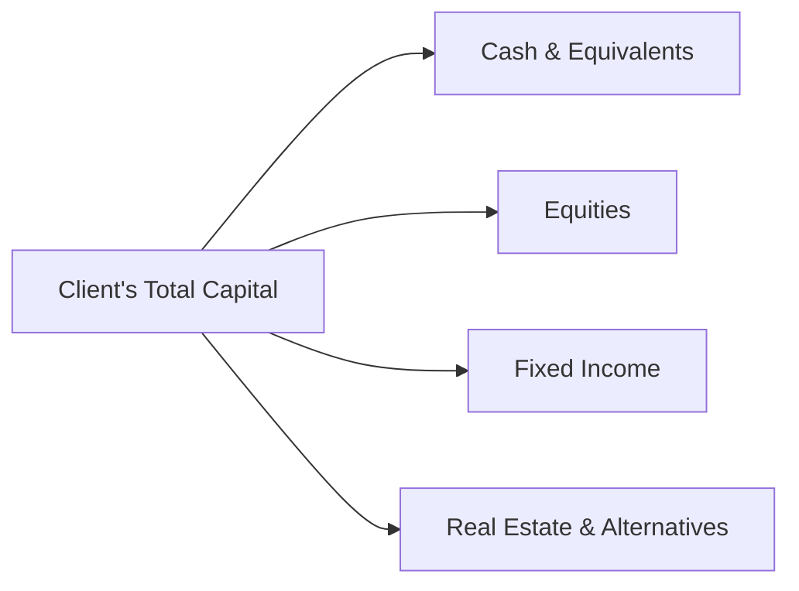

## 7.1 Strategic Wealth Preservation: The Big Picture

Strategic wealth preservation is a deliberate and proactive approach to safeguarding a client’s wealth so it endures for years to come. This involves managing potential risks, addressing estate and tax constraints, and using proven risk mitigation and asset-protection techniques. Successful wealth preservation coordinates regular reviews, structures appropriate solutions (like trusts or holding companies), and ensures investment portfolios align with the client’s legacy and philanthropic goals.

Below, we delve into the key concepts, strategies, and regulatory considerations unique to Canada. You’ll see how financial institutions (e.g., RBC, TD, BMO) and large pension funds apply diversification, tax planning, and insurance techniques to protect long-term wealth. As an advisor, your role is to manage a network of specialists—lawyers, accountants, insurance experts—and integrate these perspectives into a cohesive plan.

---

## Understanding Strategic Wealth Preservation

### Defining Wealth Preservation

Wealth Preservation is the process of protecting and growing client assets over the long term through careful planning, risk management, and alignment with personal objectives. It is sometimes called “defensive wealth management,” highlighting the protective measures taken to secure a client’s financial future.

### Why It Matters in Canada

In the Canadian context, strategic wealth preservation goes beyond conventional investment strategies. It must account for:  
- Federal and provincial tax rates (including changes announced in federal budgets).  
- CIRO (Canadian Investment Regulatory Organization) guidelines.  
- Provincial trust and estate legislation.  
- Insurance regulations overseen by the Office of the Superintendent of Financial Institutions (OSFI).  
- Additional factors such as family dynamics, philanthropic intentions, or multi-jurisdictional assets.

By staying current with these rules, advisors can match the appropriate wealth preservation techniques—be they trusts, holding companies, or insurance products—to each client’s situation.

---

## Key Components of Strategic Wealth Preservation

### 1. Diversification

Diversification spreads investments across multiple asset classes (like equities, bonds, real estate, and alternative assets) to minimize total portfolio risk. Canadian pension funds, such as the Canada Pension Plan Investment Board (CPP Investments), are known for diversifying globally, reducing exposure to a single economy or sector. Advisors can encourage clients to do the same at an individual level.

#### A Simple Diversification Diagram

This diagram shows how a client’s total investable capital can be split among multiple asset categories. Each category behaves differently under various economic conditions, mitigating the impact of a downturn in any one area.

### 2. Tax Planning and Structuring

Prudent tax planning often involves strategies like:  
- Income-splitting among family members.  
- Setting up a holding company to manage shares or other investments.  
- Benefiting from estate freezes to lock in current asset values for tax purposes.  
- Employing tax-sheltered vehicles such as TFSAs and RRSPs.

By consulting with tax specialists and referencing Canada Revenue Agency (CRA) rules, advisors help ensure clients are not overburdened by unnecessary taxes. Tax minimization paves the way for larger long-term asset accumulation.

### 3. Insurance Solutions

Insurance products (e.g., term life, whole life, universal life) provide critical coverage for estate liquidity, debt repayment, or replacing lost income. Canadian banks and insurance providers frequently partner to offer package solutions. For example, RBC and BMO might bundle life insurance with investment services to protect a client’s estate from market or mortality risks.

Advisors should evaluate the level of coverage required for marital status changes or children’s births. OSFI guidelines help ensure these insurance products maintain solvency standards and protect policyholders.

### 4. Estate Planning Tools

Strategic estate planning involves:  
- Drafting wills and setting up trusts to manage assets upon incapacity or death.  
- Appointing Powers of Attorney for property and health care decisions.  
- Designating beneficiaries for registered and non-registered accounts.  
- Organizing philanthropic gifts to charitable organizations for potential tax savings and personal gratification.

Proper documentation includes verifying current beneficiary designations and aligning them with the overall wealth preservation framework.

#### Estate Preservation Flow

This chart highlights how a will or trust enables an appointed executor or trustee to direct assets to both beneficiaries and philanthropic causes. Proper planning streamlines the transfer process, minimizing disputes and delays.

### 5. Coordinating Professionals

Because wealth preservation is complex, an advisor acts as a “coordinator,” bringing together lawyers, accountants, insurance experts, and other specialists. These professionals contribute unique expertise around:  
- Legal structures (e.g., trusts, holding companies).  
- Tax compliance and filing.  
- Insurance product selection and policy reviews.  
- Investment policy statements and asset management.

Advisors keep everyone aligned with the client’s overarching goals: building and preserving wealth across generations.

---

## Essential Practices

### Regular Reviews and Adjustments

Major life events such as marriage, divorce, retirement, or the birth of a child can drastically alter a client’s risk profile and financial needs. Set up a schedule for periodic reviews—ideally, once a year or whenever a significant event occurs.

### Thorough Documentation

Robust record-keeping ensures clarity on asset ownership, beneficiary designations, and the intent behind estate structuring. This helps avoid confusion or disputes that could lead to expensive legal action or family conflicts during estate settlement.

### Ongoing Risk Assessment

Clients’ risk tolerance evolves over time, and markets can shift unexpectedly. Keep track of changes in interest rates, credit availability, and new investment opportunities (such as responsible investment funds or Real Estate Investment Trusts). Adapting coverage amounts—like increasing life insurance after purchasing a second property—keeps the protection plan comprehensive.

### Alignment with Philanthropic and Legacy Goals

Clients often seek to leave a meaningful legacy or support charitable causes. Philanthropy can enhance a family’s sense of purpose and may reduce taxes and probate costs. A well-designed philanthropic strategy helps ensure that donations are maximized and consistent with a client’s broader vision.

---

## Common Pitfalls

1. **Failing to Update Beneficiary Designations**  
   Life changes such as divorce or remarriage can create conflicts if beneficiary designations remain outdated.

2. **Ignoring Tax Consequences**  
   Realizing capital gains all at once can trigger substantial taxes. A prudent approach involves staged selling, use of tax-sheltered accounts, or freezing assets.

3. **Overlooking Estate Settlement Costs**  
   Probate fees and legal costs can erode the estate’s value. Proper structuring (e.g., joint ownership, no-nominee accounts where permissible) may help minimize these fees.

4. **Underestimating Insurance Needs**  
   Clients often underestimate the financial impact of losing a key breadwinner. Inadequate coverage fails to protect spouses, children, or businesses in times of crisis.

---

## In Practice: Major Canadian Institutions and Case Studies

• RBC Wealth Management’s “Family Office” services illustrate how advisors coordinate insurance, tax, and legal advice to maintain high-net-worth client portfolios over generations.  
• TD Wealth Private Client Group’s philanthropic services help donors strategize giving to maximize beneficial tax treatment while supporting Canadian charities.  
• BMO Private Wealth routinely employs trust structures and estate freezes to protect family business interests and plan for orderly successions.

---

## Putting It All Together

Strategic wealth preservation demands collaboration. Advisors who keep the big picture in mind—encompassing estate, insurance, tax, and investment strategies—add significant value to clients seeking longevity for their wealth. By:

1. Diversifying effectively,  
2. Conducting prudent tax planning,  
3. Securing adequate insurance coverage,  
4. Coordinating estate planning,  
5. Encouraging consistent reviews,

advisors can oversee comprehensive, enduring protection for client assets.

**Important:** Always stay updated with CIRO regulations (replacing the defunct IIROC/MFDA) and use objective, documented processes. Refer to guidelines by the Office of the Superintendent of Financial Institutions (OSFI) and the Canadian Securities Administrators (CSA) to stay compliant. Tools offered by the Financial Consumer Agency of Canada (FCAC) can help clients manage budgets and determine savings capacity.

---

## Additional Resources

- [CIRO Guidelines](https://www.ciro.ca)  
- [OSFI Regulations](https://www.osfi-bsif.gc.ca)  
- [Financial Consumer Agency of Canada (FCAC)](https://www.canada.ca/en/financial-consumer-agency.html)  
- [Recommended Reading: “The Trust Solution: How to Protect Your Wealth and Create a Legacy” by Margaret O’Sullivan]  
- [CRA’s Personal Tax Portal](https://www.canada.ca/en/revenue-agency.html)

---

## Recap and Next Steps

Strategic wealth preservation is a dynamic, long-term effort. It builds on comprehensive insight into a client’s personal and financial circumstances, harnessing professional expertise and regulatory guidance. Advisors who refine this approach, checking periodically that estate documents, insurance coverage, and portfolio allocations remain on track, can significantly enhance their clients’ financial security and peace of mind.

---

## Test Your Knowledge: Strategic Wealth Preservation in Canada



### 1. Which of the following best describes “strategic wealth preservation”?

- [x] A coordinated, long-term approach to protecting and growing wealth
- [ ] A short-term trading strategy to capture quick gains
- [ ] A tax shelter focusing solely on deferring current tax liabilities
- [ ] A process of putting all assets into one single, high-interest savings account

> **Explanation:** Strategic wealth preservation integrates estate planning, insurance, tax strategies, and prudent investment decisions to safeguard assets over the long term.

### 2. Why is regular review important in a wealth preservation plan?

- [ ] It allows you to reduce legal fees every year.
- [x] Major life events can necessitate immediate adjustments to strategies.
- [ ] It is required monthly by CIRO regulations.
- [ ] GIC rates change daily, requiring daily updates.

> **Explanation:** Life events like marriage, divorce, birth of a child, or an inheritance can shift a client's risk profile or goals, requiring ongoing refinement of their wealth preservation strategies.

### 3. Which of the following terms refers to locking in current asset values for future tax-related calculations?

- [ ] Insurance Freeze
- [x] Estate Freeze
- [ ] Charitable Freeze
- [ ] LTC Freeze

> **Explanation:** An estate freeze locks in the value of assets for tax calculations, helping to minimize tax consequences for future asset transfers.

### 4. Which organization replaced IIROC and MFDA as Canada’s national self-regulatory body?

- [x] CIRO
- [ ] MFDA IPC
- [ ] CIPF
- [ ] OSFI

> **Explanation:** The Canadian Investment Regulatory Organization (CIRO) began operations in 2023 after the amalgamation of IIROC and MFDA.

### 5. Which best describes the purpose of diversification in wealth preservation?

- [x] Reducing the overall risk by allocating assets across different classes
- [ ] Maximizing short-term gains by focusing on high-volatility investments
- [ ] Avoiding any form of insured assets
- [ ] Placing all funds in real estate for long-term appreciation

> **Explanation:** Diversification spreads risk over various asset classes, industries, or geographical regions, thereby reducing portfolio volatility.

### 6. In Canada, which federal body is primarily responsible for regulating insurance companies?

- [ ] CRA
- [x] OSFI
- [ ] FCAC
- [ ] CIPF

> **Explanation:** The Office of the Superintendent of Financial Institutions (OSFI) oversees banks and insurance companies to ensure financial stability and policyholder protection.

### 7. What is an example of a charitable strategy in wealth preservation?

- [x] Making philanthropic donations to receive tax credits and further personal legacy goals
- [ ] Eliminating life insurance from an estate plan
- [ ] Converting all assets into cash to reduce risk
- [ ] Selecting a single beneficiary for all assets

> **Explanation:** Charitable giving not only contributes to a philanthropic goal but may also yield tax benefits and reduce the size of the taxable estate.

### 8. When coordinating professionals, which of these specialists is most likely to handle the legal structuring of trusts in a wealth preservation plan?

- [ ] Insurance underwriter
- [x] Lawyer specialized in estate planning
- [ ] Investment manager
- [ ] Accountant

> **Explanation:** An estate planning lawyer creates and maintains legal structures, such as trusts, to meet the client’s wealth preservation objectives.

### 9. Which of these pitfalls commonly occurs when people neglect to update their estate plans?

- [x] Beneficiaries may not reflect changes in marital status or family composition.
- [ ] Banks will automatically update the estate plan once a year.
- [ ] Taxes will no longer apply to the estate.
- [ ] Holding companies become obsolete.

> **Explanation:** Failing to make timely updates can lead to disputes, misaligned beneficiaries, and unintended distributions.

### 10. Ongoing risk assessments should be performed to ensure coverage and estate structures remain adequate.

- [x] True
- [ ] False

> **Explanation:** Conducting risk assessments on a regular basis helps ensure that the insurance coverage, investment allocations, and estate structures are still appropriate given the client’s evolving needs and the changing financial environment.


