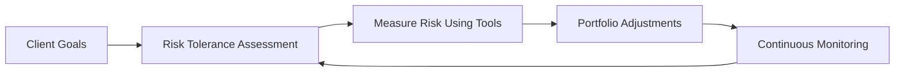

## 7.3 Measuring Risk

Measuring risk is crucial to ensuring that a client’s financial goals remain aligned with their portfolio and overall wealth strategy. Advisors who measure risk effectively can help clients preserve capital, navigate volatile markets, and make informed decisions about asset allocation. In the Canadian landscape—where regulations, market structures, and client profiles are subject to rapid change—comprehensive and ongoing risk measurement is all the more important.

Below, we explore the key tools, frameworks, and best practices for measuring risk, with a special focus on the unique considerations of Canadian financial markets.

---

### The Importance of Measuring Risk

1. **Preserving Client Wealth**  
   Risk measurement tools help identify potential threats to a portfolio’s value, enabling advisors to recommend adjustments before losses become substantial.

2. **Client-Centric Solutions**  
   When advisors regularly evaluate indicators like volatility, concentration in specific sectors, and potential drawdowns, they provide clients with tailored strategies matching their objectives and comfort levels.

3. **Regulatory and Fiduciary Responsibilities**  
   Under Canadian Investment Regulatory Organization (CIRO) guidelines, wealth professionals must assess and disclose the risks associated with portfolio composition. Adhering to these regulations is a key component of professional conduct in Canada’s financial industry.

---

### Common Risk Measurement Tools

Risk measurement leverages both quantitative and qualitative methods. While quantitative approaches use mathematical or statistical analyses, qualitative methods incorporate scenario analyses and client discussions.

#### Standard Deviation
- **Definition**: Standard deviation reflects how dispersed or variable returns are around the portfolio’s average return.  
- **Interpretation**: A higher standard deviation indicates larger fluctuations (i.e., volatility), which may not be suitable for clients with shorter time horizons or lower risk tolerance.  
- **Practical Example**: A Canadian equity mutual fund with a 20% annual return and a standard deviation of 15% is considerably more volatile than a Government of Canada bond fund with a standard deviation of 3%.

#### Beta
- **Definition**: Beta measures a security or portfolio’s sensitivity to market movements relative to a benchmark (e.g., S&P/TSX Composite Index).  
- **Interpretation**: A beta above 1 implies greater volatility than the market; a beta below 1 implies lower volatility.  
- **Practical Example**: Some large Canadian banks, like RBC or TD, may have betas close to 1, reflecting their substantial linkage to the Canadian economy. A high-tech growth stock listed on the TSX Venture Exchange could have a beta above 1, indicating higher risk and reward potential relative to the broader market.

#### Value at Risk (VaR)
- **Definition**: VaR estimates the maximum potential loss over a specified time frame (e.g., one day or one month) at a certain confidence level (often 95% or 99%).  
- **Interpretation**: If a portfolio’s daily 99% VaR is $10,000, there is a 1% chance that a daily loss will exceed $10,000.  
- **Practical Example**: Canadian pension funds (e.g., the Canada Pension Plan Investment Board, CPPIB) frequently use VaR models to stress-test asset classes under adverse market conditions, ensuring they can meet long-term liabilities.

#### Stress Testing
- **Definition**: Stress tests simulate extreme market conditions (like a rapid interest rate hike or a sudden economic downturn) to see how a portfolio might behave.  
- **Interpretation**: This method reveals worst-case scenarios beyond standard market fluctuations.  
- **Practical Example**: A portfolio heavily invested in Canadian real estate or energy stocks could undergo a stress test modeling a severe drop in oil prices or housing demand, illuminating vulnerabilities that standard deviation or VaR might underrepresent.

---

### Analyzing Concentration, Volatility, and Drawdowns

1. **Concentration Risk**  
   - Overexposure to a single company, sector, or region can significantly increase risk.  
   - For instance, a client holding 40% of their portfolio in a single stock (such as a large Canadian bank) might face undue vulnerability if that issuer experiences a downturn.

2. **Volatility**  
   - Standard deviation helps quantify volatility, but it must be interpreted in conjunction with beta to understand relative vs. absolute risk.

3. **Drawdowns**  
   - A drawdown measures the decline from a peak to a trough. Frequent or deep drawdowns signal that a portfolio might be too aggressive or poorly diversified.  
   - Historical performance analysis allows advisors to highlight risk-return trade-offs. For example, the 2008 global financial crisis led to significant drawdowns in many Canadian equity funds; analyzing how quickly a portfolio recovered can offer insights into resiliency.

---

### Quantitative vs. Qualitative Approaches

1. **Quantitative (Statistical) Methods**  
   - **RiskMetrics, VaR, Stress Testing Tools**: Advanced analytics platforms or open-source libraries (e.g., [QuantLib](https://www.quantlib.org)) compute scenario analyses, measure potential losses, and conduct multi-variable simulations.  
   - **Backtesting**: Historical data can verify how hypothetical strategies might have performed, although past performance does not guarantee future results.

2. **Qualitative (Scenario and Interview) Methods**  
   - **Structured Interviews**: Uncover intangible factors such as a client’s personal obligations, future plans, or emotional reactions to market downside.  
   - **Scenario Analysis**: Encompasses best-case, base-case, and worst-case scenarios, each of which tests a portfolio’s structural integrity against plausible or extreme market shifts.

Both methods complement each other. Statistical tools provide objective data, while qualitative assessments capture nuanced, real-life considerations impossible to quantify.

---

### Interpreting Risk Measurement Results

- **High Standard Deviation**: Implies potential for large gains or losses; caution for clients with short-term goals.  
- **High Beta**: Indicates amplified moves relative to the market. May be suitable for growth-oriented portfolios but can be risky for retirees drawing income.  
- **High VaR**: The portfolio is susceptible to sizable losses under normal market conditions; possible need for hedging or greater diversification.  
- **Results of Stress Tests**: If scenarios show severe drawdowns or breaches of acceptable loss levels, repositioning or hedging strategies may be warranted.

---

### Time Horizon, Liquidity, and Financial Goals

- **Time Horizon**: Clients nearing retirement or requiring short-term liquidity generally benefit from lower-volatility, liquid instruments like Government of Canada T-bills or high-grade corporate bonds.  
- **Liquidity Needs**: If clients need immediate access to capital, illiquid assets (e.g., real estate LPs) may constrain portfolio flexibility.  
- **Financial Goals**: Risk tolerance must align with growth objectives—conservative retirement income strategies differ significantly from an aggressive growth approach for a younger client.

---

### Scenario Planning

Scenario analysis is integral to robust risk assessment. Advisors typically evaluate:

1. **Best-Case Scenario**: Markets perform above expectations; highlights potential upside but ensures clients do not become overconfident.  
2. **Base-Case Scenario**: Markets stay within normal variance; reveals the portfolio’s long-term sustainability in stable conditions.  
3. **Worst-Case Scenario**: Market crash or economic shock; helps identify hidden vulnerabilities and develop contingency plans.

---

### Continuous Monitoring

Risk measurement is not a one-time process. Client circumstances and market conditions are dynamic. For example, a sudden shift in Canadian monetary policy, such as the Bank of Canada raising interest rates, can quickly affect bond prices and financial stocks.

- **Regular Reviews**: At least annually, or more frequently when markets or client life stages change.  
- **Rebalancing**: Portfolios might drift from their target asset allocations, altering their risk profiles.  
- **Ongoing Disclosure**: Advisors must continually inform clients about changes in risk levels, portfolio composition, and market conditions.

*Diagram Explanation:* The flowchart illustrates how measuring risk occurs within a cyclical wealth management process. After establishing client goals and risk tolerance, advisors use various risk measurement tools. Findings drive portfolio adjustments, and ongoing monitoring ensures the portfolio remains aligned with evolving goals and market realities.

---

### Regulatory Guidelines in Canada

- **Role of CIRO**:  
  - Canada’s self-regulatory organization (CIRO) oversees how investment dealers and mutual fund dealers conduct business. It issues compliance guidelines for risk disclosure and portfolio stress testing.  
  - Advisors must ensure that all recommendations align with CIRO’s regulations on “Know Your Client” (KYC) and “Know Your Product” (KYP).  

- **Investor Protection Through CIPF**:  
  - The Canadian Investor Protection Fund (CIPF) covers clients in the event an investment firm becomes insolvent. Although CIPF does not protect against market losses, being aware of its limits is vital when advising on risk.

- **Tax Considerations**:  
  - Changes in Canadian tax policies can affect after-tax performance. Advisors should factor in the results of any risk analysis alongside the latest guidance from the Canada Revenue Agency (CRA).  

---

### References and Additional Resources

- [CIRO Handbook](https://www.ciro.ca) for updated Canadian regulatory guidelines and best practices on risk measurement.  
- [CFA Institute](https://www.cfainstitute.org) for advanced research and professional development materials on portfolio risk assessment.  
- [QuantLib](https://www.quantlib.org) for open-source libraries to model VaR, run Monte Carlo simulations, and build customized risk models.  
- Ralph Vince’s “The Handbook of Portfolio Mathematics” for deeper insights into advanced risk measurement and allocation strategies.

---

### Conclusion and Key Takeaways

Effectively measuring risk requires a balanced view:

- Combine statistical tools like standard deviation, beta, and VaR with scenario analyses and client interviews.  
- Consider the client’s unique context—time horizon, liquidity needs, financial goals, and emotional tolerance for losses.  
- Employ a proactive and continuous monitoring approach, adjusting the portfolio as markets shift and personal circumstances evolve.  
- Stay current with CIRO regulations and industry best practices to uphold fiduciary responsibilities and deliver client-centric wealth solutions.

By adopting a comprehensive risk measurement framework, advisors can guide clients confidently in achieving both capital preservation and strategic growth.

---

## Master Your Risk Measurement Strategies: Canadian Wealth Management Quiz



### 1. What does a high standard deviation in a portfolio typically indicate?

- [ ] It guarantees higher returns.  
- [x] It suggests greater volatility in the portfolio’s returns.  
- [ ] It shows a more stable portfolio.  
- [ ] It means regulatory compliance is already met.  

> **Explanation:** Standard deviation measures how far returns may deviate from the average. A high standard deviation indicates greater fluctuations (i.e., volatility), not necessarily guaranteed higher returns.

---

### 2. In Canadian markets, a beta greater than 1 suggests:

- [x] The security or portfolio is more volatile than the S&P/TSX index.  
- [ ] The security or portfolio has minimal volatility.  
- [ ] The security or portfolio is risk-free.  
- [ ] The security or portfolio is negatively correlated with the market.  

> **Explanation:** Beta above 1 indicates that the security or portfolio’s returns are likely to exceed market movements (both up and down) in magnitude.

---

### 3. Value at Risk (VaR) is best described as:

- [ ] The guaranteed minimum return on an investment.  
- [x] An estimate of the maximum potential loss over a given time frame with a certain confidence level.  
- [ ] A direct measure of portfolio liquidity.  
- [ ] A replacement for stress testing.  

> **Explanation:** VaR calculates how much loss a portfolio could experience, given normal market conditions, within a specific timeframe at a specified confidence level.

---

### 4. Stress testing a portfolio means:

- [ ] Substituting actual holdings with hypothetical assets.  
- [x] Modeling extreme market events to assess potential worst-case outcomes.  
- [ ] Avoiding scenario analysis to minimize data-based decisions.  
- [ ] Using only historical returns to gauge future performance.  

> **Explanation:** Stress testing involves modeling abnormal or extreme market conditions (such as large interest rate shocks or severe economic downturns) to see how the portfolio might behave.

---

### 5. Which of the following best describes concentration risk?

- [ ] Investing in multiple sectors to reduce risk.  
- [x] Holding a large portion of assets in a single security or industry.  
- [ ] Distributing assets globally to diversify.  
- [ ] Being overweight in government bonds.  

> **Explanation:** Concentration risk occurs when a portfolio is too heavily exposed to one security, sector, or asset class, heightening vulnerability if that area declines.

---

### 6. When analyzing drawdowns, an advisor is primarily looking at:

- [x] The percentage or amount a portfolio decreases from its peak to its trough.  
- [ ] Long-term government bond yields only.  
- [ ] Annual GDP growth rates.  
- [ ] Forecasted inflation data.  

> **Explanation:** Drawdown refers to the magnitude of a single or multiple declines from a peak portfolio value, offering insight into the severity of losses during downturns.

---

### 7. What is the benefit of scenario analysis?

- [x] It explores different market conditions (best, base, worst) to identify potential portfolio outcomes.  
- [ ] It eliminates the need for continuous monitoring.  
- [x] It helps clients better understand how their portfolios may adapt to various events.  
- [ ] It removes all uncertainty in investing.  

> **Explanation:** Scenario analysis tests the portfolio under multiple conditions, improving clients’ understanding of potential outcomes without guaranteeing performance or removing uncertainty.

---

### 8. Why is continuous monitoring of portfolio risk crucial?

- [x] Market conditions and client circumstances can change, affecting risk parameters.  
- [ ] It is only a legal requirement with no added benefit.  
- [ ] It eliminates all investment losses.  
- [ ] It’s optional if VaR has been calculated.  

> **Explanation:** Since markets, regulations, and personal goals are dynamic, ongoing monitoring ensures the portfolio remains aligned with the client’s needs and risk tolerance.

---

### 9. Under current Canadian regulations (as overseen by CIRO):

- [x] Advisors must assess and disclose the client’s risk profile and portfolio risks on an ongoing basis.  
- [ ] Advisors are only obligated to disclose risk on the initial transaction.  
- [ ] There are no guidelines related to client risk assessment.  
- [ ] CIRO no longer provides updates on risk.  

> **Explanation:** The Canadian Investment Regulatory Organization (CIRO) requires advisors to maintain appropriate knowledge of their clients’ risk profile and to disclose relevant risks throughout the advisory relationship.

---

### 10. True or False: Higher volatility is always undesirable.

- [x] True  
- [ ] False  

> **Explanation:** While generally perceived as negative, higher volatility can be beneficial if it aligns with a client’s risk tolerance and return objectives, particularly for those focusing on growth over the long term. Still, it must be managed carefully.


