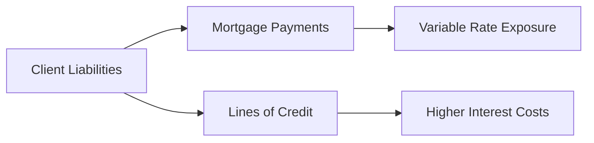

## 7.4 Identifying Risk within a Client’s Net Worth

Effectively identifying risk within a client’s net worth stands at the core of successful wealth management. In Canada, where regulatory frameworks, market structures, and tax considerations can vary significantly compared to other jurisdictions, wealth advisors must adopt a thorough and customized approach. Below, we discuss key areas of focus for uncovering vulnerabilities, addressing gaps in insurance coverage, and effectively collaborating with other professionals (e.g., tax experts, legal advisors) to safeguard a client’s overall financial stability.

---

## Understanding Net Worth and Potential Risks

A client’s net worth is calculated using a simple formula:

$$
\text{Net Worth} = \text{Total Assets} - \text{Total Liabilities}
$$

While the formula itself is straightforward, accurately determining what is risky or underperforming within this equation presents a more nuanced challenge. The goal is to ensure no single exposure—whether debt, an illiquid asset, or an unexpected life event—undermines the client’s financial stability and long-term goals.

### Common Areas of Vulnerability
- Underperforming assets (e.g., stagnant real estate, low-yield investments).  
- Concentrated investments (e.g., large sums in one company’s stock).  
- Inadequate liquidity, leading to forced asset sales in emergencies.  
- High or variable interest debt that can balloon with changing rates.

**Tip:** A thorough net worth review is more than a snapshot. Advisors should analyze the composition, growth trajectory, and potential external threats—such as market fluctuations or regulatory changes—that might impact the client’s total wealth.

---

## Analyzing Liabilities: Mortgage Obligations and Debt

Debt is often a primary driver of risk in a client’s financial picture. Mortgage obligations, lines of credit, and credit card debt can impose serious constraints on liquidity and limit investment capacity.

### Mortgage Review
• Fixed vs. Variable Rates: A fixed-rate mortgage can offer predictable payments but may lock the client into higher interest costs if rates drop. Variable rates can be beneficial if interest rates remain stable or trend downward, but they can quickly become expensive if the Bank of Canada raises rates.  
• Prepayment Penalties: Some Canadian banks, such as RBC or TD, might charge penalties for early repayment or large lump-sum payments, directly affecting the borrower’s flexibility and total cost.

### High-Interest Debt
• Credit cards and high-interest loans (often above 15% APR) can rapidly erode a client’s net worth if they carry substantial balances.  
• Consolidation or restructuring of such debt, potentially using a line of credit at a lower rate from a Canadian lender (e.g., BMO), may reduce interest expenses and free up cash for other financial objectives.

**Important:** Engaging in regular liability management helps ensure that debts align with the client’s evolving goals and market conditions. This might involve refinancing a mortgage when interest rates are low or paying off smaller debts to reduce monthly obligations.

---

## Insurance Coverage Gaps

Maintaining proper insurance coverage is vital to preserving net worth. Gaps in life, disability, critical illness, or property and casualty insurance can expose a client to enormous costs.

### Assessing Policy Adequacy
1. **Life Insurance**: Evaluate whether the death benefit is sufficient to cover outstanding liabilities (e.g., mortgage balances), provide for dependents, and settle final expenses.  
2. **Disability and Critical Illness**: Since the probability of a debilitating illness or injury is often underestimated, confirm coverage aligns with the client’s needs (e.g., their monthly living expenses, future earning potential).  
3. **Property Insurance**: Ensure that homeowner’s or tenant’s insurance reflects current property values, especially in expensive Canadian real estate markets like Toronto or Vancouver.

**Pitfall:** Underinsuring, or not updating insurance policies as assets grow, can result in severe financial strain. In many cases, increasing coverage slightly can provide significant peace of mind and protect against unexpected life events.

For official guidance, advisors and clients can consult:
- The Canadian Life and Health Insurance Association (CLHIA) for industry guidelines: [https://www.clhia.ca](https://www.clhia.ca)

---

## Impact of Inflation and Changing Interest Rates

Inflation and interest rates present ongoing risks that affect both assets and liabilities. During periods of rising inflation, real returns on savings or fixed-income investments can diminish. For variable-rate loans, an increase in the prime lending rate can result in higher monthly payments, reducing cash flow.

This diagram illustrates how liabilities may be influenced by changing interest rates when a client holds variable-rate debt. As rates rise, minimum payments follow suit—stressing the client’s overall budget.

**Tip:** Encourage clients to:
- Stress-test their mortgage by assessing payment capacity at higher interest rates.  
- Diversify interest structures (i.e., split between fixed and variable rates) to balance benefits and risks.

---

## Emergency Funds and Liquidity

An **Emergency Fund** is a dedicated reserve of liquid assets (often cash or cash equivalents) meant to cover three to six months’ worth of expenses. It functions as a critical buffer should the client experience a sudden job loss, unexpected medical costs, or family emergencies. Without an adequate cushion, a client may need to tap into credit cards, high-interest loans, or forced asset sales—significantly jeopardizing their net worth.

**Recommended Tools:**  
- The Financial Consumer Agency of Canada (FCAC) provides free budgeting and net worth calculation tools to help track expenses and establish an emergency fund: [https://www.canada.ca/en/financial-consumer-agency.html](https://www.canada.ca/en/financial-consumer-agency.html)

**Pitfall:** Holding too large an emergency fund in cash may lead to opportunity costs (i.e., missing out on potential investment returns). Striking the right balance is key.

---

## Estate Planning Pitfalls

Another dimension of risk often overlooked is improper estate planning. Whether it’s failing to update a beneficiary designation for registered plans (RRSPs, TFSAs) or lacking a valid will, these oversights can reduce the value of a client’s estate and create disputes among heirs.

### Common Estate Issues
1. **Outdated Beneficiary Designations**: Changes in marital status or family structure can render earlier designations invalid or suboptimal.  
2. **Insufficient Will**: A will not drafted with current estate laws or updated family details may cause delays in probate and additional legal costs.  
3. **Trust Considerations**: For high-net-worth or complex family arrangements, setting up a trust can help protect assets and streamline tax considerations.

**Note:** Advisors should work closely with experienced estate attorneys to ensure that client instructions are enforceable and aligned with applicable laws in their province. Continuous reviews, especially after major life changes, reduce the risk of disputes and unplanned tax liabilities.

---

## The Role of Tax Planning

Mismanagement of tax liabilities can quickly erode a client’s net worth. Collaborating with tax professionals is pivotal in optimizing tax efficiency, addressing capital gains, and meeting ongoing obligations.

### Potential Challenges
- **Capital Gains Triggers**: Large one-time sales of investments or real estate can create significant tax bills if not timed or structured properly.  
- **Tax Penalties**: Late or incorrect filings may incur penalties and interest.  
- **Provincial Variations**: Each Canadian province imposes nuanced differences in tax rules, such as land transfer taxes and probate fees.

**Best Practice:** Encourage clients to consult CRA publications and keep current with changes to federal or provincial tax laws. An advisor should remain informed about broader industry shifts to guard against unforeseen tax consequences. Visit [https://www.ciro.ca](https://www.ciro.ca) to review CIRO’s latest recommendations regarding how to gather client information for a complete risk assessment, including tax considerations.

---

## Balancing Portfolio and Net Worth

Portfolio diversification is a fundamental guard against risk. However, it must be done holistically—taking into account not just the investment accounts but also the client’s broader net worth, including real estate, business interests, and illiquid assets such as private equity.

### Designed for the Canadian Market
- Canadian investors often hold a considerable portion of their net worth in real estate, particularly in large urban centers where property values tend to appreciate quickly.  
- Canadian pension funds, like the Canada Pension Plan Investment Board (CPPIB), often use a diversified approach that includes both domestic and international equities, bonds, real estate, and alternative asset classes.  
- Investors may emulate aspects of pension fund strategies by allocating across multiple asset classes, albeit scaled for the individual’s risk tolerance and liquidity requirements.

**Step-by-Step Approach to Balancing the Portfolio:**
1. **Assess Current Allocation**: Determine the weight of Canadian vs. global assets and equity vs. fixed income.  
2. **Identify Concentrations**: Check for specific stock or sector exposures (e.g., tech or energy) that might carry outsized risk.  
3. **Match Duration to Goals**: Align bond maturities or GIC terms to meet near-term cash needs.  
4. **Monitor Liquidity**: Reserve adequate funds in short-term instruments to handle emergencies.  
5. **Review Annually**: Market conditions change, so revisit your asset allocation regularly to address both risk tolerance and net worth distribution.

---

## Example Case Study

Suppose a Toronto-based client, Emily, has the following situation:
- Real Estate: Primary residence with a variable-rate mortgage of $500,000.  
- Investment Portfolio: $300,000 with a 70% equity / 30% fixed-income allocation.  
- Emergency Fund: $10,000, which covers barely two months of expenses.  
- Insurance: Life insurance sufficient only to cover half of her outstanding mortgage.

In identifying Emily’s risks, the advisor notes:
1. **Variable Mortgage Exposure**: Rising rates could substantially increase monthly payments, impairing cash flow.  
2. **Underfunded Emergency Reserve**: At two months, the fund is inadequate for a prolonged job loss or illness.  
3. **Insurance Coverage Gap**: If Emily passes away unexpectedly, her loved ones may struggle to handle the mortgage shortfall.

The advisor recommends:  
• Refinancing a portion of the mortgage to a fixed rate or accelerating payments, mitigating interest-rate risk.  
• Increasing the emergency fund to three to six months’ worth of expenses.  
• Opting for increased life insurance coverage to match the mortgage balance plus a buffer for incidental expenses.

---

## Conclusion

Identifying and managing risk within a client’s net worth requires regular review, proactive planning, and coordinated strategies. Performing a net worth analysis highlights vulnerabilities such as concentrated holdings, underperforming assets, high-interest liabilities, insurance shortcomings, and estate planning oversights. By addressing these areas methodically—often in collaboration with specialized professionals—advisors can help ensure that clients maintain their financial health and pursue their goals with greater confidence.

---

## Test Your Knowledge: Identifying Risks in Canadian Net Worth



### Which of the following best describes a key objective of assessing a client’s net worth?
- [x] Identifying potential financial vulnerabilities in the client’s overall portfolio
- [ ] Calculating a client’s credit score
- [ ] Comparing Canadian banks globally
- [ ] Prefilling the client’s tax return

> **Explanation:** Evaluating net worth helps advisors examine assets, liabilities, and potential risks that might undermine an individual’s financial stability.

### Which of these liabilities is typically considered the highest priority to pay off first?
- [x] High-interest credit card debt
- [ ] A low-interest mortgage
- [ ] A student loan at prime rate
- [ ] A car loan at a moderate interest rate

> **Explanation:** High-interest debt (e.g., credit card balances above 15–20%) can quickly erode net worth, making it crucial to reduce or eliminate this liability first.

### What is a common pitfall in estate planning?
- [x] Failing to update the beneficiary designations after major life changes
- [ ] Putting assets into mutual funds
- [ ] Paying off all debt immediately
- [ ] Working with a professional advisor

> **Explanation:** When beneficiaries are not updated, assets may not pass to intended parties, creating disputes and tax complications.

### How can rising interest rates impact a variable-rate mortgage?
- [x] Monthly payments typically increase, reducing cash flow
- [ ] Mortgage payments remain fixed for the life of the loan
- [ ] Interest charges remain unaffected if the loan is Canadian
- [ ] The mortgage automatically converts to a fixed rate

> **Explanation:** A variable-rate mortgage is directly linked to market or prime rates. If rates rise, so do the monthly mortgage payments.

### Which statement about an emergency fund is correct?
- [x] It should cover at least three to six months of expenses
- [ ] It must be in foreign currency to mitigate exchange risk
- [x] It prevents clients from resorting to high-interest loans
- [ ] It only applies to high-net-worth individuals

> **Explanation:** Emergency funds are meant to provide immediate liquidity and cover living costs for a set period, reducing reliance on debt.

### What is the primary reason for having adequate insurance coverage?
- [x] To protect against unforeseen life events that could significantly impact net worth 
- [ ] To ensure that all debts are always paid on time
- [ ] To pay lower taxes each year
- [ ] To keep interest rates low on lines of credit

> **Explanation:** Insurance, such as life or disability insurance, shields households from substantial financial liabilities if unexpected events occur.

### Which of the following is a best practice when managing debt in Canada?
- [x] Refinancing or restructuring high-interest debt into a lower-interest option
- [ ] Maintaining only short-term debt to avoid long-term decisions
- [x] Reviewing credit obligations regularly
- [ ] Investing solely in equity to generate higher returns for debt repayment

> **Explanation:** Consolidating debts at lower interest rates and regularly assessing obligations are key steps in prudent liability management.

### What is a recommended practice for mitigating inflation risk?
- [x] Including assets with growth potential or inflation-linked features
- [ ] Relying on short-term GICs only
- [ ] Keeping 100% in cash
- [ ] Ignoring inflation if the client’s net worth is substantial

> **Explanation:** Assets such as equities, real estate, or inflation-indexed bonds can help protect purchasing power and counteract the effects of inflation.

### Which organization sets guidelines for life and health insurance providers in Canada?
- [x] The Canadian Life and Health Insurance Association (CLHIA)
- [ ] The Canadian Investor Protection Fund (CIPF)
- [ ] The Bank of England
- [ ] The Canada Revenue Agency (CRA)

> **Explanation:** CLHIA offers guidance on best practices for life and health insurers operating in Canada.

### A properly balanced portfolio should consider:
- [x] Risk tolerance, liquidity needs, and overall client net worth
- [ ] Only short-term speculation for quick gains
- [ ] Exclusion of all Canadian equities
- [ ] Mandatory 50% in real estate holdings

> **Explanation:** Effective portfolio construction aligns asset allocation with the client’s ability to handle risk, need for liquidity, and total financial picture.


