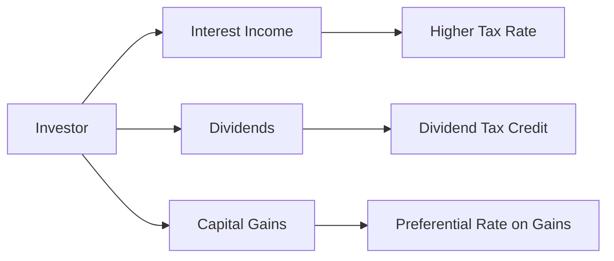

## 8.1 Financial Planning and Taxation

Taxation is a fundamental pillar of effective financial planning in Canada. Advisors must continuously examine how various financial decisions—from investment selections to retirement contributions—interplay with a client’s overall tax position. By understanding the intricacies of Canada’s tax system, financial advisors help clients achieve a balance between immediate needs and long-term objectives.

In this section, we delve into the essential components of tax planning within wealth management, clarifying how after-tax returns, registered plans, current regulations, and life events all coalesce to form a comprehensive tax strategy. We also focus on how Canadian advisors can stay compliant, adapt to ongoing regulatory changes, and leverage government incentives for their clients’ benefit.

---

## Why Taxation Matters in Financial Planning

Taxation shapes the financial landscape in multiple ways:

1. ► Reducing Tax Liabilities:  
   Skilled tax planning helps ensure that clients pay only what is legally required––no more and no less. This often involves leveraging deductions, credits, and deferrals.

2. ► Maximizing After-Tax Wealth:  
   Investment returns must be considered on an after-tax basis. Advisors who fail to account for taxes risk presenting unrealistic projections.

3. ► Aligning with Life Goals:  
   Tax-efficient strategies let clients allocate more capital toward retirement, their children’s education, a home purchase, or other significant goals.

4. ► Avoiding Regulatory Pitfalls:  
   The Canada Revenue Agency (CRA) oversees personal and corporate tax compliance. Advisors must meet all legal obligations and keep pace with tax law changes to avoid violating regulations.

---

## Key Components of Effective Tax Planning

Below are some fundamental strategies and considerations that guide financial advisors in creating tax-aware plans for their Canadian clients:

### 1. Utilizing Registered Plans

Canada offers several registered plans that confer special tax benefits:

- ◼ Registered Retirement Savings Plan (**RRSP**): Contributions are tax-deductible and investments grow tax-deferred until withdrawn.  
- ◼ Tax-Free Savings Account (**TFSA**): Contributions are made with after-tax dollars, but qualified withdrawals remain tax-free.  
- ◼ Registered Education Savings Plan (**RESP**): Allows contributors to save for a child’s post-secondary education while benefiting from government grants and tax-deferred growth.

Properly balancing contributions across these accounts can minimize a client’s overall tax burden. For example, many Canadian pension funds and institutions, such as the Canada Pension Plan Investment Board (CPPIB), adopt a similar principle of tax minimization by investing in tax-advantaged environments and structures globally.

### 2. Timing of Income Realization

The rates at which different types of income are taxed can vary significantly. For instance:

- ▪ Capital gains receive preferential treatment compared to interest income.  
- ▪ Eligible dividends (e.g., dividends from publicly traded Canadian companies like RBC or TD Bank) benefit from the federal dividend tax credit.  
- ▪ Income deferral can be achieved by holding certain investments in registered accounts or strategically realizing gains and losses to align with lower marginal tax years.

Advisors often consider a client’s marginal tax rate when deciding whether to accelerate or defer income. This approach is particularly relevant if the client anticipates life events—like retirement or a leave of absence—that could temporarily reduce their taxable income, potentially moving them into a lower tax bracket.

### 3. Income Splitting

Where allowed, transferring a portion of income from a high-income individual to a lower-income family member can reduce the family’s overall tax bill. For instance, spousal RRSPs allow a higher-income spouse to contribute to the plan of a lower-income spouse, thereby achieving future income splitting in retirement. Major Canadian banks (e.g., BMO, RBC, or TD) frequently highlight spousal RRSP strategies in their client-facing wealth planning resources.

### 4. Leveraging Tax Deductions and Credits

Deductions and credits are among the most powerful tools for reducing personal or corporate taxes:

- ▪ **Tax Deductions**: Reduce taxable income (e.g., RRSP contributions, certain childcare expenses, employment expenses).  
- ▪ **Tax Credits**: Directly offset tax liability (e.g., charitable donations, medical expenses, the GST/HST credit).

A common pitfall is assuming that all items are equally beneficial. In reality, a dollar of tax credit usually provides a greater benefit than a dollar of deduction because credits reduce the tax payable directly, whereas deductions reduce the income on which tax is calculated.

### 5. Monitoring Regulatory Changes

Tax legislation in Canada evolves through federal and provincial budgets, CRA guidelines, and sometimes court rulings. Advisors should:

- ▪ Stay informed of new or proposed tax rules.  
- ▪ Regularly review CRA guidance and technical bulletins.  
- ▪ Consult the **Canadian Investment Regulatory Organization (CIRO)** for guidelines on ethical practices and the recommended standards for integrated tax advice.  
- ▪ Evaluate opportunities and risks associated with any updates (e.g., changes to contribution limits, introduction of new credits, or modification of tax brackets).

### 6. Navigating Life Events

Major life events often carry tax implications. Changes in marital status, residency, employment, or inheritance require an updated financial plan. For example:

- ▪ **Marriage or Common-Law Partnerships**: Potential for spousal benefits, spousal RRSPs, or other forms of income splitting.  
- ▪ **Divorce or Separation**: Reassess assets, property division, child support, and spousal support payments.  
- ▪ **Job Relocation**: Shifts in provincial residency can lead to changes in tax brackets or eligibility for certain credits.  
- ▪ **Inheritance**: Might trigger capital gains if inherited assets are disposed of. An updated estate plan could mitigate further tax liabilities.

---

## After-Tax Return Analysis

A critical aspect of tax planning in wealth management is the concept of after-tax return. This represents the actual gain (or loss) on an investment once all applicable taxes have been factored in.

### Formula for a Hypothetical After-Tax Return

If we assume all income is taxed at a single marginal rate \\( t \\) and the investment yields a pre-tax return \\( r \\), then:

$$
\text{After-Tax Return} = r \times (1 - t)
$$

However, real-world scenarios are more complex because different sources of investment income (interest, dividends, capital gains) may be taxed at different rates. Advisors often use financial planning or tax software to incorporate these variations accurately.

---

## Visualizing Taxation in an Investment Portfolio

Below is a simplified Mermaid diagram illustrating how different investments can lead to various streams of taxable income:

- Interest income from a bond or GIC is typically taxed at the investor’s full marginal rate.  
- Dividends from eligible Canadian corporations (e.g., RBC, BMO) can be offset by the dividend tax credit, lowering the effective rate.  
- Capital gains enjoy a favorable inclusion rate (currently 50% of the gain is included in taxable income).

---

## Best Practices and Potential Pitfalls

### Best Practices

1. **Review Client Tax Status Annually**  
   A yearly “tax check-up” ensures changes in income, investments, or personal circumstances are reflected in the plan.  
2. **Leverage Professional Software**  
   Advanced planning tools (e.g., NaviPlan) or open-source alternatives (like GNUCash) help advisors forecast tax scenarios.  
3. **Integrate with Estate and Insurance Strategy**  
   Tax planning is not only about immediate liabilities. Incorporate life insurance, trusts, and estate planning strategies to reduce potential probate fees and taxes upon death.

### Potential Pitfalls

1. **Overlooking Future Changes**  
   Failing to anticipate possible tax hikes or bracket shifts can undermine an otherwise robust plan.  
2. **Ignoring Taxable Events in Non-Registered Accounts**  
   Reinvested distributions or rebalancing trades can trigger capital gains or interest income that must be recorded.  
3. **Misusing Credits and Deductions**  
   Simply claiming every available credit without validating eligibility or strategic timing can result in audits and penalties.

---

## Regulatory Environment and Resources

1. **Canada Revenue Agency (CRA)**  
   The CRA enforces federal tax laws and maintains resources on personal, corporate, and trust taxation.  
   • Website: [https://www.canada.ca/en/revenue-agency.html](https://www.canada.ca/en/revenue-agency.html)

2. **Canadian Investment Regulatory Organization (CIRO)**  
   As of 2023, CIRO is Canada’s national self-regulatory organization overseeing investment dealers and mutual fund dealers. Historical references to the Mutual Fund Dealers Association (MFDA) and the Investment Industry Regulatory Organization of Canada (IIROC) now fall under CIRO.  
   • Website: [https://www.ciro.ca](https://www.ciro.ca)

3. **Canadian Investor Protection Fund (CIPF)**  
   Protects investor assets if a CIRO member becomes insolvent. Note: CIPF does not protect against losses from market fluctuations.

4. **Provincial Securities Commissions**  
   Each Canadian province or territory (e.g., Ontario Securities Commission) has local regulations affecting tax-advantaged investments, real estate transactions, and other considerations.

5. **Recommended Reading and Tools**  
   • “Essential Tax Facts for Canadian Investors” by Evelyn Jacks  
   • “Canadian Tax Principles” by Byrd & Chen  
   • Tools & Software: GNUCash (open-source), QuickBooks, or professional financial planning suites (e.g., RazorPlan)  

---

## Real-World Canadian Examples

• Major Canadian Pension Funds: The Ontario Teachers’ Pension Plan (OTPP) and CPPIB often utilize limited partnerships and corporate structures in international jurisdictions to optimize tax outcomes for plan members.  

• Canadian Banks: RBC, TD, and BMO often advise high-net-worth clients on establishing holding companies, trusts, or using hybrid securities to structure capital gains, dividends, and interest in a tax-efficient manner. 

• Case Study Example:  
  Suppose a client holds shares in RBC and receives quarterly dividends. These dividends are “eligible” dividends, qualifying for a dividend tax credit that reduces the effective tax rate. If the client’s marginal tax rate is 40%, the integrated rate on these dividends may be significantly lower once the dividend tax credit is accounted for. Proper planning around the timing of dividend payments, as well as additional contributions to a TFSA or an RRSP, can further optimize the client’s after-tax cash flow.

---

## Applying Tax Strategies Step-by-Step

1. **Assess the Client’s Current Tax Position**  
   Gather T1 general returns, Notice of Assessments, and relevant tax slips (T4, T5, T3, etc.).  
2. **Project Future Income Needs**  
   Estimate the client’s income in various life stages (working years vs. retirement).  
3. **Develop a Registered Plan Strategy**  
   Decide how much to allocate to RRSP, TFSA, RESP, or other specialized accounts.  
4. **Optimize Investment Portfolio for After-Tax Returns**  
   Incorporate asset location strategies (e.g., placing higher-yield or frequently trading assets within registered accounts to defer or minimize tax events).  
5. **Monitor and Adjust**  
   Continuously review and revise the plan in response to statutory or personal changes.

---

## Summary

Tax-aware financial planning ensures clients keep more of what they earn and invest. By thoroughly evaluating each client’s unique situation, monitoring changes to Canadian tax laws, and strategically leveraging registered plans, advisors can substantially enhance after-tax returns. The Canadian tax landscape is dynamic, but a well-structured plan that integrates both present obligations and future goals is indispensable to achieving long-term wealth.

---

## Maximize Your Wealth: Financial Planning and Taxation in Canada Quiz



### Which statement best describes the role of tax planning in financial advising?

- [ ] It is solely focused on reducing the current year’s tax liability.  
- [x] It integrates both current and future tax implications to align with overall financial goals.  
- [ ] It concentrates primarily on estate tax reduction.  
- [ ] It applies only to registered accounts.  

> **Explanation:** Effective tax planning ensures that both current and future tax liabilities align with a client’s broader financial goals. Estate planning and registered accounts are factors but not the sole focal points.

---

### What is a key tax advantage of holding eligible Canadian dividends (e.g., from RBC shares) in a non-registered account?

- [ ] They are solely taxed at the investor’s marginal rate.  
- [x] They qualify for a dividend tax credit, reducing the effective tax rate.  
- [ ] They are fully tax-exempt up to a maximum threshold.  
- [ ] They must be reinvested to avoid tax penalties.  

> **Explanation:** Eligible Canadian dividends receive tax credits that offset the investor’s tax payable, resulting in a lower effective tax rate relative to other forms of income.

---

### Which of the following is true about the timing of capital gains realizations?

- [ ] Realizing gains in high-income years always lowers overall taxes.  
- [ ] Capital gains are taxed at 100% of the gain’s value.  
- [x] Delaying capital gains until a year in which you anticipate a lower marginal tax rate can reduce tax.  
- [ ] Capital gains are never taxed if reinvested.  

> **Explanation:** Delaying the realization of capital gains to years with lower income can reduce the capital gains tax payable. Currently, 50% of a capital gain is included in taxable income.

---

### Which registered account in Canada allows contributions with after-tax dollars and tax-free withdrawals on qualified distributions?

- [ ] RRSP  
- [x] TFSA  
- [ ] RESP  
- [ ] LIRA  

> **Explanation:** A TFSA uses after-tax dollars for contributions, and qualified withdrawals (including any investment growth) remain tax-free.

---

### What is one primary advantage of spousal RRSPs for a high-income earner?

- [ ] They are only beneficial if the spouses are in the same tax bracket.  
- [x] They facilitate income splitting during retirement, potentially reducing overall tax.  
- [ ] They offer unlimited contributions, beyond RRSP limits.  
- [ ] They eliminate the need to file taxes jointly.  

> **Explanation:** Spousal RRSPs can split retirement income by having the lower-income spouse hold funds, thus often reducing a couple’s combined tax liability upon withdrawal.

---

### If an individual’s marginal tax rate on interest income is 30%, and they expect to earn a 5% return annually, which simplified formula approximates their after-tax return, assuming no other income types?

- [ ] 5% × 0.30 = 1.5%  
- [x] 5% × (1 – 0.30) = 3.5%  
- [ ] 5% + (1 – 0.30) = 5.70%  
- [ ] 5% ÷ 0.30 = 16.67%  

> **Explanation:** The simplified after-tax return formula is After-Tax Return = r × (1 – t), which gives 3.5% in the example above.

---

### Which strategy can help an investor minimize taxes when rebalancing a portfolio in a non-registered account?

- [x] Harvesting capital losses to offset realized gains.  
- [ ] Converting capital gains into interest income.  
- [x] Using registered accounts for frequent trades.  
- [ ] Realizing gains only on domestic stocks.  

> **Explanation:** Harvesting capital losses can offset gains, reducing net taxable capital gains. Conducting frequent trades in registered accounts also defers or eliminates immediate taxation on trading profits.

---

### Which organization currently oversees both investment dealers and mutual fund dealers in Canada?

- [ ] IIROC  
- [ ] MFDA  
- [x] CIRO  
- [ ] CIPF  

> **Explanation:** As of 2023, the Canadian Investment Regulatory Organization (CIRO) is the national self-regulatory organization for investment and mutual fund dealers, replacing IIROC and MFDA.

---

### Why is it important to review an individual’s Notice of Assessment (NOA) when conducting a tax analysis?

- [x] The NOA confirms the CRA’s calculation of taxable income, credits, and remaining contribution room.  
- [ ] The NOA only provides a credit score.  
- [ ] The NOA includes comprehensive estate planning documents.  
- [ ] The NOA is no longer issued by the CRA.  

> **Explanation:** A Notice of Assessment from the CRA validates the taxpayer’s reported income, tax credits, and potential RRSP contribution room. This is critical for accurate ongoing tax planning.

---

### True or False: Advisor recommendations should remain static because Canadian tax legislation rarely changes.

- [x] True  
- [ ] False  

> **Explanation:** This statement is false. Tax legislation in Canada changes periodically, often annually through federal or provincial budgets. Advisors must adapt strategies accordingly.




