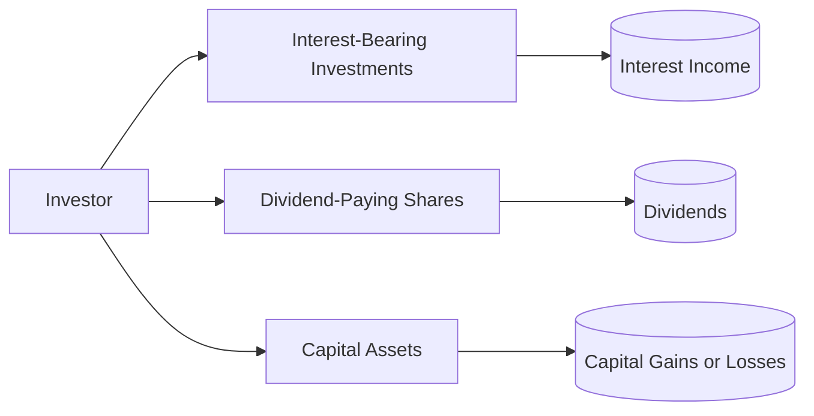

## 8.3 Taxation of Investment Income

Taxation of investment income in Canada can significantly affect an investor’s net return over time. Understanding the differences among interest, dividends (eligible and non-eligible), and capital gains or losses, as well as how they are treated by the Canada Revenue Agency (CRA), is critical to ensuring tax-efficient portfolio construction. This section provides an in-depth look at the tax treatment of various types of investment income, planning considerations, and practical strategies to help investors preserve more of their wealth.

---

## Overview of Investment Income Taxation in Canada

Investment income generally falls into three main categories:

1. **Interest Income** – Fully taxable at the investor’s top marginal tax rate.  
2. **Dividend Income** – Taxed more favorably through a gross-up and dividend tax credit mechanism.  
3. **Capital Gains (or Losses)** – Currently, only 50% of net capital gains are taxable. Capital losses can sometimes be used to offset capital gains in the current, prior, or future years.

The different ways each category is taxed can substantially influence decision-making around asset allocation, product selection, and the timing of trades.

---

## Interest Income

Interest income arises from investments like:

- Guaranteed Investment Certificates (GICs)  
- High-interest savings accounts  
- Bonds  
- Treasury bills  
- Certain structured notes  

Because 100% of interest income is included in taxable income, it can be the least tax-efficient source of investment returns for investors in higher tax brackets. For example, if someone is in a combined federal and provincial marginal tax rate of 45%, earning $1,000 of interest would result in $450 in total taxes on that interest.

### Real-World Canadian Example
A Canadian pension fund might hold a large portfolio of government and corporate bonds for liability matching. While receiving interest on bonds is essential to their client obligations, pension funds (unlike individual investors) have unique tax-exempt status. However, the principle remains that interest is the most taxed form of income for individual investors. Banks like RBC or BMO often issue GICs as secure, interest-bearing instruments for retail investors. Although secure, GIC interest is fully taxable.

### Practical Tip
For higher-rate taxpayers, putting interest-bearing investment products in registered accounts such as RRSPs or TFSAs is often advisable to shelter all or part of the income from immediate taxation.

---

## Dividend Income

Dividend income from Canadian corporations typically qualifies either as:

1. **Eligible Dividends:** Issued by Canadian public corporations, or certain private corporations that designate dividends as eligible. These come with an “enhanced” dividend tax credit.  
2. **Non-Eligible Dividends:** Generally paid by Canadian-controlled private corporations (CCPCs) that do not qualify for the enhanced credit. They receive a lower dividend tax credit.

### Why Dividends Are Attractive for Canadian Investors
Because of the dividend gross-up and tax credit system, dividend income often benefits from a significantly lower effective tax rate compared to interest. This mechanism aims to reduce double taxation at the corporate and shareholder levels.

### Example Using RBC Dividend
Suppose an investor receives $1,000 of eligible dividends from shares in RBC. For the 2025 tax year, the dividend amount is “grossed up” by a specified percentage (e.g., 38%) and then taxed. However, a federal and provincial dividend tax credit reduces the final amount of tax payable. 

### Pitfall
Despite dividends’ favorable treatment, large dividend payouts can push an investor’s taxable income into higher marginal brackets. Review the effect of dividends on Old Age Security (OAS) clawback and other income-tested government benefits.

---

## Capital Gains (and Capital Losses)

A **capital gain** arises when an investment is sold for more than the adjusted cost base (ACB) plus associated selling costs. In Canada, only 50% of capital gains are currently included in taxable income.

### Formula for Taxable Capital Gains
$$
\text{Taxable Capital Gain} = 0.50 \times \bigl(\text{Proceeds of Disposition} - \text{Adjusted Cost Base} - \text{Selling Costs}\bigr)
$$

### Adjusted Cost Base (ACB)
• Cost of the property (e.g., shares purchased at $20 each, plus commissions).  
• Adjusted for returns of capital, reinvested distributions, or corporate actions.  

Capital **losses** can only be used to offset capital gains (not interest income or dividends). Any net capital loss can be carried back up to three years or carried forward indefinitely to offset future gains.

### Strategic Use of Capital Losses
• Harvest losses near year-end to offset realized gains.  
• Retain records for carry-forward or carry-back.  
• Consider superficial loss rules (which disallow capital losses when repurchasing the same investment within 30 days).

### Example: TD Shares
If an investor bought 100 shares of TD at $60 and later sold them at $75, the capital gain on each share is $15 (ignoring commissions). Assuming a 50% inclusion rate, only $7.50 per share is taxed. Conversely, if the investor sells those shares at $50 for a $10 capital loss per share, that loss can offset other realized gains from the current or future years.

---

## Impact of Mutual Funds, ETFs, and Distribution Schedules

Even if you don’t sell your fund holdings, mutual funds and ETFs distribute income and capital gains annually. These can trigger a tax liability. For instance:

- **Equity Funds:** May distribute eligible dividends and often capital gains from portfolio turnover.  
- **Fixed-Income Funds:** May distribute mostly interest income.  
- **Balanced Funds:** Can distribute a combination of interest, dividends, and capital gains.

### Year-End Distributions
Buying a mutual fund or ETF right before its year-end distribution can lead to “buying a distribution,” where investors immediately incur a taxable event. To avoid this:

1. Track expected distribution dates.  
2. Consider purchasing after the annual capital-gains distribution if tax-management is a priority.  
3. Align with your advisor to avoid unintended tax consequences.

---

## Tax-Efficient Products and Structures

### Corporate-Class Funds
These funds allow for switching among different asset class sleeves within the same corporate structure without realizing immediate capital gains. They can be advantageous for tax deferral, though rules may change with new government budgets.

### T-Series Funds
Often used by retirees, these funds distribute primarily return of capital (ROC) in a monthly cash flow, deferring taxes until the ACB is reduced to zero. Only then do withdrawals become capital gains.

### Foreign Investment Income and Withholding Tax
Foreign income may be subject to withholding tax by the source country. Canadians may be eligible for a **foreign tax credit** to avoid double taxation. It is essential to detail these amounts on your T3 or T5 slip and claim appropriate credits when filing.

---

## Practical Steps for Investors

Below is a high-level approach for ensuring tax efficiency:

1. **Determine Your Marginal Tax Rate**  
   - Understand how additional income from interest, dividends, or capital gains affects your taxable income.

2. **Optimize Your Asset Location**  
   - Hold interest-bearing securities in registered accounts (RRSP, TFSA).  
   - Keep dividend-paying and growth assets in non-registered accounts if feasible.

3. **Use Losses Strategically**  
   - Monitor capital gains and losses throughout the year.  
   - Harvest losses when appropriate to reduce overall tax.

4. **Stay Informed on Distributions**  
   - Coordinate purchases around year-end distributions for mutual funds and ETFs.

5. **Leverage Professional Tools and Advice**  
   - Use software tools like AdjustedCostBase.ca to accurately track ACB.  
   - Consult with professional advisors, especially for complex estate, trust, or high-value transactions.

---

## Mermaid Diagram: Sources of Investment Income

**Explanation:**  
• This diagram illustrates the three main streams of investment income.  
• Interest-bearing investments (e.g., GICs, bonds) produce interest income.  
• Dividend-paying shares (e.g., Canadian banks, large public companies) provide dividends.  
• Capital assets (e.g., stocks, real estate, funds) can generate capital gains (or losses) when sold.

---

## Regulatory Considerations

• **CRA**: The Canada Revenue Agency outlines how to calculate and report income, including interest, dividends, and capital gains. See [CRA T4037 Guide (Capital Gains)](https://www.canada.ca/en/revenue-agency/services/forms-publications/publications/t4037.html).  
• **CIRO**: The Canadian Investment Regulatory Organization (CIRO) is Canada’s national self-regulatory organization after the amalgamation of the former MFDA and IIROC. CIRO’s compliance bulletins guide dealers on proper client disclosures regarding investment income.  
• **CIPF**: The Canadian Investor Protection Fund is now the single protection fund for client account assets. Although it does not insure against losses in market value, it does protect investors if a CIRO member firm becomes insolvent.  
• **Department of Finance Canada**: Proposes and ratifies fiscal statutes that can change rates or rules around investment income taxation.  

---

## Additional Resources and Further Learning

- **Department of Finance Canada**: Stay up-to-date on upcoming budget proposals that may affect the taxation of dividends or capital gains.  
- **Professional Courses**: Explore advanced investment taxation offerings at Canadian Securities Institute (CSI) and CPA Canada.  
- **CIRO Website**: [https://www.ciro.ca](https://www.ciro.ca) for the latest compliance materials and investor protection information.  
- **AdjustedCostBase.ca** for tracking multiple securities’ ACB in real time.  

---

## Summary

Taxation of investment income is an essential component of any wealth management strategy. By recognizing the distinct tax treatments of interest, dividends, and capital gains, investors can structure their portfolios in a way that potentially lowers their overall tax burden. Coordinating the timing of distributions, strategically using capital losses, and choosing products designed to manage taxes are crucial steps in boosting after-tax returns. Staying informed and working closely with qualified professionals helps ensure compliance with Canadian tax laws and enhances long-term wealth accumulation.

---

## Test Your Knowledge: Canadian Investment Income Taxation Quiz



### 1. Which type of investment income is fully taxed at the investor’s marginal rate?

- [ ] Eligible dividends  
- [ ] Capital gains  
- [x] Interest income  
- [ ] Return of capital  

> **Explanation:** Interest income (e.g., from GICs or bonds) is included at 100% and taxed at the investor’s marginal rate.

---

### 2. How much of a capital gain is currently taxable in Canada?

- [ ] 25%  
- [ ] 100%  
- [x] 50%  
- [ ] 75%  

> **Explanation:** At present, 50% of net capital gains are included in taxable income.

---

### 3. Which of the following statements about capital losses is correct?

- [ ] Capital losses can offset all forms of income.  
- [x] Capital losses can only be used to offset capital gains.  
- [ ] Capital losses cannot be carried forward.  
- [ ] Capital losses must be used immediately.  

> **Explanation:** In Canada, capital losses can only reduce capital gains. Any excess capital losses can be carried back three years or carried forward indefinitely.

---

### 4. Which of the following describes “eligible dividends?”

- [x] Dividends issued by certain Canadian public and private corporations that grant an enhanced tax credit.  
- [ ] Dividends issued by foreign corporations only.  
- [ ] Dividends that cannot receive a dividend tax credit.  
- [ ] Dividends subject to a 75% inclusion rate.  

> **Explanation:** Eligible dividends grant the enhanced dividend tax credit, reducing the effective tax rate on these dividends.

---

### 5. To avoid “buying a distribution” on a mutual fund, an investor could:

- [x] Purchase the fund after its year-end distribution.  
- [ ] Purchase immediately before the distribution.  
- [ ] Reinvest the distribution to avoid taxes.  
- [ ] Only invest in corporate bonds.  

> **Explanation:** Waiting until after year-end distributions can minimize immediate tax liability from recently distributed income and gains.

---

### 6. A retired investor wanting to defer taxes using return of capital might consider:

- [ ] Equity growth funds.  
- [ ] Government bonds.  
- [ ] Foreign shares.  
- [x] T-Series funds.  

> **Explanation:** T-Series funds distribute monthly payments that are mostly return of capital, deferring taxes until the investor’s ACB is depleted.

---

### 7. The Adjusted Cost Base (ACB) of an asset increases by:

- [ ] The asset’s sale proceeds.  
- [ ] Dividend distributions.  
- [ ] Capital losses.  
- [x] Expenses to acquire or improve the asset.  

> **Explanation:** ACB typically includes the purchase price and related acquisition costs (like commissions). Distributions like dividends or return of capital can affect the ACB differently depending on the nature of the payment.

---

### 8. What does the foreign tax credit allow Canadian residents to do?

- [ ] Claim only domestic tax refunds.  
- [x] Avoid double taxation on foreign-sourced income.  
- [ ] Defer paying taxes indefinitely.  
- [ ] Eliminate all foreign taxes.  

> **Explanation:** The foreign tax credit is designed to offset or reduce Canadian tax payable when foreign taxes have already been paid on the same income.

---

### 9. Under current regulations, which organization oversees investment dealers and mutual fund dealers in Canada?

- [ ] The defunct MFDA.  
- [ ] IIROC, as the sole active SRO.  
- [x] CIRO, the Canadian Investment Regulatory Organization.  
- [ ] The Canadian Investor Protection Fund (CIPF).  

> **Explanation:** MFDA and IIROC amalgamated to form CIRO; CIPF is the investor protection fund, not the national self-regulatory organization.

---

### 10. True or False: All dividends from Canadian corporations receive the same dividend tax credit.

- [x] True  
- [ ] False  

> **Explanation:** This statement might be considered partially correct or nuanced. In principle, “eligible” and “non-eligible” dividends do receive different levels of tax credit. However, if “all dividends” in this question refers to any Canadian-sourced dividends, both types do receive some form of credit, though the rates differ. Thus, the question’s binary phrasing can be misleading. Always distinguish between eligible and non-eligible dividends to apply the correct credit.


