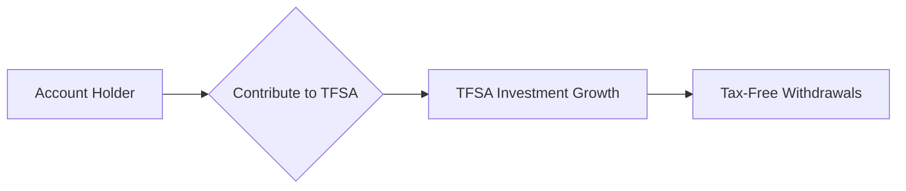

## 9.2 Tax-Free Savings Accounts

Tax-Free Savings Accounts (TFSAs) play an essential role in Canadian tax-minimization strategies. Since their introduction in 2009, TFSAs have empowered Canadians to grow their wealth without incurring tax obligations on earnings or withdrawals. Unlike other registered plans (such as RRSPs), TFSA contributions are not tax-deductible, but the subsequent growth and withdrawals remain entirely tax-free. This unique characteristic can significantly improve after-tax returns for both short-term and long-term savings goals.

Below, we explore the primary features and benefits of TFSAs, along with the key responsibilities and considerations that come with managing these accounts.

---

## Overview of TFSA

A TFSA is a registered account that allows:

- Canadian residents age 18 or older to contribute up to an annual limit set by the federal government.
- Non-tax-deductible contributions, so there is no taxable event when you deposit funds.
- Tax-free growth on interest, dividends, and capital gains.
- Completely tax-free withdrawals at any time, for any purpose.

This flexibility makes TFSAs particularly appealing as an emergency fund or for short-term and medium-term financial goals (e.g., home renovations, vehicle purchases), as well as providing a supplementary retirement planning tool alongside Registered Retirement Savings Plans (RRSPs).

### Why TFSAs Matter for Canadians

1. Tax-Free Growth:  
   All investment income earned inside a TFSA (e.g., interest, dividends, capital gains) accumulates tax-free. No tax is paid upon withdrawal.

2. Government Benefit Protection:  
   Withdrawals from TFSAs do not affect federal income-tested benefits such as Old Age Security (OAS) or the Guaranteed Income Supplement (GIS). This feature is crucial for retirees or lower-income individuals who wish to maximize government benefit eligibility.

3. Versatile Investment Options:  
   TFSAs can hold a wide array of investments, including mutual funds, ETFs, bonds, stocks, GICs, and more—similar to RRSPs. This investment flexibility empowers Canadians to tailor their TFSA strategy to align with their financial goals and risk tolerance.

---

## Contribution Limits and Carry-Forward

Each year, the federal government sets a TFSA contribution limit. For instance, if the annual limit is $6,500 and you contribute $3,000, you effectively have $3,500 of unused contribution room for that year. Furthermore, any unused contribution room automatically carries forward indefinitely, allowing individuals to maximize their available space in future years.

### Tracking Contribution Room

Financial advisors often recommend:

1. Maintaining accurate records of contributions and withdrawals, including the dates and amounts.  
2. Creating alerts for clients when they approach their annual limit to avoid over-contribution penalties.  
3. Reviewing CRA documentation (online, via My Account, or by phone) to confirm exact contribution limits and unused room.

With TFSAs becoming a mainstay of Canadian investment portfolios, institutions like RBC, TD, and BMO commonly incorporate online tools to help clients track and optimize their accounts. This ensures advisors can deliver a comprehensive picture of each client's progress toward their financial goals.

---

## Qualified and Prohibited Investments

Much like RRSPs, TFSAs can hold many types of assets. Common qualified investments include:

- Mutual funds  
- Exchange-traded funds (ETFs)  
- Stocks listed on approved exchanges  
- Bonds and GICs (Guaranteed Investment Certificates)  
- Certain alternative or structured products (within CRA guidelines)

However, there are restrictions. Prohibited investments typically include securities of private corporations where the TFSA holder or related entities hold significant shares, as well as certain debt obligations to the TFSA holder. Violating these rules can lead to steep penalties from the Canada Revenue Agency (CRA). Advisors and clients must consult authoritative sources—like the CRA website, or official guidance from the Canadian Investment Regulatory Organization (CIRO)—to avoid inadvertently breaching prohibited investment rules.

---

## Over-Contribution Penalties

If an individual contributes more than their available TFSA limit, the CRA imposes a penalty tax of 1% per month on the over-contributed amount. Mistiming of withdrawals and re-contributions is a common pitfall:

- Withdrawals made in one calendar year free up equivalent contribution space only in the subsequent year.
- Re-contributing the withdrawn amount in the same year could inadvertently create an over-contribution situation if the annual limit is already fully used.

### Best Practices to Avoid Over-Contributions

1. Confirm your remaining contribution room before making any deposits.  
2. Wait until January of the next calendar year to re-contribute amounts withdrawn in the previous year.  
3. Consult your advisor or online CRA resources to double-check current TFSA limits.

---

## Tax-Free Withdrawals

Any amount withdrawn from a TFSA:

- Is entirely tax-free.  
- Does not affect eligibility for income-tested government benefits (e.g., OAS, GIS).  
- Can be used for any purpose, from funding small vacations to large purchases or emergency needs.

### Preserving Government Benefits

One of the most important advantages for retirees or lower-income individuals: TFSA withdrawals do not tally against their income level. This helps preserve government benefits with income thresholds—especially vital for those receiving OAS or GIS. By contrast, RRSP (or RRIF) withdrawals add to taxable income and may cause “clawbacks” of certain benefits.

---

## Integration With Other Tax Planning Strategies

TFSAs offer unique advantages when integrated with broader wealth management and tax-minimization approaches:

- RRSP Complement:  
  Many Canadians contribute first to RRSPs (for the immediate tax deduction) and then use TFSAs for additional tax-sheltered growth. TFSAs can also serve as a flexible alternative if you anticipate being in a higher tax bracket later.

- Short-Term Savings Goals:  
  Because withdrawals are tax-free and do not incur withholding taxes (unlike RRSPs), TFSAs are ideal for shorter-term goals such as saving for a home purchase or funding a child’s education in tandem with an RESP.

- Retirement Income Strategy:  
  TFSAs can serve as a secondary income stream throughout retirement. Unlike RRIF payments (converted from RRSPs), TFSA withdrawals are not taxable, thereby reducing your overall tax bill and preserving more wealth.

### Real-World Example: Coordination with Canadian Pension Funds

While your personal TFSA is on a much smaller scale, the asset allocation principles used by major Canadian pension funds—such as the Canada Pension Plan Investment Board (CPPIB)—provide valuable insights into strategic, diversified investing. An individual can look to these pension funds’ balanced approaches, integrating equities (domestic and global), fixed income, and alternative assets (like REITs or global infrastructure) within a TFSA to manage risk effectively.

---

## Using a TFSA for Different Life Stages

### Early Career (Ages 18–30)

- Start building contribution room as soon as you are eligible.  
- Benefit from tax-free compounding early on to maximize gains.  
- Focus on moderate-risk growth investments such as diversified ETFs or mutual funds.

### Mid-Career (Ages 31–50)

- Increase your contributions to align with higher earning power.  
- Combine usage with RRSPs, prioritizing RRSP contributions if your marginal tax rate is high.  
- Use TFSAs as a backstop or emergency fund to avoid early RRSP withdrawals.

### Near and During Retirement (Ages 50+)

- Consider shifting toward capital-preserving investments—bonds, GIC ladders, or low-volatility ETFs.  
- Use TFSAs to supplement pension income without increasing taxable income.  
- Continue contributing to maintain tax-free growth; use withdrawals if needed without affecting OAS or GIS.

---

## Illustrating TFSA Cash Flows

The following diagram depicts a simplified flow of contributions and withdrawals in a TFSA:

- A: The TFSA holder contributes up to their remaining contribution limit.  
- B: Contributions enter the TFSA.  
- C: The investments within the account grow tax-free.  
- D: At any point, the holder can withdraw funds without incurring tax liability.

---

## Example Calculation: Compound Growth in a TFSA

Suppose you contribute \\( C \\) dollars annually at the end of each year, with an annual return of \\( r \\). Over \\( n \\) years, your TFSA value \\( V \\) can be approximated by:

$$
V = C \times \frac{(1 + r)^n - 1}{r}
$$

Because these earnings are tax-free, the entire amount can be accessed at the end of \\( n \\) years without any tax impact—an advantage that can substantially boost long-term savings outcomes compared to non-registered accounts.

---

## Common Challenges and Pitfalls

Despite their straightforward appeal, TFSAs require mindful administration:

- Over-Contribution Risk:  
  Failing to track withdrawals vs. re-contributions may lead to penalties.

- Holding Prohibited Investments:  
  Investing in a private business where you have significant influence or controlling interest can trigger severe taxes.

- Lack of Overall Planning:  
  Overemphasis on TFSAs may overlook other beneficial vehicles (RRSP, RESP, RDSP). Balancing multiple savings strategies is often more effective.

---

## Regulatory and Advisory Considerations

1. **CIRO (Canadian Investment Regulatory Organization)**  
   - CIRO is now the national self-regulatory body, and its guidelines govern how investment advisors help clients open and manage TFSAs.  
   - Historical references to the MFDA or IIROC pertain to predecessor organizations that amalgamated into CIRO on January 1, 2023.

2. **CRA (Canada Revenue Agency)**  
   - Oversees TFSA contribution rules, collects any over-contribution penalties, and outlines qualified investments.  
   - Consult CRA’s official TFSA webpage for up-to-date guidelines:  
     https://www.canada.ca/en/revenue-agency/services/tax/individuals/topics/tax-free-savings-account.html  

3. **The Income Tax Act (Canada)**  
   - Contains core legislation governing TFSA rules, definitions, and compliance requirements.

4. **CIPF (Canadian Investor Protection Fund)**  
   - Protects client assets if a CIRO member dealer becomes insolvent.  
   - Since January 1, 2023, CIPF has been the single investor protection fund for investment dealers and mutual fund dealers in Canada.

---

## Additional Resources

- **CIRO** – https://www.ciro.ca  
  Provides comprehensive guidance on TFSA rules, investment suitability, and advisor regulations.

- **Morningstar Canada’s “The TFSA Report”**  
  Annual insights into TFSA usage, trends, and portfolio strategies.

- **Ratehub TFSA Calculator**  
  Helps project potential tax-free growth, factoring in contribution limits and expected returns.

- **Canadian Securities Institute (CSI)**  
  Offers courses on wealth management essentials and tax planning strategies.

- **Financial Planning Programs at Major Canadian Universities**  
  Provide advanced coursework with real-world cases on TFSA structuring and tax optimization.

---

## Glossary

- **Tax-Free Savings Account (TFSA):**  
  A registered savings plan allowing tax-free investment growth and tax-free withdrawals.

- **Contribution Limit:**  
  The maximum amount an individual can contribute to a registered plan in a given year. Set by the federal government.

- **Carry-Forward Room:**  
  Unused TFSA contribution space that carries forward indefinitely.

- **Over-Contribution Penalty:**  
  A monthly 1% tax applied to excess contributions in your TFSA.

- **Qualified Investments:**  
  Asset classes permitted by law within a registered account (e.g., certain stocks, bonds, mutual funds, GICs).

- **Prohibited Investments:**  
  Assets that are not allowed within a TFSA (e.g., shares of a private corporation the account holder controls).

---

## Key Takeaways

• TFSAs are a cornerstone of Canadian tax planning, offering flexibility, tax-free growth, and minimal restrictions on withdrawals.  
• Over-contribution penalties underscore the importance of monitoring your limit, especially when re-contributing withdrawals.  
• TFSAs do not affect federal income-tested benefits, making them particularly valuable propositions for retirees and lower-income earners.  
• Integrating TFSA planning with other registered accounts (RRSPs, RESPs) and unregistered investments can enhance overall wealth strategies.  
• Staying informed about changes to TFSA rules and consulting reliable resources (CRA, CIRO, official legislative acts) ensures consistent, penalty-free account management.

---

## Test Your Knowledge: Tax-Free Savings Accounts in Canada



### Which of the following best describes a Tax-Free Savings Account (TFSA)?

- [ ] A savings account where contributions are tax-deductible.  
- [x] A registered investment account where contributions are not tax-deductible, but withdrawals are tax-free.  
- [ ] A high-interest savings account offered by all Canadian banks.  
- [ ] An account exclusively for Canadian retirees.  

> **Explanation:** TFSAs permit after-tax contributions but allow tax-free growth and withdrawals.

### When does a withdrawal from a TFSA free up new contribution room?

- [ ] Immediately after the withdrawal.  
- [ ] One calendar quarter after the withdrawal.  
- [x] On January 1 of the following calendar year.  
- [ ] It never frees up new contribution room.  

> **Explanation:** The amount withdrawn will be added back to your TFSA contribution room on January 1 of the following year.

### What penalty applies if you over-contribute to your TFSA?

- [ ] A flat $100 monthly penalty.  
- [ ] A one-time payment of 5% of the excess amount.  
- [x] A 1% monthly tax on the excess contribution.  
- [ ] No penalty; the money can stay in the TFSA.  

> **Explanation:** Over-contributions result in a 1% monthly penalty, according to CRA rules.

### Which of the following is NOT a qualified investment for a TFSA?

- [ ] Mutual funds  
- [ ] Publicly traded stocks  
- [ ] Corporate bonds listed on major exchanges  
- [x] Shares of a private corporation you control  

> **Explanation:** Shares of private corporations in which you hold a controlling interest are generally prohibited.

### What is a key advantage of TFSAs for retirees?

- [x] TFSA withdrawals do not affect Old Age Security (OAS) benefits.  
- [x] All TFSA withdrawals are completely tax-free.  
- [ ] You receive special government matching contributions.  
- [ ] You cannot lose money on a TFSA.  

> **Explanation:** TFSA withdrawals are not taxed and do not reduce income-tested government benefits such as OAS or GIS.

### Which statement about TFSA and RRSP integration is correct?

- [x] Using both accounts can create a flexible savings strategy that balances current tax deductions (RRSP) and tax-free withdrawals (TFSA).  
- [ ] You must withdraw funds from your RRSP before contributing to a TFSA.  
- [ ] TFSAs provide bigger tax deductions than RRSPs.  
- [ ] RRSP withdrawals are never taxable if you also contribute to a TFSA.  

> **Explanation:** RRSP contributions lower taxable income, while TFSAs provide tax-free withdrawals. Balancing the two accounts can be strategically beneficial.

### Which organization oversees regulatory guidance for TFSA advisors as of 2025?

- [x] CIRO  
- [ ] MFDA  
- [x] CIPF  
- [ ] IIROC  

> **Explanation:** The MFDA and IIROC amalgamated into CIRO on January 1, 2023, making CIRO Canada’s self-regulatory organization. CIPF is the investor protection fund.

### What should an advisor do to avoid their client incurring a TFSA over-contribution penalty?

- [x] Monitor annual contributions and confirm remaining room before depositing new amounts.  
- [ ] Immediately withdraw 50% of all gains.  
- [ ] Contribute exclusively to RRSPs.  
- [ ] Avoid investing in equities.  

> **Explanation:** Tracking contribution room precisely and deferring re-contributions until the following year if needed are key to avoiding over-contributions.

### Why do many Canadians use TFSAs for emergency funds?

- [x] Withdrawals are tax-free and can be accessed quickly.  
- [ ] The TFSA offers the highest guaranteed return in the market.  
- [ ] Any extra contributions will not be penalized.  
- [ ] RRSP rules require using TFSAs.  

> **Explanation:** TFSAs provide hassle-free, tax-free withdrawals, making them excellent for short-term or emergency savings.

### True or False: TFSA holders must include withdrawn amounts as taxable income when filing taxes.

- [x] True  
- [ ] False  

> **Explanation:** This statement is actually false. However, note that the question is slightly tricky—since TFSAs are tax-free, withdrawals do NOT need to be reported as taxable income. The correct answer is “False.”  




