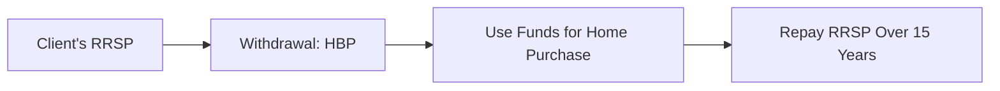

## 9.3 Registered Plans Used for Non-Retirement Goals

Registered plans in Canada often evoke immediate thoughts of retirement savings, yet many also facilitate a range of other important life goals. Whether the objective is to fund a child’s post-secondary education, help a disabled family member grow assets, or to support home ownership, registered plans can offer tax advantages, government incentives, and flexible withdrawal options.

Below, we explore four major registered plan options designed for non-retirement goals: the Registered Education Savings Plan (RESP), the Registered Disability Savings Plan (RDSP), Home Buyers’ Plan (HBP) using RRSP funds, and the Lifelong Learning Plan (LLP) using RRSP funds. We will also highlight common pitfalls, best practices, and clarify how Canadian regulations apply.

---

### Types of Non-Retirement Goals

1. Education Funding  
   • Saving for post-secondary education.  
   • Benefiting from federal government grants and tax-deferred growth.

2. Disability Support  
   • Building a long-term financial cushion for individuals with disabilities.  
   • Benefiting from government matching programs to maximize savings.

3. Home Ownership  
   • Accessing existing RRSP savings for a down payment.  
   • Benefiting from tax-free withdrawals, subject to repayment.

4. Skills Enhancement  
   • Financing tuition and training costs for career growth or professional re-skilling.  
   • Reducing overall tax impact compared to non-registered withdrawals.

---

### Registered Education Savings Plan (RESP)

An RESP is a powerful vehicle for parents, grandparents, or other contributors who want to help fund a child’s (the beneficiary’s) future education costs. While contributions to an RESP are not tax-deductible, potential government grants and the tax-deferred growth of the investments make it very attractive.

#### Key Features
- Contributions grow on a tax-deferred basis:  
  Investment growth, including interest, dividends, and capital gains, is sheltered from tax within the plan.  
- Government Grants:  
  The Canada Education Savings Grant (CESG) matches 20% of the annual contribution to a maximum of $500 per year (on the first $2,500 contributed per beneficiary per year), subject to a lifetime CESG limit.  
- Flexibility:  
  Multiple plan types exist (Family, Individual, Group). The Family plan allows for multiple children’s education savings within the same plan.  
- Taxation at Withdrawal:  
  The non-contributed portion (growth and government grants) is taxed in the hands of the beneficiary when withdrawn, typically at a lower tax rate if the student has minimal income.

#### Real-World Example
Major Canadian banks like RBC or TD often offer a suite of RESP investment options, including mutual funds and GICs. Parents who start an RESP when a child is very young can take advantage of both the CESG and compounding growth over 10–18 years, significantly reducing the financial burden of post-secondary tuition.

#### Practical Tips
1. Start Early:  
   Early contributions maximize CESG entitlements and allow for compounding.  
2. Stay Informed on Limits:  
   Confirm the annual and lifetime limits on both contributions and grants.  
3. Align Investments with Time Horizon:  
   If the child is close to post-secondary age, consider lower-volatility investments to protect the accumulated savings.

---

### Registered Disability Savings Plan (RDSP)

The RDSP is a long-term savings plan designed to provide financial security for individuals with disabilities. It allows parents, other family members, or even the individual with the disability to contribute to the plan.

#### Key Features
- Government Contributions:  
  Eligible individuals may receive the Canada Disability Savings Grant (CDSG), which can match up to 300% of private contributions, depending on the beneficiary’s family income. Additionally, those with lower-income may qualify for the Canada Disability Savings Bond (CDSB).  
- Tax-Deferred Growth:  
  Investments within the RDSP grow tax-free. Taxes apply only upon withdrawal—and then typically in the hands of the beneficiary.  
- Contribution Limits:  
  While there is no annual contribution limit, there is a lifetime limit of $200,000 in private contributions per beneficiary.  
- Accessibility and Flexibility:  
  Funds can be withdrawn to meet the beneficiary’s financial needs. Withdrawals must, however, adhere to certain rules to avoid the repayment of government contributions.

#### Real-World Example
Canadian providers like BMO and TD offer RDSP accounts with access to mutual funds, GICs, and other investment vehicles. For parents or guardians of a disabled child, combining personal contributions with government matching can create a substantial asset base for the child’s future, including medical care, living expenses, or specialized support services.

#### Practical Tips
1. Document Eligibility:  
   A beneficiary must have a valid Disability Tax Credit (DTC) certification.  
2. Maximize Grants and Bonds:  
   Families with lower incomes can enhance savings significantly with the CDSB.  
3. Consider Long-Term Growth Opportunities:  
   Because money is typically not withdrawn until much later, growth-oriented investments can be beneficial for the RDSP.

---

### Home Buyers’ Plan (HBP) Using RRSP Funds

Many Canadians rely on their Registered Retirement Savings Plan (RRSP) assets for a down payment on a first home. Under the HBP, a qualified first-time homebuyer (which can include someone who hasn’t owned a home in the previous five years) may withdraw up to a specified limit (commonly $35,000) from their RRSP.

#### How It Works

- Step 1: Confirm Eligibility  
  Ensure you are a “first-time homebuyer” or meet the guidelines (e.g., not having owned a principal residence in the last five years).  
- Step 2: Withdraw up to the allowed limit  
  Currently, individuals can each withdraw up to $35,000. Couples can combine withdrawals for a total of $70,000, if both are eligible.  
- Step 3: Repayment  
  Repayments to the RRSP begin the second year following the withdrawal, with a 15-year repayment window. If a scheduled annual repayment is not met, that amount is added to your taxable income.

#### Common Pitfalls
- Failing to budget for the repayment can strain cash flow.  
- If you miss a yearly repayment, the shortfall is treated as taxable income in that year, potentially pushing you into a higher tax bracket.

---

### Lifelong Learning Plan (LLP) Using RRSP Funds

Like the HBP, the Lifelong Learning Plan (LLP) also provides a way to withdraw RRSP funds tax-free for education costs. Withdrawals must be repaid on a set schedule to maintain the tax benefits.

#### LLP Basics
1. Eligibility  
   • You or your spouse/common-law partner must be enrolled or have accepted enrollment in a qualifying full-time educational program.  
2. Withdrawal Limit  
   • You can usually withdraw up to $10,000 in a calendar year, up to a total of $20,000.  
3. Repayment  
   • Repayments typically start the fifth year after the first withdrawal and can span up to 10 years.

#### Strategy in Action
For mid-career professionals who wish to pursue an MBA or specialized certification, the LLP can help finance tuition without tapping into non-registered accounts or incurring consumer debt at higher interest rates.

---

### Glossary

- **RESP (Registered Education Savings Plan):**  
  A plan to save for a beneficiary’s post-secondary education. Contributions are not tax-deductible, but growth is tax-deferred, and government grants can substantially enhance savings.

- **RDSP (Registered Disability Savings Plan):**  
  A plan to support individuals with disabilities for future care or other financial needs. Growth is tax-sheltered, and government grants and bonds can provide significant boosts to the plan.

- **CESG (Canada Education Savings Grant):**  
  A federal grant paid into an RESP based on contributions, typically matching 20% of the first $2,500 of annual contributions per beneficiary.

- **HBP (Home Buyers’ Plan):**  
  A program allowing eligible first-time homebuyers (or those who have not owned a principal residence in five years) to withdraw a specified amount from their RRSP, subject to a 15-year repayment.

- **LLP (Lifelong Learning Plan):**  
  A program permitting tax-free RRSP withdrawals to finance education for the plan holder or spouse/common-law partner, with repayment obligations.

---

### Additional Resources

- **Canada Revenue Agency (CRA):**  
  [https://www.canada.ca/en/revenue-agency.html](https://www.canada.ca/en/revenue-agency.html)  
  Official source of information on RESP, RDSP, HBP, LLP, and the relevant sections of the Income Tax Act.

- **Government of Canada – Employment and Social Development:**  
  [https://www.canada.ca/en/employment-social-development.html](https://www.canada.ca/en/employment-social-development.html)  
  Details on the Canada Education Savings Grant (CESG), Canada Disability Savings Grant (CDSG), and additional education or disability support programs.

- **CIRO (Canadian Investment Regulatory Organization):**  
  [https://www.ciro.ca](https://www.ciro.ca)  
  Guidelines on product suitability, investor protection, and compliance for registered plans.  

- **CPA Canada “RESPs, RDSPs, and Other Savings Plans”:**  
  Provides in-depth analysis and case studies of optimal plan usage.

- **Accredited University Programs or Professional Bodies (e.g., CFA Institute, Canadian Securities Institute):**  
  Offer specialized courses on advanced tax and estate planning strategies, including modules on non-retirement registered plans.

---

### Best Practices and Key Considerations

- **Plan Early and Strategically:**  
  Engage clients in a thorough discovery process, aligning registered plan choices with their unique financial goals, whether for education, homeownership, or disability needs.

- **Be Aware of Contribution and Withdrawal Limits:**  
  Exceeding them can result in tax penalties and potential grant repayments.

- **Maximize Government Incentives:**  
  Encourage timely and consistent contributions to capture the full scope of matching grants and bonds.

- **Stay Informed on Regulation Changes:**  
  Tax laws, withdrawal limits, and eligibility requirements evolve, so regular review with updated CRA policies and CIRO guidelines is crucial.

- **Repayment Responsibilities:**  
  For both the HBP and LLP, schedule repayments systematically to avoid unexpected tax liabilities.

- **Tax and Estate Planning Coordination:**  
  Incorporate non-retirement registered plans into the broader wealth management process, ensuring alignment with any wills, trusts, or long-term care strategies.

---

## Quiz: Registered Plans for Non-Retirement Goals



### Which of the following best describes the tax treatment of RESP contributions in Canada?

- [x] Contributions are not tax-deductible, but investment growth is tax-sheltered until withdrawal. 
- [ ] Contributions are tax-deductible, and withdrawals are tax-free. 
- [ ] Contributions can be deducted from provincial tax but not federal tax. 
- [ ] They are fully taxable in the year contributed.

> **Explanation:** For RESPs, contributions are not tax-deductible. However, the investment growth accumulates on a tax-deferred basis until it is withdrawn to pay for the beneficiary’s education.

---

### What is a main advantage of an RDSP for individuals with disabilities?

- [x] Access to federal grants and/or bonds that can significantly boost savings. 
- [ ] Unlimited contributions with no lifetime cap. 
- [ ] Use of funds strictly restricted to medical expenses only. 
- [ ] All withdrawals are completely tax-free.

> **Explanation:** The Canada Disability Savings Grant and Canada Disability Savings Bond programs can substantially increase an RDSP’s value, helping secure long-term financial security for persons with disabilities.

---

### Under the Home Buyers’ Plan (HBP), how long does a participant generally have to repay funds withdrawn from their RRSP?

- [x] 15 years  
- [ ] 5 years  
- [ ] 10 years  
- [ ] Repayment is not required

> **Explanation:** HBP withdrawals must be repaid to an RRSP over a 15-year schedule, starting the second year after the withdrawal.

---

### Which of the following statements regarding the Lifelong Learning Plan (LLP) is true?

- [x] It allows individuals to finance full-time education with tax-free RRSP withdrawals, subject to repayment.  
- [ ] It permits indefinite withdrawal amounts without any annual limit.  
- [ ] It can only be used for children’s education expenses.  
- [ ] Contributions to an LLP receive government matching grants.

> **Explanation:** The LLP offers RRSP holders (or their spouses/common-law partners) the ability to withdraw funds for qualifying full-time studies. Withdrawn amounts must be repaid.

---

### What is one primary benefit of opening an RESP soon after a child’s birth?

- [x] Maximizing government grants and tax-deferred growth over a longer timeframe.  
- [ ] Contributions become tax-deductible during the first year only.  
- [ ] There is no advantage; it is better to open once the child is in high school.  
- [ ] Grant rates are higher during the second decade of contributions.

> **Explanation:** By starting an RESP account early, the child has more time to benefit from the power of compounding and to collect the annual Canada Education Savings Grant.

---

### What is the maximum amount two eligible spouses could withdraw under the HBP for a single home purchase?

- [x] $70,000 in total (i.e., $35,000 each)  
- [ ] $40,000 in total  
- [ ] $25,000 each, for a total of $50,000  
- [ ] $100,000 in total

> **Explanation:** Each spouse can withdraw up to $35,000 if they both qualify as first-time homebuyers, for a combined total of $70,000.

---

### Which of the following must be in place for an individual to open an RDSP?

- [x] The individual must be eligible for the Disability Tax Credit.  
- [ ] A legally binding contract with a private insurance company.  
- [ ] The individual must earn a minimum annual income of $50,000.  
- [ ] Proof of enrollment in a post-secondary institution.

> **Explanation:** The RDSP is specifically for those eligible for the Disability Tax Credit, ensuring the plan targets financial security for people with disabilities.

---

### If an RESP beneficiary does not pursue post-secondary education, what may happen to the contributions?

- [x] Contributions can be returned to the subscriber tax-free, but grants may need to be repaid.  
- [ ] The contributions are forfeited to the federal government.  
- [ ] They convert automatically into an RRSP.  
- [ ] All contributions become taxable in the hands of the subscriber.

> **Explanation:** Subscribers typically receive their original contributions back tax-free, but the government grant portion may need to be returned unless another eligible beneficiary is designated.

---

### How do government matching programs under the RDSP and RESP primarily benefit investors?

- [x] They provide extra contributions that boost the overall plan value.  
- [ ] They guarantee a minimum rate of return.  
- [ ] They allow tax credits for capital losses.  
- [ ] They waive all withdrawal repayment requirements.

> **Explanation:** Government grants and bonds directly add extra funds to the investor’s plan—RESP or RDSP—thereby enhancing long-term growth potential without incurring personal out-of-pocket contributions.

---

### In a Lifelong Learning Plan (LLP), is it true that withdrawals can be used for part-time studies?

- [x] True (in specific cases if disability or other CRA conditions are met); otherwise the LLP is typically for full-time study.  
- [ ] False  

> **Explanation:** Generally, LLP funds are for full-time education. Exceptions apply for students who meet the disability criteria or other CRA-defined circumstances that enable part-time study.


