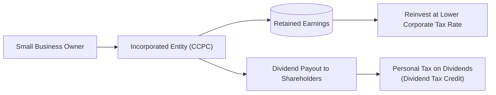

## 9.4 Incorporation

Incorporation involves creating a separate legal entity (a corporation) that can own property, generate business income, and take on liabilities separate from its owner(s). Canadians—from small business owners to professional practitioners—often choose to incorporate for its potential tax advantages, legal protections, and opportunities to optimize wealth management strategies. This section examines the essentials of incorporation, the tax benefits, and the key considerations when deciding whether to incorporate from a Canadian perspective.

---

### Incorporation Overview

#### What Is Incorporation?
In Canada, incorporation establishes a distinct legal entity—referred to as a corporation—that exists and operates separate from the person or persons who own its shares. As a separate legal person, the corporation can:

- Own property and assets.  
- Enter into contracts.  
- Hire employees.  
- Incur liabilities.  
- Pay corporate taxes on its income.  

You can incorporate at the federal level through Corporations Canada, or at the provincial/territorial level through the respective registries (e.g., Ontario Business Registry, BC Registry Services). Each jurisdiction has its set of formation documents, ongoing filing requirements, and associated fees.

#### Types of Corporations
1. **Public Corporations** – Large, widely held corporations that trade on stock exchanges.  
2. **Private Corporations** – Held by a small group of shareholders; they do not publicly list shares on a stock exchange.  
   - Canadian-controlled private corporations (CCPCs) are a special type of private corporation that satisfy specific Canadian ownership requirements. They can be eligible for certain tax benefits (e.g., the small business deduction).

#### Professional Corporations
Some professions (such as law, medicine, dentistry, and accounting) allow practitioners to incorporate as “professional corporations.” These entities often face rules from a governing body—e.g., a provincial law society or College of Physicians and Surgeons—that can restrict who may own shares or control the corporation.  

> **Important:** Always confirm with relevant professional regulators (medical colleges, legal societies, etc.) that the form and structure of the professional corporation comply with all requirements. Failure to do so can lead to regulatory sanctions or the dissolution of the professional corporation.

---

### Potential Tax Advantages

For many entrepreneurs and professionals, the primary motivation to incorporate is the potential for tax savings and enhanced wealth-building capacity, including:

1. **Small Business Deduction and Lower Corporate Tax Rates**  
   - Most Canadian-controlled private corporations (CCPCs) qualify for a reduced tax rate on active business income up to a predefined threshold (the “small business limit”).  
   - This rate can be substantially lower than personal marginal tax rates, freeing up capital to reinvest within the corporation.

2. **Income Splitting Through Dividends**  
   - A corporation can pay dividends to multiple shareholders, often family members.  
   - If those family members are in lower tax brackets (and meet legislative requirements around splitting income), it can yield overall tax savings.  
   - Note that income-splitting rules have undergone revisions to ensure that dividends paid to relatives are “reasonable” and commensurate with their contributions to the business.

3. **Tax Deferral**  
   - By retaining profits in the corporation instead of immediately paying them out to shareholders, you may defer personal taxes until you eventually withdraw the funds (e.g., as dividends).  
   - Over many years, this deferral enables additional reinvestment at the lower corporate tax rate, potentially compounding returns.

> **Tip:** Investors often compare the combined corporate and personal tax burden (when dividends are eventually withdrawn) to the personal tax they would have paid without incorporation. The net advantage depends on the difference between personal and corporate rates, the timing of withdrawals, and shareholder remuneration strategies.

---

### Integration With Personal Financial Planning

Though incorporation can offer notable advantages, advisors must remain conscious of both short-term and long-term financial implications:

- **Registration and Maintenance Costs**  
  - Fees for incorporating, annual returns, and corporate governance (e.g., preparing corporate financial statements) can exceed those of a sole proprietorship or partnership.  
  - Complexity is higher, requiring additional bookkeeping for corporate filings and separate corporate bank accounts.

- **Corporate-Shareholder Compensation Mix**  
  - Determining how to withdraw funds from the corporation—via salary or dividends—requires careful analysis.  
  - Salaries are deductible to the corporation, reduce corporate income, and can form the basis of Registered Retirement Savings Plan (RRSP) contribution limits. Dividends do not qualify for RRSP contribution room but may receive the dividend tax credit, reducing personal tax.  
  - Canadian financial institutions, such as RBC, BMO, or TD, often provide tools or professional guidance to evaluate the optimal remuneration strategy. These tools factor in personal marginal rates, corporate tax rates, and lifestyle needs.

- **Professional Corporations**  
  - Regulatory bodies might limit the flexibility of share ownership and profits distribution in ways not applicable to standard business corporations.  
  - Not all professionals can freely split income with family members—strict rules on share ownership and directorship often apply.

> **Pitfall:** Incorporating without a clear plan for compensation and reinvestment can result in unnecessary complexity or even increased tax costs. Always run simulations comparing (a) operating as a sole proprietorship and (b) incorporating, to confirm the estimated net advantage.

---

### Withdrawal Strategies

One of the central issues in using a corporation is deciding how (and when) to draw income. The primary compensation methods are:

1. **Salary**  
   - Deductible expense for the corporation.  
   - Creates RRSP contribution room for the recipient.  
   - Subject to employment-related withholdings (e.g., Canada Pension Plan premiums, Employment Insurance, etc.).

2. **Dividends**  
   - Paid from after-tax corporate profits, so the corporation does not get a deduction.  
   - Potentially qualified for the dividend tax credit, lowering personal taxes.  
   - Generates no RRSP contribution room and is ineligible for the Canada Employment Credit.

#### Finding the Optimal Balance
The choice typically hinges on ensuring that total tax paid (corporate + personal) is minimized while achieving personal objectives like retirement savings, estate building, and charitable giving. Advisors will:

- Evaluate corporate tax brackets vs. personal tax brackets.  
- Consider the client’s current lifestyle and liquidity needs.  
- Incorporate future expansion or succession planning.  

> **Formula**  
> Theoretical “integration” aims for a neutral overall tax outcome—whether an individual earns personally or via a corporation. However, differences in timing and provincial rules can create or diminish tax benefits. A simplified representation of dividend tax cost for an individual can be shown as:  
>

$$
\text{Effective Tax} = \text{Corporate Tax} + \left(\text{Personal Tax on Dividends} - \text{Dividend Tax Credit}\right).
$$



---

### Winding Up or Selling a Corporation

Eventually, the corporation may be sold, wound up, or transferred upon retirement or as part of an estate plan. Common scenarios include:

1. **Selling Shares**  
   - This may trigger capital gains, potentially qualifying for the Lifetime Capital Gains Exemption (LCGE) on qualified small business corporation (QSBC) shares.  
   - The LCGE limit is indexed for inflation. Check the current threshold on the CRA website.

2. **Asset Sale**  
   - If the purchaser only wants certain assets, the corporation can sell these assets while the ownership in the corporation remains unchanged.  
   - May lead to additional tax implications at both the corporate and shareholder levels.

3. **Voluntary Wind-Up**  
   - Liquidating corporate assets and distributing proceeds to shareholders can result in deemed dividends, capital gains, or both. Proper tax advice is indispensable to navigating these rules efficiently.

> **Important:** A well-structured exit strategy can significantly reduce taxes and maximize the return on a lifetime of building the corporation’s value.

---

### Real-World Canadian Examples

1. **Case Study: Dr. Smith’s Professional Corporation**  
   - A family physician in Ontario incorporates her practice.  
   - By paying herself a combination of salary and dividends, Dr. Smith manages her personal taxes effectively, retains some profits in the corporation for reinvestment in clinic infrastructure, and opens the door to future tax deferrals.  
   - She consults with a wealth advisor for a holistic plan integrating RRSP contributions, insurance coverage, business expansion, and potential succession.

2. **Case Study: Small Business Owner in Alberta**  
   - A local IT consultant sets up a CCPC.  
   - Takes advantage of the Alberta small business corporate tax rate, lower than his personal marginal rate.  
   - Retains most of the surplus within the company each year to finance growth and invests part of it in a diversified portfolio.  
   - Later, he plans to sell shares to a larger tech firm, potentially benefiting from the LCGE on QSBC shares, assuming he meets the qualification period and ownership thresholds.

3. **Strategies Used by Canadian Pension Funds**  
   - Large pension funds (e.g., CPP Investments or Ontario Teachers’ Pension Plan) focus extensively on reinvestment to grow the fund’s assets.  
   - While these funds themselves are not “incorporated small businesses,” their approach showcases how retaining earnings at lower rates can facilitate compound growth, similar in principle to the benefits professionals or small business owners can achieve within a CCPC.

---

### Additional References and Resources

- **CIRO (Canadian Investment Regulatory Organization)**  
  [https://www.ciro.ca](https://www.ciro.ca)  
  Provides guidelines and compliance considerations for advisors working with incorporated professionals and small businesses.

- **CRA (Canada Revenue Agency)**  
  [https://www.canada.ca/en/revenue-agency.html](https://www.canada.ca/en/revenue-agency.html)  
  Offers materials on small business deductions, dividend tax credits, CCPC rules, and official forms.

- **Corporations Canada**  
  [https://www.ic.gc.ca/eic/site/cd-dgc.nsf/eng/home](https://www.ic.gc.ca/eic/site/cd-dgc.nsf/eng/home)  
  For federal incorporation procedures, online filing, and guides.

- **Provincial Registries**  
  - Ontario Business Registry  
  - BC Registry Services  
  - Quebec’s Registraire des entreprises

- **Further Reading**  
  - “Canadian Securities Course” and “Wealth Management Essentials (WME)” (CSI) for integrated tax and corporate strategies.  
  - Courses in corporate taxation and business law offered by recognized Canadian business schools or professional accounting associations.

---

### Glossary

- **CCPC (Canadian-Controlled Private Corporation):** A private corporation controlled by Canadian residents, often eligible for certain tax incentives (e.g., small business deduction).  
- **Active Business Income:** Income generated by the actual operations of a business, excluding income solely from investments.  
- **Dividend:** Distribution of a corporation’s after-tax profits to shareholders.  
- **Dividend Tax Credit:** A credit that reduces an individual’s taxes on dividends from taxable Canadian corporations.  
- **Small Business Deduction (SBD):** A deduction that lowers the corporate tax rate on qualifying active business income.  
- **Lifetime Capital Gains Exemption (LCGE):** An exemption for capital gains realized upon the disposition of qualified small business corporation shares (and certain other qualified properties).  
- **Professional Corporation:** A corporation created by specific professionals (e.g., lawyers, physicians, accountants) that must meet additional regulatory requirements.

---

The above diagram shows how, once a business owner incorporates, they can either retain earnings within the Canadian-controlled private corporation (CCPC) at a lower corporate tax rate (to fuel growth or investments) or pay out dividends to shareholders, who then pay personal tax at potentially reduced rates thanks to the dividend tax credit. This highlights the duality of corporate vs. personal income flows.

---

### Best Practices, Common Pitfalls, and Strategies to Solve Them

1. **Best Practices**  
   - Perform a thorough cost-benefit analysis before deciding on incorporation.  
   - Explore optimal mix of salary and dividends each year, revisiting as tax laws evolve.  
   - Keep corporate and personal records meticulously separate.  
   - Seek professional advice—tax, legal, and financial—to ensure compliance and smart structuring of corporate ownership.

2. **Common Pitfalls**  
   - **Failing to Plan Withdrawals:** Leaving large sums in the corporation without a distribution strategy can create complications, especially if personal funds are needed.  
   - **Not Using RRSP Contributions:** Paying purely dividends and ignoring salary may limit RRSP and Canada Pension Plan contributions, impacting retirement.  
   - **Missing Regulatory Rules for Professionals:** Professional corporations can be subject to unique share ownership and governance rules, leading to disciplinary action if ignored.

3. **Strategies to Overcome Challenges**  
   - Establish a yearly “compensation plan” with your wealth advisor, factoring in personal living expenses, RRSP targets, and corporate growth objectives.  
   - Use financial models to understand the eventual “all-in” tax cost when withdrawing retained earnings.  
   - Stay current with CRA bulletins and changes to small business threshold limits, the SBD rate, and dividends taxation.

---

### Summary

Incorporation can be a powerful tool for tax management, asset protection, and broader wealth-building opportunities. However, it comes with added costs, responsibilities, and complexities that must be carefully weighed against potential benefits. For many professionals and business owners, the capacity to retain earnings at lower corporate tax rates and strategically distribute profits—combined with limited liability protection—can result in enhanced long-term advantages. But a thoughtful approach is essential, including robust planning, annual reviews, and adherence to the latest Canadian tax guidelines and regulatory frameworks.

---

## Tax Reduction Strategies with Incorporation in Canada Quiz



### 1. Which of the following best describes a Canadian-controlled private corporation (CCPC)?

- [ ] A corporation that is no longer active but still holds investments.
- [x] A private corporation that is primarily controlled by Canadian residents.
- [ ] A publicly traded corporation listed on the TSX.
- [ ] A corporation owned exclusively by foreign investors.

> **Explanation:** A CCPC is a private corporation controlled by Canadian residents. It enjoys certain tax benefits like the small business deduction.

### 2. Which is NOT a potential tax advantage of incorporation for a small business owner in Canada?

- [ ] Access to the small business deduction for active business income.
- [ ] The ability to offer dividends to multiple shareholders.
- [x] Complete exemption from income tax for corporate profits.
- [ ] The possibility of deferring personal taxes by retaining earnings inside the corporation.

> **Explanation:** Corporations always face some corporate income tax. The small business deduction reduces, but does not eliminate, corporate taxes.

### 3. Which of the following is a main advantage of retaining income within a corporation?

- [ ] Decreased liability for shareholders.
- [ ] Guaranteed higher returns on investments.
- [x] Deferral of personal tax obligations.
- [ ] Automatic eligibility for the Lifetime Capital Gains Exemption (LCGE).

> **Explanation:** Retaining funds inside the corporation can defer personal taxes until they are eventually withdrawn, allowing more funds to potentially compound.

### 4. Why is professional advice crucial when structuring an optimal salary/dividend mix for shareholders?

- [x] Remuneration choices affect personal taxes, RRSP contributions, and corporate tax liabilities.
- [ ] Salary is always more beneficial than dividends.
- [ ] Dividends are always more beneficial than salary.
- [ ] Professional advice is only needed after 10 years of incorporation.

> **Explanation:** Each shareholder’s situation differs, and professional input helps identify the most tax-efficient mix of salary vs. dividends.

### 5. Which of the following statements about professional corporations is correct?

- [ ] They are only available to doctors and dentists.
- [ ] Professionals can split income with any family member without restriction.
- [x] They are subject to unique rules set by each profession’s regulatory body.
- [ ] They never require annual fees or reporting.

> **Explanation:** Professional corporations often follow specific rules set by regulatory bodies on share ownership, directorship, and practice standards.

### 6. When selling shares in a qualified small business corporation (QSBC), the seller may benefit from:

- [ ] A 100% tax holiday on all capital gains.
- [ ] No reporting obligations to the CRA.
- [x] The Lifetime Capital Gains Exemption (LCGE) up to a specified limit.
- [ ] Eliminating both corporate and personal taxes permanently.

> **Explanation:** QSBC shares can qualify for the LCGE, which reduces or eliminates tax on capital gains up to a set threshold.

### 7. Which of the following is a primary difference between a salary and a dividend from a corporation?

- [x] Salary is deductible to the corporation; dividends are not.
- [ ] Dividends can be deducted from the corporation’s taxable income; salaries cannot.
- [ ] Both are deductible for the corporation.
- [ ] Both generate new RRSP contribution room.

> **Explanation:** A salary is deductible for corporate tax purposes, whereas dividends are not. Dividends come out of after-tax corporate profits.

### 8. What is one potential downside of distributing exclusively dividends to a shareholder over many years?

- [ ] Paying higher corporate taxes.
- [ ] No intermediate corporate bookkeeping requirements.
- [x] The shareholder does not generate new RRSP contribution room.
- [ ] Salaries are forced upon the corporation.

> **Explanation:** Dividends do not create RRSP contribution room. A shareholder relying exclusively on dividends might reduce their future retirement contributions.

### 9. Which Canadian regulatory organization currently oversees investment dealers and mutual fund dealers?

- [ ] MFDA, but only until 2026.
- [ ] IIROC, which replaced the mutual fund dealers.
- [x] CIRO, the Canadian Investment Regulatory Organization.
- [ ] CIPF, the Canadian Investor Protection Fund.

> **Explanation:** CIRO is the national self-regulatory organization that replaced IIROC and MFDA (both now defunct).

### 10. True or False: Incorporating a small business guarantees lower overall taxes in every situation.

- [x] False
- [ ] True

> **Explanation:** While incorporation can reduce taxes in many scenarios, it does not always guarantee lower overall taxes. Factors like personal needs, corporate costs, and changes in provincial/national tax laws all affect outcomes.


